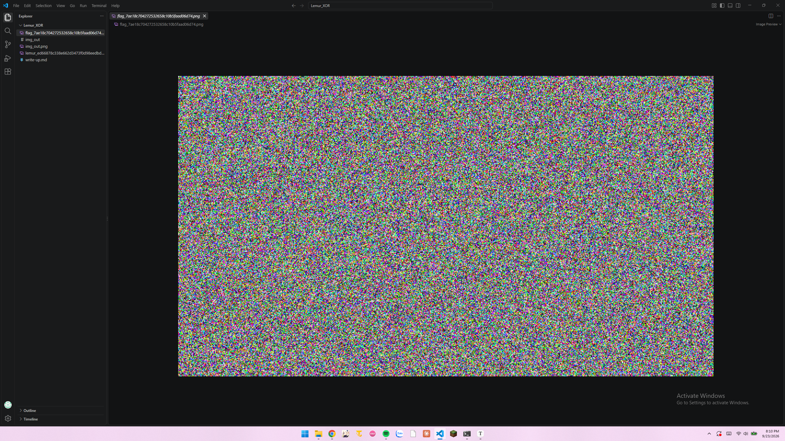
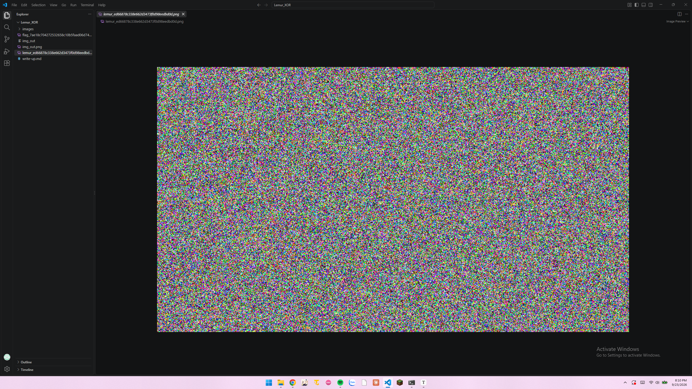
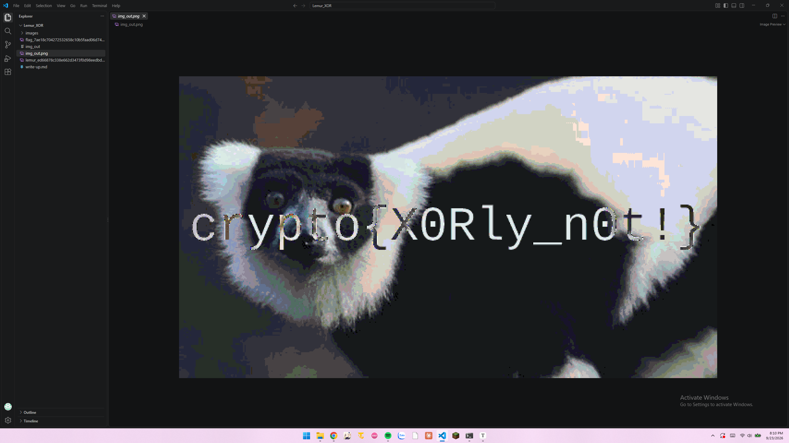
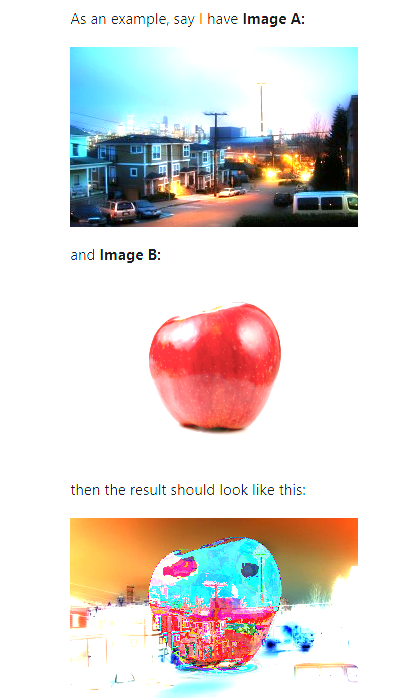

# Lemur_XOR

##### Overview

Đây là 1 bài khiến chúng ta hiểu rõ hơn về cách mà 1 dữ liệu xor với nhau.
Đề cho: 2 tấm ảnh gồm 1 tấm ảnh flag ^ secret key và 1 tấm ảnh lemur ^ secret key

## Solutiuon

1. Hướng giải
   Cách tìm cờ cũng khá đơn giản, chúng ta chỉ cần xor 2 tấm ảnh lại với nhau để triệt tiêu phép xor của secret key thôi. Và khi xor 2 tấm ảnh thì chúng ta sẽ thu được 1 tấm ảnh flag ^ lemur

   > Ơ mà, 2 tấm ảnh xor với nhau thì sao mà tìm được cờ??? 

   Tôi sẽ chứng minh chúng ta có thể lấy được cờ ở mục 2

2. Quá trình giải
   Khi tôi đang tìm kiếm thông tin về cách xor dữ liệu (ở đây là pixel bởi vì hint của đề đã nói không phải xor dữ liệu thuần của 2 tấm ảnh ) điểm ảnh thì tôi đã tìm ra lênh bash sau:

   ```bash
   convert img1 img2 -fx "(((255*u)&(255*(1-v)))|((255*(1-u))&(255*v)))/255" img_out
   ```

   > **convert** là lệnh bash của ImageMagick
   >
   > Với img1,2 là ảnh 1, ảnh 2 làm đầu vào, flag -fx cho phép thực hiện phép tính trong **""**  với **u** và **v** là dữ liệu pixels của img1 và img2 và cuối cùng là img_out là đầu ra
   > Bởi vì lệnh convert không hỗ trợ bitwise xor nên chúng ta phải tự tạo 1 cái đó chính là:
   >
   > ```bash
   > (u & NOT v) | (NOT u & v)
   > ```
   >
   > Và điều đặt biệt là thông tin pixels được ImageMagick đọc được chỉ có khoảng dữ liệu từ [0,1] trong khi bình thường các ứng dụng vẽ hay thiết kế dùng dãy dữ liệu từ [0,255].
   >
   > ```bash
   > ((255*u & 255*(NOT v)) | (255*(NOT u) & 255*v))/255
   > ```
   >
   > Thêm 1 điều nữa là NOT trong câu lệnh trên được định nghĩa theo logic, không phải bitwise. Và chúng ta được biết NOT x = 255 - x nếu như x là pixels 8 bits mà. Vậy thì từ đó ta có :
   >
   > ```bas
   > (((255*u)&(255*(1-v)))|((255*(1-u))&(255*v)))/255
   > ```

   Và chúng ta chỉ cần mở ảnh img_out (chính là flag ^ lemur) lên và lấy cờ thôi! >-<:

   Ảnh flag ^ secret key:

   Ảnh lemur ^ secret key:
   

> À thì không khác gì ảnh flag ^ secret :v

Và đây là ảnh đầu ra sau khi chạy lệnh bash:



#### Flag:crypto{X0Rly_n0t!}


## Tại sao chúng ta lại lấy được cờ khi mà phép xor trên flag cũng chưa biến mất?

* Cho 1 ví dụ trực quan hơn cho các bạn dễ hình dung:
  

  

Đơn giản là chúng ta vẫn có thể đọc được những chữ của flag dù có phép xor vs ảnh lemur.
