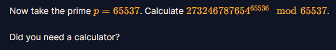

# Modular Arithmetic 2

#### 1. Overview

Bài nãy dẫn chúng ta đến 1 khái niệm rất phổ biến và được sử dụng rất là nhiều trong Crypto, dó chính là khái niệm Trường hữu hạn, Vành, trong lý thuyế t số module.

#### 2. Nền tảng lý thuyết

* Trong Trường hữu hạn F(p), là tập hợp gồm các phần tử {0,1,2,3,...,p-1} với p là số nguyên tố và tồn tại 1 số khi thực hiện phép + và phép * nghịch đảo (Hay trong trường số vô hạn Q của ta là phép chia nghịch đảo -  **a * 1/a = 1** và phép trừ đối số - **a + (-a) = 0**  ) dành cho mọi phần tử trong tập hợp của Trường hữu hạn trừ số 0. Có nghĩa là trong Trường hữu hạn F(p), mọi phần tử khác 0 đều có nghịch đảo nhân và cộng của nó. 

* Tiếp đến là định lý Fermat nhỏ : [Xem thêm tại đây](https://vi.wikipedia.org/wiki/%C4%90%E1%BB%8Bnh_l%C3%BD_nh%E1%BB%8F_Fermat)

  * Định lý fermat nhỏ nêu rằng luôn tồn tại `số nguyên tố p` và `số nguyên a bất kỳ` thỏa:

    

  * Ngoài ra định lý còn cách nêu khác như sau với `a là số nguyên không chia hết cho p` và `p là 1 số nguyên tố` :

    

  * Nó còn 1 cách phát biểu nữa là với`p là số nguyên`và `a là số nguyên không chia hết cho p` thì :

.png)

#### 3. Phân tích

Khi làm theo ví dụ của tác giả, ta có thể thấy:

* Tác giả lấy p = 17, tạo ra trường hữu hạn module = 17
* Tính các biểu thức trong ảnh ta thu được là chính giá trị đó mà mất đi số mũ (Giống với biểu thức đồng dư thứ nhất của mục 2)
* Khi tính 7 mũ 16 mod 17, ta nhận được 1. Nói chính xác hơn ý tác giả muốn nói đến là biểu thức đồng dư thứ 2
* Đề hỏi, cho:
* Hint: *Did you need a caculator?*
* Chúng ta nhận ra ngay tác giả đang muốn nói đến định lý fermat nhỏ khi mà số mũ của số *big-integer* là `p - 1`, áp dụng định lý fermat (theo biểu thức đồng dư thứ 2 hoặc là phép tính module thứ 3 đều được), ta sẽ nhận được **giá trị = 1** mà không cần tính toán bằng máy tính !

#### 4. Exploit chain

* Nhập đáp án là 1 =)))))))))))

#### Number : 1

#### 5. Reference

* Wikipedia Fermat fomula: [Đọc thêm](https://vi.wikipedia.org/wiki/%C4%90%E1%BB%8Bnh_l%C3%BD_nh%E1%BB%8F_Fermat)