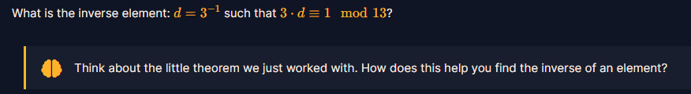

 # Modular_Inversting

#### 1.Overview

* Đây chính là lúc vận dụng tất cả kiến thức từ đầu khóa học đến giờ để giải!

#### 2. Nền tảng cốt lõi

* Các bạn cần phải hiểu và biết được thuật toán Euclid mở rộng cũng như phát biểu của nó.

#### 3. Phân tích

* Như ta đã biết, luôn tồn tại cặp số `x,y` thõa mãn:

  

  > Lưu ý:  Fomula trên đang được xét trong Trường vô hạn hay chính là thế giới toán học thuần túy của chúng ta - nơi mà trục số kéo dài đến vô hạn. Còn Trường hữu hạn lại có 1 trục số **HÌNH TRÒN** và số phần tử nguyên trên trục số là hữu hạn.

* Khi đặt công thức này vào trường hữu hạn:

  .png)

* Trong trường hữu hạn, chỉ bao gồm các phần tử bé hơn p, nên xét `a = g` và `b = p`, bởi vì p là số nguyên tố nên `gcd(g,p) = 1 với mọi giá trị g trong trường hữu hạn` ,ta có được:.png)
* Vậy khi phát biểu Euclid mở rộng trong trường hữu hạn, ta sẽ luôn có một số x**( y * p mod p = 0 nên không được biểu diễn trong fomula)** thỏa biểu thức trên, hay x chính là nghịch đảo nhân của g theo định nghĩa của trường hữu hạn !!!
* Chúng ta sẽ áp dụng thuật toán Euclid mở rộng để tìm nghịch đảo nhân của 3 trong đề bài:
* Hint : *Think about the little theorem we just worked with. How does this help you find the inverse of an element?

#### 4. Exploit chain

* Chúng ta viết hàm tìm cặp (x,y) thỏa mãn với gcd là cặp số (g , p) với g = 3 và p = 13

* Script: [script giải](solve.py)

* Bạn sẽ khá khó hiểu tại vì script tính ra là -4! Vì script giải hiện tại vẫn nằm trên trường vô hạn , nên nó vẫn chưa được ép vào trường hữu hạn để trở về giá trị đúng của nó

* Trường hữu hạn chỉ có giá trị từ [0,p-1] hay là [0,12] đối với bài của ta, bạn hãy nghĩ rằng trục số là mặt đồng hồ có 13 giờ. `-4` chính là từ 0 lùi lại 4 bước là sẽ thành 0 -> 12(b1) -> 11(b2) -> 10(b3) -> 9(b4) và BÙM

* Chúng ta đã lấy được nghịch đảo nhân của 3 trên trường module 13 đó là 9

  #### number: 9

#### 5. Reference

Euclid mở rộng: [Đọc wu bài Extended GCD](Extended_GCD/write-up.md)