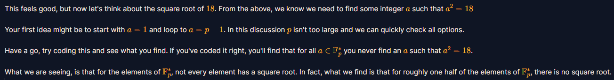

# Quadratic Residues

#### 1. Overview

* Bài này chúng ta sẽ cùng tìm hiểu về Quadratic Residues hay chính là *Thặng dư bậc hai* trong trường hữu hạn.

#### 2. Nền tảng

* Một số `x` được gọi là *Thặng dư bậc hai* khi tồn tại 1 số `a` thỏa mãn:  

  

#### 3. Phân tích

* Đề bài hint cho ta rõ ràng về cách giải: 

  

* Chúng ta sẽ quét qua tất cả các phần tử `ai` của trường hữu hạn, và tính `ai^2` lưu vào 1 list mới, sau đó kiểm tra từng số `14, 6, 11` có nằm trong list không, nếu có thì số đó chính là *Thặng dư bậc hai*, dùng hàm index() để in ra vị trí giá trị a^2 của số đó đầu tiên của list mới.

  > Hàm index(<giá trị>) hoạt động bằng cách quét qua list, nếu tìm thấy <giá trị> đầu tiên của dãy sẽ in ra vị trị (index) của <giá trị> trong list đó. Bởi vì tập trường hữu hạn gồm các giá trị `ai` từ [0,p-1], ta dễ dàng nhận ra vị trí của từng phần tử sẽ bằng đúng giá trị của nó, hay dễ hiểu là `ai = i`  . Nên tìm index(x) chính là tìm giá trị `ai`  thỏa đồng dư thức ở trên, bởi vì in ra giá trị đầu tiên mà hàm tìm thấy nên nó cũng chính là giá trị nhỏ nhất giữa 2 nghiệm: 

#### 4. Exploit chain

* Như đã phân tích: [Đọc script](solve.py)

* #### Number: 8

