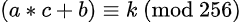
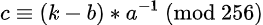
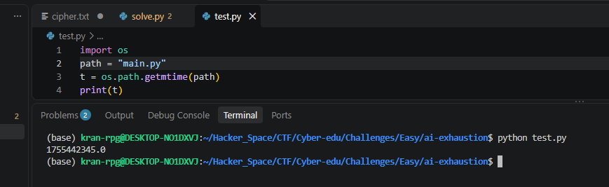
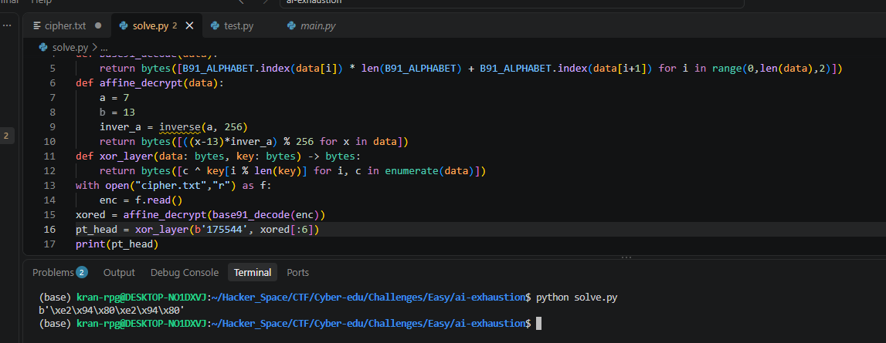
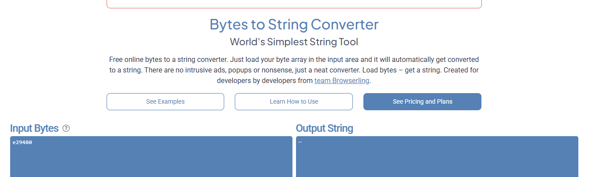
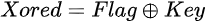
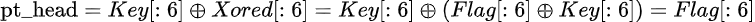
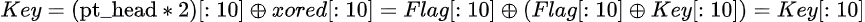

# ai-exhaustion

#### Tags: Crypto - Diff: Easy - Source code encrypt: [Đọc](main.py)

#### 1. Overview

* Đây là 1 bài mình đánh giá là underate nhất, độ khó của nó không nên ở mức easy, mà nên ở mức medium! Đây là 1 trong những bài mình đánh giá rất cao và rất hay cho những người mới ~~(như mình)~~
* `Mục tiêu`: Decrypt ciphertext để lấy cờ
* `Kỹ thuật`: Linh hoạt kĩ năng research, tính toán, nhạy bén để decrypt. Sử dụng script để đảo ngược encode.

#### 2. Nền tảng cốt lõi

* Thành thạo thuật toán và đọc hiểu code python
* Biết cách tìm nghịch đảo module trong trường số module
* Tính chất phép xor
* Biết cách dự đoán timestamp của file để đoán khóa bí mật

#### 3. Phân tích lỗ hỗng

* Phân tích main.py của server ta thấy rằng là cờ được encrypt qua 3 lớp:

* ```python
  def encrypt(plaintext: bytes, key: bytes) -> str:
      xored = xor_layer(plaintext, key)
      aff = affine_encrypt(xored)
      return base91_encode(aff)
  ```

  * Lớp đầu tiên là lớp xor với khóa bí mật
  * Lớp thứ 2 là module
  * Lớp thứ 3 là base91 encode fake <('')

* Nhiệm vụ của ta là đảo ngược 3 quá trình này để lấy được flag.

* Đối với lớp đầu tiên là base91

  * ```python
    B91_ALPHABET = [chr(i) for i in range(33, 124)] 
    
    def base91_encode(data: bytes) -> str:
        out = []
        for b in data:
            hi = b // len(B91_ALPHABET)
            lo = b % len(B91_ALPHABET)
            out.append(B91_ALPHABET[hi] + B91_ALPHABET[lo])
        return ''.join(out)
    
    ```

  * `data` khi qua hàm `base91_encode` sẽ bị nhân đôi độ dài bởi vì 1 kí tự đã được tính toán ra 2 kí tự mới.

  * Để khôi phục kí tự gốc, ta cần mỗi 2 kí tự trong ciphertext, tính toán lại giá trị `b`

  * Giá trị `b` được tính bằng cách quy đổi 2 kí tự trong cipher thành 2 giá trị x,y chính là vị trị trong list `B91_ALPHABET`, sau đó:

  *  ```python 
     b = x * len(B91_ALPHABET) + y
     ```

* Lớp thứ 2 là `affine_encrypt`

  * ```python
    def affine_encrypt(data: bytes, a: int = RSA_A, b: int = RSA_B) -> bytes:
        return bytes([(a * c + b) % 256 for c in data])
    ```

  * `data` chính là `xored` trong file main.py , sau khi qua hàm `affine_encrypt` sẽ bị biến đổi số học module. Và ta cần khôi phục lại `c` từ cipher sau khi decode base91

  *  Giá trị `c` sau khi tính toán module sẽ ra 1 giá trị `k`

  * 

  * Vậy thì `c` sẽ được tính bằng cách:

  * 

  * Điều kiện để tìm được nghịch đảo module của a là `gcd(a, 256) = 1` ,giá trị của `a = 7` => `gcd(7 ,256) = 1` nên `a` module khả nghịch!

* Lớp cuối cùng là phép xor_layer với khóa bí mật

  * Tới bước này mình thật sự không biết làm thế nào để tìm được khóa bí mật.

  * ```python
    def get_aes_key() -> bytes:
        """Derive AES_KEY from flag.txt modification timestamp"""
        ts = int(os.path.getmtime("flag.txt"))
        return str(ts).encode()
    ```

  * Mình có research thử hàm sinh khóa cho khóa bí mật thì mình biết được đó là hàm trích xuất tem thời gian cuối cùng mà file chỉnh sửa theo Unix timestamp.

  * Hiện tại, file được chỉnh sửa có tem thời gian gần với `flag.txt` nhất chính là file `main.py` bởi vì nó được tạo ra sau hay trước đó 1 chút so với flag

  * Thì mình có thử trích xuất tem thời gian của main.py thử thì được như sau:

  * 

  * Có thể đầu key bí mật chính là dãy số `175544xxx` nếu như tác giả lưu tem thời gian cùng lúc, có nghĩa là tác giả hoàn thành bài CTF này - bao gồm file `main.py` và `flag.txt` trong khoảng thời gian ngắn

  * Giả định rằng đầu key bí mật là `175544` thì khi xor với ciphertext sau khi decode base91 và affine thì ta được như sau:

  * 

  * Chúng ta không nhận được đầu cờ là `ctf{` mà là 1 chuỗi bytes  không thể in được.

  * Tưởng tới đây là bế tắc nhưng quy luật của chuỗi bytes khá là bất thường bởi vì nó đang lặp lại chuỗi byetes `\xe2\x94\x80`

  * Sau khoảng thời gian research thì mình biết được rằng chuỗi bytes trên khi decode ở dạng utf-8 chính là dấu `─`

  * 

  * Vậy thì khả năng rất cao, đây là 1 banner , chứ chưa phải là cờ hoàn chỉnh để chúng ta lấy flag. Vậy thì khả năng sẽ có 1 chuỗi `─` liên tiếp nhau 

  * Ta sẽ lấy chính phần `head * 2`, rồi lấy đúng 10 bytes kí tự tương đương với độ dài key bí mật xor với 10 bytes đầu tiên xored để lấy lại key.

  * Giải thích chi tiết hơn thì sao khi decode base91 vào affine thì chuỗi bytes ta đang có hiện tại chính là flag xor với Key

  * 

  * `head` tính bằng cách:

  * 

  * Và lúc này, ta đã biết rằng, đây là 1 banner bắt đầu bằng 1 chuỗi `─`, vậy thì key sẽ được khôi phục bằng cách như đã kể ở trên

  * 

  * Khi đã có key, ta chỉ cần xor Key cho cả file cipher, ta sẽ thu được 1 banner hoàn chỉnh

#### 4. Exploit chain

* Quy trình:

  * Viết hàm đảo ngược base91 encode
  * Tính toán đảo ngược phép module
  * Khôi phục lại key
  * Giải mã cờ

* Script: [Đọc](solve.py)

* #### Banner:

  ``````
  ──────────────────────────────────────────────
  🎉🎉🎉  CONGRATULATIONS, CRYPTO SLAYER!  🎉🎉🎉
  ──────────────────────────────────────────────
  
  You have walked through the labyrinth of XOR shadows, 
  untangled the twisted affine maze, 
  and conquered the strange lands of fake Base91 encoding.  
  The timestamp key tried to guard the secret, 
  but you were sharper, faster, and more relentless.  
  
  You refused to be fooled by misleading AES whispers 
  and RSA distractions scattered across the code.  
  Your patience, skill, and hacker instinct carried you 
  through the chaos of misdirection.  
  
  With clever eyes and steady hands, you revealed the truth:  
  the hidden FLAG that so many lines of Python 
  tried to keep from you.  
  
  This was not just decryption — it was a battle of wits.  
  You didn’t just solve a puzzle.  
  You outsmarted the challenge,  
  and that makes you a true CTF champion.  
  
  ──────────────────────────────────────────────
  🏆 Raise your terminal high — you’ve earned it! 🏆
  ──────────────────────────────────────────────
  
  Joke over, here is the flag: Joke over, here is the flag:
  ctf{85442935690be24eaa7278925fbb35368b8bb230516a530090c637f83b25f516}
  ``````

* #### Flag: ctf{85442935690be24eaa7278925fbb35368b8bb230516a530090c637f83b25f516}

#### 5. Reference

* Bytes to string converter: [Đọc](https://onlinestringtools.com/convert-bytes-to-string)
* Tra Unix timestamp hiện tại: [Đọc](https://www.unixtimestamp.com/)
* UTF-8 code page: [Đọc](https://www.charset.org/utf-8/10#:~:text=Circled%20Digit%20Zero-,9472,-U%2B2500)
