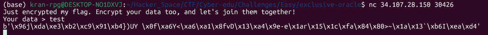
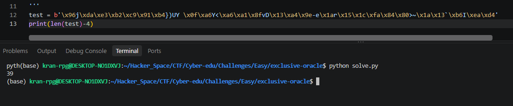
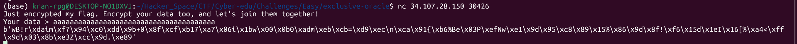

# exclusive-oracle

#### Tags: Crypto - Diff: Easy

#### 1. Overview

* `Mục Tiêu`: Sử dụng oracle bị lộ để tính toán ra chìa khoá
* `Kỹ thuật`: Sử dụng tính chất phép xor để khôi phục khoá

#### 2. Nền tảng cốt lõi

* Hiểu tính chất của phép xor: [Đọc tại đây](https://wiki.vnoi.info/algo/basic/bitwise-operators.md)

#### 3. Phân tích lỗ hổng

* Khi đọc [source code của server](main.py) thì chúng ta thấy rằng `key` và` flag` có chung độ dài.

* Ngoài ra, khi nhập input vào` oracle` thì server sẽ đồng thời nhả ra `cờ đã xor với key` và `đoạn dữ liệu của ta xor với key`

* Để khôi phục key, ta chỉ kiểm tra xem `flag` gốc dài bao nhiêu ký tự để tính độ dài `key`, sau đó nhập 1 chuỗi text tương ứng với độ dài để oracle nhả ra full phép xor của `key với dữ liệu của ta.`

* Khi input của ta nhỏ hơn độ dài key thì:

* ```python
  i %= len(first)
          j %= len(second)
          if i == 0 or j == 0:
              return data
  ```

* Phép xor sẽ bị huỷ giữa chừng, vậy nên ta cần nhập input >= len(key) để lấy full đoạn oracle nhả ra chính là `input xor key`

* Lấy output của input xor với chính input ta sẽ thu được key

#### 4. Exploit chain

* Quy trình:

  * Gửi đoạn mẫu để nhận đoạn enc, tính toán độ dài flag để suy ra độ dài key
  * Gửi 1 đoạn mẫu mới dài bằng độ dài key để nhận đoạn enc
  * Lấy đoạn mẫu đã bị enc, xor với chính đoạn mẫu để lấy key
  * Lấy key xor với flag 

* Chi tiết:

  * B1: Gửi đoạn mẫu

  * 

  * => Độ dài key là 39

  * B2: Khôi phục key, lấy cờ

  * 

  * Script: [Đọc](solve.py)

  * #### Flag: TFCCTF{wh4ts_th3_w0rld_w1th0u7_3n1gm4?}