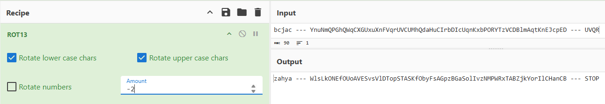
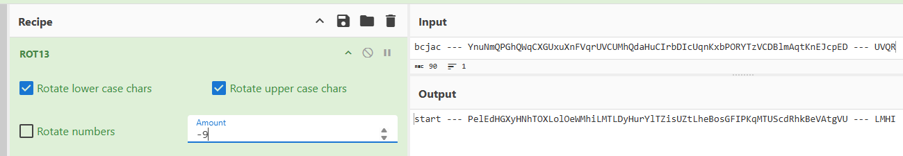

# super_caesar

#### Tags: Crypto - Diff: Easy

#### 1. Overview

* Đây là 1 trong những bài caesar rất thú vị, và mình thực sự hứng thú khi giải bài này =)))))

* `Mục tiêu`: Giải mã ciphertext bị đè 2 lớp caeser?
* `Kỹ thuật`: Dò tìm khoá caeser

#### 2. Nền tảng cốt lõi

* Chỉ cần hiểu định nghĩa của caeser cổ điển

#### 3. Phân tích 

* Message :`bcjac --- YnuNmQPGhQWqCXGUxuXnFVqrUVCUMhQdaHuCIrbDIcUqnKxbPORYTzVCDBlmAqtKnEJcpED --- UVQR`
* `Decrypt and find your flag.`
* Khi nhìn vào bài này thì thật sự không biết giải bắt từ đâu, mình dò thử các bảng dịch bảng chứ cái, thì phát hiện ra 2 thứ:
  * `STOP`:
  * `start`:
* Đoạn ciphertext bị trộn lẫn kí tự thường và kí tự in hoa, và với 2 dữ kiện thu được là chữ `start`(in thường) và chữ `STOP`(in hoa) thì mình dự đoán là chữ cái thường đã bị dịch 9 chữ cái và chữ cái hoa dịch 2 kí tự

#### 4. Exploit chain

* Quy trình:

  * Brute force shifted văn bản,lấy các key cần thiết cho phép dịch chuyển kí tự caeser cổ điển
  * Lấy cờ

* Script: [Đọc](solve.py)

* #### Flag: ECSC{BGtSheIosNMPWRqTABZcdYhkIeCHtgCB}