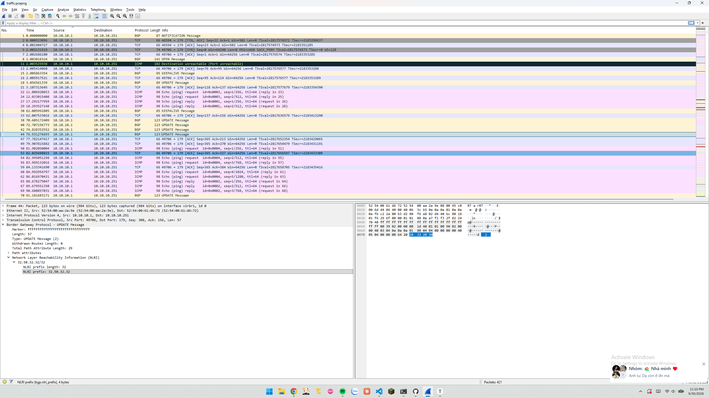
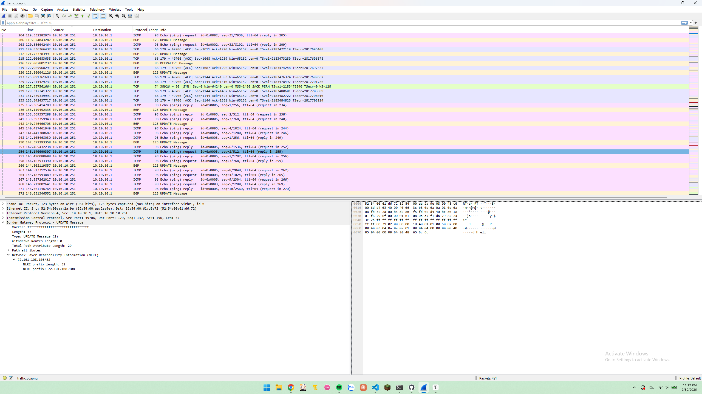
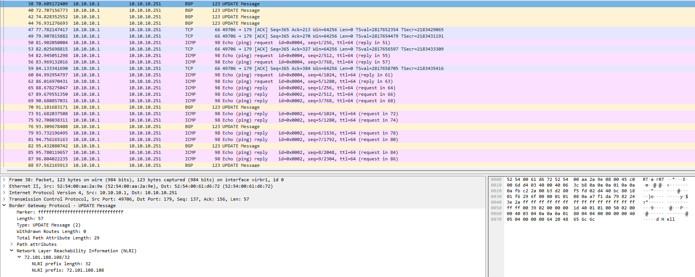
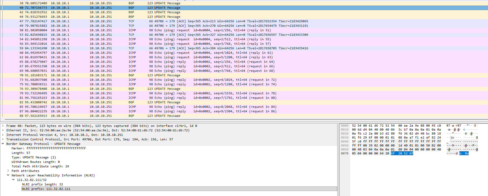
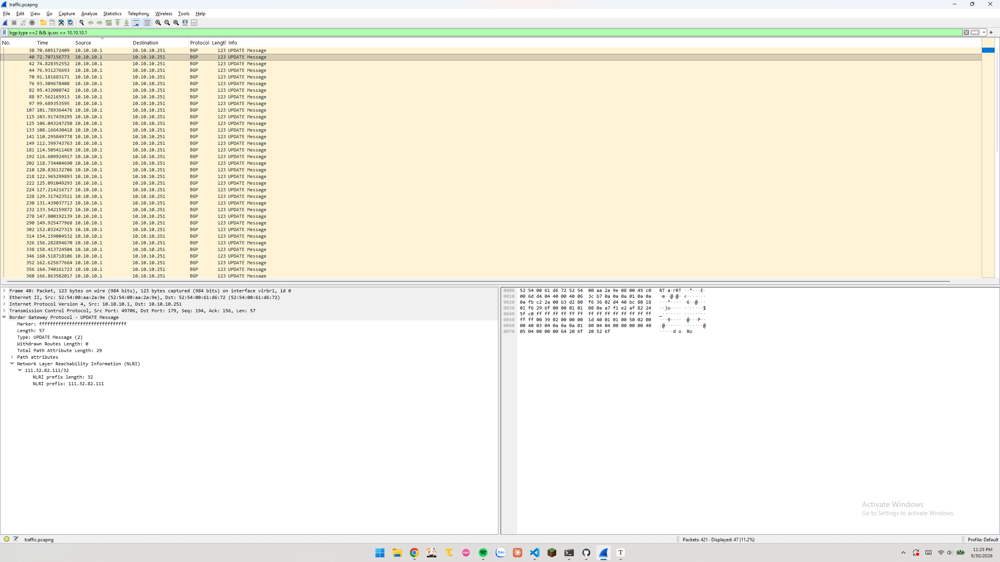
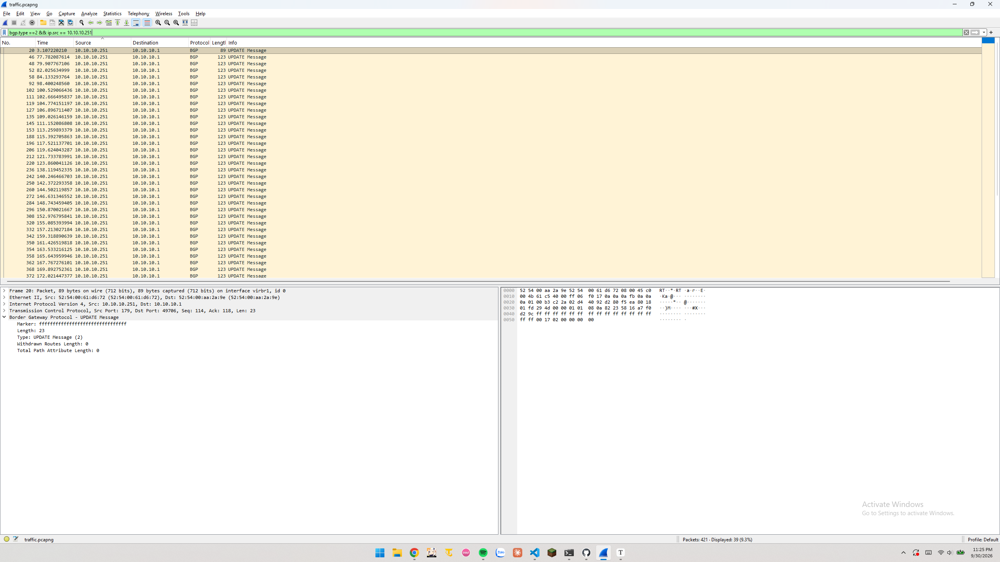
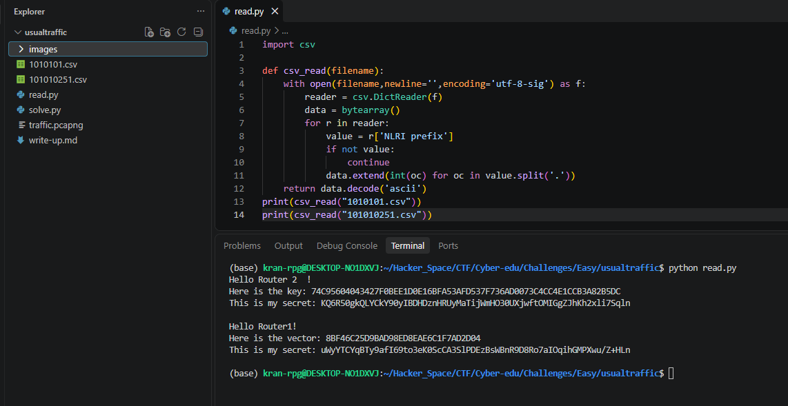

# usualtraffic

#### Tags: Crypto/Network/ROCSC - Diff: Easy

#### 1. Overview

* Đây là bài đầu tiên mình động đến mảng `Netwrok` và `ROCSC` mix với Cryopto như này.
* `Mục tiêu`: Điều tra các gói tin để tìm thông điệp giao tiếp giữa 2 router
* `Kỹ thuật`: Sử lý packet và giải mã gói tin

#### 2. Nền tảng cốt lõi

* Biết giải mã base64, AES
* Biết cách điều tra, nhận diện được các gói tin trao đổi giữa các router trong không gian mạng.
* Biết cách sử dụng `wireshake` (tùy chọn - có thì sẽ rất tiện để truy xuất thông tin gói tin)

#### 3. Phân tích lỗ hổng

* 
* Khi mở các gói tin lên thì đập ngay vào mắt là rất nhiều dòng thông tin `UPDATE MESSAGE` của nguồn là `10.10.10.1` và địa chỉ đích là `10.10.10.251`
* 
* Lướt xuống ta thấy nguồn `10.10.10.251` phản hồi lại địa chỉ `10.10.10.1`
* Khi kiểm tra chi tiết các gói tin hơn thì mình nhận ra rằng, các gói packet này rất bất thường và có khả năng đang sử dụng IP address để gửi tin bí mật giữa 2 router
* 
* 

> 2 gói tin ví dụ ở trên khi ghép các kí tự IP bên phải sẽ thành `Hello Ro`

* Mình lọc các gói tin `UPDATE` của IP `10.10.10.1`  thì có rất nhiều gói tin như vậy, tương tự với IP `10.10.10.251`
* 
* 

* Mình sẽ xuất ra 2 file csv để sử lý bằng python để lấy thông tin trong IP, ngoài ra trước khi xuất ra file csv, mình cũng cần phải thêm cột `NLRI prefix` để có cột để trích xuất.
* Script đọc file csv: [Đọc](read.py)
* 
* Chính xác. Hai router đã giao tiếp thông điệp bí mật với nhau thông qua IP address.
* Và hai router đã trao đổi với nhau khóa và vector, đây là dấu hiệu thông điệp đã bị mã hóa `AES`, ngoài ra trong `secret` có các kí tự `/, +`, secret cũng đã bị mã hóa base64

#### 4. Exploit chain

* Quy trình:

  * Điều tra các gói tin, phát hiện bất thường ở các gói tin `UPDATE` bởi vì tầng suất rất nhiều. Phát hiện 2 router trao đổi với nhau bằng IP
  * Trích xuất các IP, đóng gói các IP lại để thành 1 văn bảng hoàn chỉnh
  * Giải mã base64 với các secret
  * Giải mã AES

* Script: [Đọc](solve.py)

* #### Flag: CTF{25B24F21A9B698C026A7FF6D911B252414260C11A4A7F46DD6885C9BAA0A5386}

#### 5. Reference

* CSV python: [Đọc](https://docs.python.org/3/library/csv.html)
* Extend bytearray: [Đọc](https://embeddedinventor.com/bytearray-append-extend-explained-with-examples/)