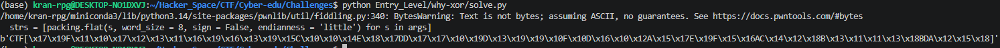
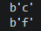
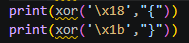

# why-xor

#### Tags: Crypto - Diff: Entry level

#### 1. Overview

* Mục tiêu: Đề cho ta 1 đoạn xored được tính bằng cách xor flag với key
* Kỹ thuật: Dò tìm flag bằng format cờ đã biết

#### 2. Nền tảng

* Hiểu bản chất của xor

#### 3. Phân tích

* Thứ chúng ta biết duy nhất là flag ^ key và format cờ là CTF{sha256} được đề cung cấp, và đây chính là cú lừa của bài này.

* Khi tính thử độ dài cờ thì ta có sha256 dài 64 kí tự và thêm độ dài format chuẩn là 5 nữa là 69 kí tự

* 3 bytes đầu của flag^key là 3 bytes `\x00`, có nghĩa là 3 kí tự đầu tiên của cờ giống với 3 kí tự đầu tiên của key

* Khi test thử phép xor đối với key là `CTF` bởi vì format key bắt đầu bằng `CTF` thì ta thu  được đoạn sau:

  * 

* Ta chẳng nhận được gì cả, nhưng có 1 điều chú ý ở đây là trong hình trên, flag lại có dạng `CTF[...]`, nhưng chuẩn flag là `CTF{sha256}`, vậy thì chúng ta đổi hướng qua phân tích xem thứ gì xor với `{}` tạo ra 2 bytes la `\x18\x1b` (bytes thứ 4 và bytes cuối cùng của cờ) thì ta thu được.

* 

* độ dài cờ là 69 và kí tự thứ 4 của cờ được xor với kí tự `c` và kí tự thứ 69 được xor với kí tự `f` => Giả thuyết rằng key dài 3 kí tự và 3 kí tự đó là `ctf`

* #### Bùm => Flag: ctf{79f107231696395c004e87dd7709d3990f0d602a57e9f56ac428b31138bda258}

* Đề đã lừa chúng ta bằng format có sẵn, thực tế format cờ không phải là `CTF{sha256}` mà là `ctf{sha256}`

#### 4. Exploit chain

* Lấy xored của đề xor với key `ctf`

