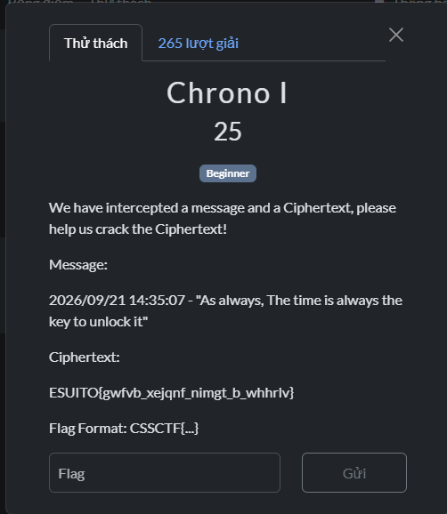

# Chrono I

#### Category: Crypto - Diff: Beginner

#### 1. Overview

* `Mục Tiêu`: Giải mã ciphertext
* `Kỹ thuật`: Giải mã caesar cổ điển

#### 2. Nền tảng

* Biết về mã hóa caesor và cách giải mã

#### 3. Phân tích lỗ hổng

* Format cờ là `CSSCTF`, ciphertext có đầu cờ là `ESUITO`.
* Dựa vào hint: `2026/09/21 14:35:07 - "As always, The time is always the key to unlock it"`
* Chúng ta sẽ nhận ra dễ dàng rằng đây là loại mã hóa caesar cổ điển. Với 3 kí tự đầu `CSS`, các kí tự bị dịch chuyển đi lần lượt `202` bước thành `ESU` và key chính là các số trong tem thời gian của hint

#### 4. Exploit chain

* Quy trình:

  * Viết hàm giải mã caesor khi biết số dịch chuyên trước
  * Nhập cipher và tem thời gian vào code
  * Giải mã

* Script: [Đọc](solve.py)

* #### Flag: CSSCTF{every_second_hides_a_secret}

