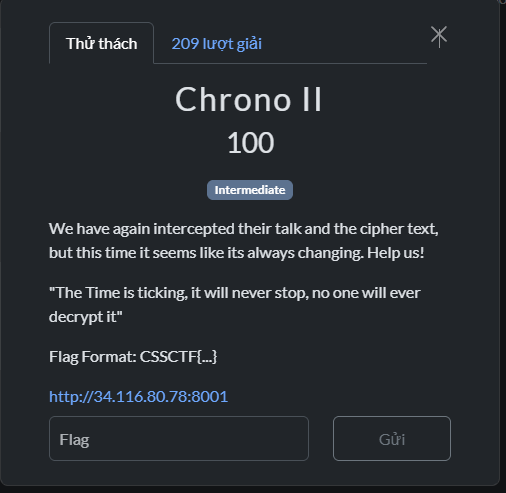
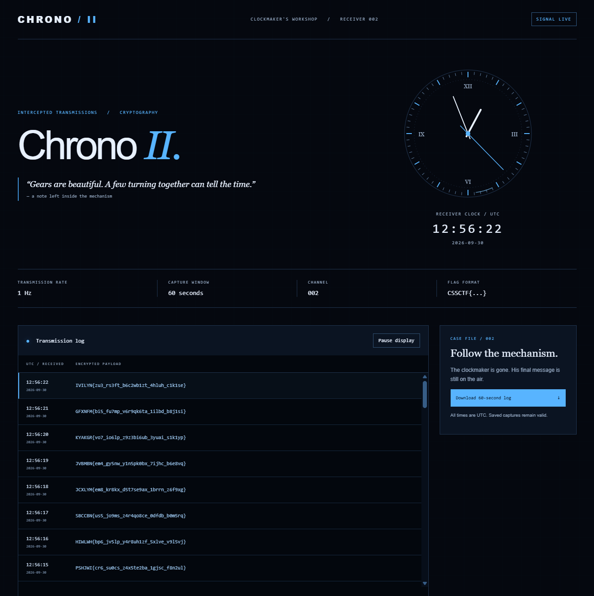

# Chrono II





#### Category: Crypto - Diff: Intermediate

#### 1. Overview

* Bài này tốn mình gần 2 tiếng mới giải ra được. Thật sự bài này cách giải không khác gì Chrono I nhưng quy luật của nó rất khác biệt khiến cho mình chật vật mới tìm ra quy luật của bài này.
* `Mục Tiêu`: Tìm ra quy luật mã hóa cờ và giải mã cờ.
* `Kỹ thuật`: Sử dụng module và mô hình hóa

#### 2. Nền tảng cốt lõi

* Biết cách sử dụng module
* Biết về mã hóa caesor cổ điển

#### 3. Phân tích lỗ hổng

* Trang web cho chúng ta thấy cờ đang bị mã hóa liên tục theo thời gian thực.

* Các ký tự trong cờ chỉ bị dịch chuyển các chữ cái cùng loại, có nghĩa là chữ cái in hoa sẽ bị đổi qua chữ in hoa mới tùy vào số bước dịch chuyển, chữ cái in thường đổi qua chữ cái in thường khác, số thì chỉ đổi qua số mới.

* Khi tải file json chứa các ciphertext trong 60s kể từ thời điểm tải thì mình kiểm tra thấy rằng cả 60 ciphertext đều khác nhau

* Tưởng rằng là không có quy luật gì hết, mình thử ghi lại 1 ciphertext và chờ trang web liệu có mã hóa ra giống ciphertext mình đang giữ hay không.

  * Ciphertext mình chọn:`DWFHER{ap4_oo9ju_w7z8cf2uu_1dryi_x2h7yi}`
  * Sau khoảng 1 lúc thì mình lại nhận lại chính ciphertext trên!
  * Điều này có nghĩa là ciphertext được mã hóa theo CHU KỲ

* Đo đạc thử thời gian thì tổng cộng ta có 77 ciphertext khác nhau, và thay đổi theo chu kỳ.

* Bước tiếp theo, ta cần đối chiếu xem, bước nhảy (hay là mã hóa caesor) có quy luật như thế nào, thi khi lấy cả 77 ciphertext đối chiếu với format cờ đã biết là `CSSCTF` thì ta được như sau:

* ```python
  0 .  [1, 4, 13, 5, 11, 12]# Chú ý cột 1 (Dãy số 1, 4, 12, 0, 16,...)
  1 .  [4, 6, 3, 16, 9, 5]
  2 .  [12, 3, 9, 7, 10, 5]
  3 .  [0, 15, 7, 3, 3, 9]
  4 .  [16, 4, 9, 3, 2, 8]
  5 .  [9, 10, 0, 8, 8, 1]
  6 .  [10, 5, 9, 5, 7, 11]
  7 .  [3, 9, 10, 8, 8, 11]
  8 .  [6, 8, 8, 13, 12, 2]
  9 .  [13, 5, 11, 12, 7, 8]
  10 .  [3, 16, 9, 5, 8, 6]
  11 .  [9, 7, 10, 5, 4, 13]
  12 .  [7, 3, 3, 9, 10, 3]
  13 .  [9, 3, 2, 8, 8, 13]
  14 .  [0, 8, 8, 1, 11, 12]
  15 .  [9, 5, 7, 11, 5, 5]
  16 .  [10, 8, 8, 11, 5, 1]
  17 .  [8, 13, 12, 2, 7, 4]
  18 .  [11, 12, 7, 8, 1, 12]
  19 .  [9, 5, 8, 6, 13, 0]
  20 .  [10, 5, 4, 13, 5, 16]
  21 .  [3, 9, 10, 3, 16, 9]
  22 .  [2, 8, 8, 13, 7, 10]
  23 .  [8, 1, 11, 12, 7, 3]
  24 .  [7, 11, 5, 5, 8, 6]
  25 .  [8, 11, 5, 1, 4, 13]
  26 .  [12, 2, 7, 4, 6, 3]
  27 .  [7, 8, 1, 12, 3, 9]
  28 .  [8, 6, 13, 0, 15, 7]
  29 .  [4, 13, 5, 16, 4, 9]
  30 .  [10, 3, 16, 9, 10, 0]
  31 .  [8, 13, 7, 10, 5, 9]
  32 .  [11, 12, 7, 3, 9, 10]
  33 .  [5, 5, 8, 6, 8, 8]
  34 .  [5, 1, 4, 13, 5, 11] # Chú ý cột thứ 2
  35 .  [7, 4, 6, 3, 16, 9]
  36 .  [1, 12, 3, 9, 7, 10]
  37 .  [13, 0, 15, 7, 3, 3]
  38 .  [5, 16, 4, 9, 3, 2]
  39 .  [16, 9, 10, 0, 8, 8]
  40 .  [7, 10, 5, 9, 5, 7]
  41 .  [7, 3, 9, 10, 8, 8]
  42 .  [8, 6, 8, 8, 13, 12]
  43 .  [4, 13, 5, 11, 12, 7]
  44 .  [6, 3, 16, 9, 5, 8]
  45 .  [3, 9, 7, 10, 5, 4]
  46 .  [15, 7, 3, 3, 9, 10]
  47 .  [4, 9, 3, 2, 8, 8]
  48 .  [10, 0, 8, 8, 1, 11]
  49 .  [5, 9, 5, 7, 11, 5]
  50 .  [9, 10, 8, 8, 11, 5]
  51 .  [8, 8, 13, 12, 2, 7]
  52 .  [5, 11, 12, 7, 8, 1]
  53 .  [16, 9, 5, 8, 6, 13]
  54 .  [7, 10, 5, 4, 13, 5]
  55 .  [3, 3, 9, 10, 3, 16]
  56 .  [3, 2, 8, 8, 13, 7]
  57 .  [8, 8, 1, 11, 12, 7]
  58 .  [5, 7, 11, 5, 5, 8]
  59 .  [8, 8, 11, 5, 1, 4]
  60 .  [13, 12, 2, 7, 4, 6]
  61 .  [12, 7, 8, 1, 12, 3]
  62 .  [5, 8, 6, 13, 0, 15]
  63 .  [5, 4, 13, 5, 16, 4]
  64 .  [9, 10, 3, 16, 9, 10]
  65 .  [8, 8, 13, 7, 10, 5]
  66 .  [1, 11, 12, 7, 3, 9]
  67 .  [11, 5, 5, 8, 6, 8]
  68 .  [11, 5, 1, 4, 13, 5] # Chú ý cột thứ 3
  69 .  [2, 7, 4, 6, 3, 16]
  70 .  [8, 1, 12, 3, 9, 7]
  71 .  [6, 13, 0, 15, 7, 3]
  72 .  [13, 5, 16, 4, 9, 3]
  73 .  [3, 16, 9, 10, 0, 8]
  74 .  [13, 7, 10, 5, 9, 5]
  75 .  [12, 7, 3, 9, 10, 8]
  76 .  [5, 8, 6, 8, 8, 13]
  ```

* Như các bạn thấy, quy luật dịch chuyển kí tự ở cột 1, khi xuống đến hàng/pha 34, thì quy luật ở cột 2 bắt đầu giống với cột 1,và tương tự với cột 3 ở hàng/pha 68

* Có thể bài này đã lưu 1 list khóa caesar gồm các step khác nhau để in ra theo quy luật trên.

* Ta giả sử rằng `K[t][j]` chính là khóa caesar ở `hàng/pha t` tại kí tự `thứ j`, vậy thì rõ ràng `K[t][0]` chính là khóa đã mã hóa kí tự `C` trong cờ. Ta sẽ lưu lại 77 khóa Caesar đã mã hóa kí tự `C` lại và bắt đầu tính toán xem, nếu như `j tăng lên 1` thì quy luật toán nào sẽ khiến quy luật ở pha 1 diễn ra ở pha 35 tại cột 2 (hay là `j = 1`)

* Ý tưởng ở trên là thế, nhưng lúc giải mình lại suy luận theo kiểu khác, cách suy luận của mình để tìm ra quy luật khóa `K` như sau:

* ```python 
  0 .  [1, 4, 13, 5, 11, 12] #Chú ý cột 2, các bạn lướt xuống
  1 .  [4, 6, 3, 16, 9, 5] #Chú ý cột 3
  2 .  [12, 3, 9, 7, 10, 5]
  3 .  [0, 15, 7, 3, 3, 9]
  4 .  [16, 4, 9, 3, 2, 8]
  5 .  [9, 10, 0, 8, 8, 1]
  6 .  [10, 5, 9, 5, 7, 11]
  7 .  [3, 9, 10, 8, 8, 11]
  8 .  [6, 8, 8, 13, 12, 2]
  9 .  [13, 5, 11, 12, 7, 8] #Chú ý cột 1,quy luật giống với cột 3 ở trên
  10 .  [3, 16, 9, 5, 8, 6]
  11 .  [9, 7, 10, 5, 4, 13]
  12 .  [7, 3, 3, 9, 10, 3]
  13 .  [9, 3, 2, 8, 8, 13]
  14 .  [0, 8, 8, 1, 11, 12]
  15 .  [9, 5, 7, 11, 5, 5]
  16 .  [10, 8, 8, 11, 5, 1]
  17 .  [8, 13, 12, 2, 7, 4]
  18 .  [11, 12, 7, 8, 1, 12]
  19 .  [9, 5, 8, 6, 13, 0]
  20 .  [10, 5, 4, 13, 5, 16]
  21 .  [3, 9, 10, 3, 16, 9]
  22 .  [2, 8, 8, 13, 7, 10]
  23 .  [8, 1, 11, 12, 7, 3]
  24 .  [7, 11, 5, 5, 8, 6]
  25 .  [8, 11, 5, 1, 4, 13]
  26 .  [12, 2, 7, 4, 6, 3]
  27 .  [7, 8, 1, 12, 3, 9]
  28 .  [8, 6, 13, 0, 15, 7]
  29 .  [4, 13, 5, 16, 4, 9]
  30 .  [10, 3, 16, 9, 10, 0]
  31 .  [8, 13, 7, 10, 5, 9]
  32 .  [11, 12, 7, 3, 9, 10]
  33 .  [5, 5, 8, 6, 8, 8]
  34 .  [5, 1, 4, 13, 5, 11]
  35 .  [7, 4, 6, 3, 16, 9]
  36 .  [1, 12, 3, 9, 7, 10]
  37 .  [13, 0, 15, 7, 3, 3]
  38 .  [5, 16, 4, 9, 3, 2]
  39 .  [16, 9, 10, 0, 8, 8]
  40 .  [7, 10, 5, 9, 5, 7]
  41 .  [7, 3, 9, 10, 8, 8]
  42 .  [8, 6, 8, 8, 13, 12]
  43 .  [4, 13, 5, 11, 12, 7] #Chú ý cột 1, quy luật giống với cột 2 ở trên
  44 .  [6, 3, 16, 9, 5, 8]
  45 .  [3, 9, 7, 10, 5, 4]
  46 .  [15, 7, 3, 3, 9, 10]
  47 .  [4, 9, 3, 2, 8, 8]
  48 .  [10, 0, 8, 8, 1, 11]
  49 .  [5, 9, 5, 7, 11, 5]
  50 .  [9, 10, 8, 8, 11, 5]
  51 .  [8, 8, 13, 12, 2, 7]
  52 .  [5, 11, 12, 7, 8, 1]
  53 .  [16, 9, 5, 8, 6, 13]
  54 .  [7, 10, 5, 4, 13, 5]
  55 .  [3, 3, 9, 10, 3, 16]
  56 .  [3, 2, 8, 8, 13, 7]
  57 .  [8, 8, 1, 11, 12, 7]
  58 .  [5, 7, 11, 5, 5, 8]
  59 .  [8, 8, 11, 5, 1, 4]
  60 .  [13, 12, 2, 7, 4, 6]
  61 .  [12, 7, 8, 1, 12, 3]
  62 .  [5, 8, 6, 13, 0, 15]
  63 .  [5, 4, 13, 5, 16, 4]
  64 .  [9, 10, 3, 16, 9, 10]
  65 .  [8, 8, 13, 7, 10, 5]
  66 .  [1, 11, 12, 7, 3, 9]
  67 .  [11, 5, 5, 8, 6, 8]
  68 .  [11, 5, 1, 4, 13, 5]
  69 .  [2, 7, 4, 6, 3, 16]
  70 .  [8, 1, 12, 3, 9, 7]
  71 .  [6, 13, 0, 15, 7, 3]
  72 .  [13, 5, 16, 4, 9, 3]
  73 .  [3, 16, 9, 10, 0, 8]
  74 .  [13, 7, 10, 5, 9, 5]
  75 .  [12, 7, 3, 9, 10, 8]
  76 .  [5, 8, 6, 8, 8, 13]
  ```

* Ở pha 0, kí tự đầu tiên (j = 0) `C` mã hóa bằng khóa `K[0][0]`, ở kí tự thứ 2 (j = 1) `S` mã hóa bằng khóa `K[0][1]` giống với khóa `K[43][0]`, ở kí tự thứ 3 (j = 3)`S` mã hóa bằng khóa `K[0][2]` giống với khóa `K[9][0]`. Và quy luật này áp dụng cho tất cả các pha. Nhưng chúng ta vẫn chưa tìm được quy luật các khóa được sử dụng ở các cột 4,5,6 (ngay cả cột 3 ta vẫn chưa biết)

* Đây là công đoạn tốn thời gian nhất nhưng là công đoạn cuối cùng để giải quyết bài này: `tìm dạng tổng quát của sử dụng khóa K`, sau khoảng thời gian dài thì mình rút ra quy luật ở pha `t` và kí tự thứ `j` như sau:

  * Ở pha thứ `t`, kí tự thứ `j` được mã hóa bằng khóa `K[(t + 43*j) % 77][0]` 

* Khi đã tìm ra quy luật mã hóa của khóa K, bắt đầu giải mã thôi >-<

#### 4. Exploit chain

* Quy trình:

  * Viết hàm dịch chuyển kí tự dành riêng cho từng trường hợp (3 trường hợp mã hóa caesar là kí tự in hoa, kí tự thường, chữ số)
  * Lưu list khóa K bằng cách lấy các step dịch chuyển của các ciphertext ở kí tự thứ nhất so với cờ
  * Lấy pha `t = 0`, đảo ngược mã hóa caesor, giải mã ciphertext.
  
* Script: [Đọc](solve.py)

* #### Flag: CSSCTF{th3_cl0ck_r3m3mb3rs_3very_s3c0nd}

  

  

  

  

  

  

  

  

  

  

  

  

  

  

  

  

  

  

  

   

