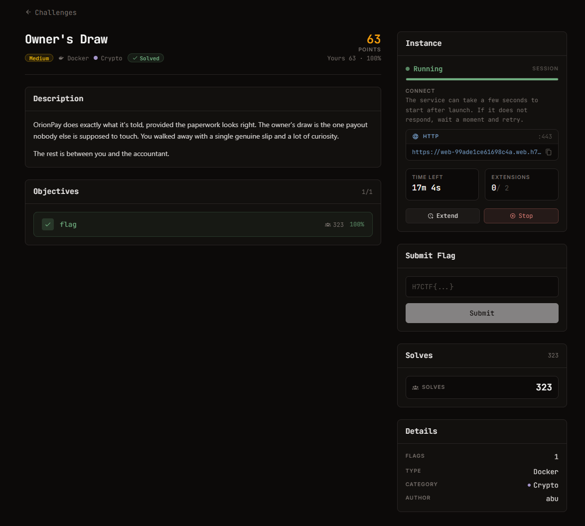
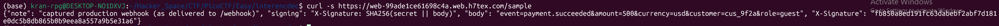

# Owner's Draw - H7CTF Qual

#### Mảng: Crypto - Mức độ: Medium -  Web template: [Đọc](webtemplate.txt)



#### 1. Overview

* Đây là 1 bài Crypto sử dụng docker để thao tác trên server để nhận file, vì vậy muốn giải được cần phải biết cách thao tác get/post đối với server để thực hiện thử thách, khá là khó chịu đối với những người hay thao tác trên local hay netcat.
* `Mục Tiêu`: Gửi 1 headers gồm 1 chữ kí sha256 (sha256 signature) và body được lưu trữ dưới dạng bytes raw, và phần body được đính kèm role = owner để nhận cờ, kèm với chữ kí sha256 tương ứng
* `Lỗ Hổng`: Đây là 1 lỗ hỗng có tên là Length Extension Attacks
* `Kỹ thuật`: Sử dụng chữ kí của khách và body khách, kẹp thêm mã độc để đánh lừa server lấy cờ.

#### 2. Nền tảng cốt lõi

* Bạn cần biết cách mà lỗi Length Extension Attacks hoạt động [Xem thêm wikipedia](https://en.wikipedia.org/wiki/Length_extension_attack) [Xem thêm ví dụ sha2](https://viblo.asia/p/sha-2-and-length-extension-attack-pgjLNmWdJ32) [Xem thêm ví dụ sha256](https://medium.com/@splintercat/understanding-length-extension-attacks-855084c0170d)

  * Hiểu 1 cách đơn giản, khi hash 1 file dữ liệu, ví dụ như sha256. Sha256 hash theo khối, có nghĩa là nó sẽ lấy mỗi khối (sha256 là lấy khối 64 bytes) rồi thực hiện vô số phép dịch chuyển bit, and or,... để hash nguyên khối đó. Trong đa số các trường hợp, file dữ liệu đều không chứa dữ liệu bytes chia hết cho độ dài khối, nên hash luôn có cơ chế đối với trường hợp như này là thêm padding vào đuôi để đủ độ dài khối.

  * Ví dụ bạn có 1 chuỗi bytes dài **367** byte, bạn hash chuỗi đó bằng hash sha256 nó sẽ hoạt động như sau:

    * Khởi tạo 8 biến khởi đầu - 32 bytes hash sha256 **IV** theo quy ước có sẵn

    * Các khối 512 bit - 64 bytes được đưa vào hàm nén, sau đó cập nhập lên 8 biến khởi đầu

    * Khi đến chuỗi thừa cuối cùng dài 47 bytes thì hash sẽ thêm padding bằng cách:

      1. Bước 1: Thêm 1 bytes `\x80`
      2. Bước 2: Thêm 1 chuỗi bytes `\x00` đến khi chuỗi dài 56 bytes (ở ví dụ là chèn thêm 56 - 47 - 1 = 8 bytes `\x00`), chừa lại 8 bytes cuối
      3. Bước 3: Thêm 8 bytes cuối biểu diễn độ dài của chuỗi gốc (ở đây là 47 kí tự biểu diễn dưới dạng hex là `\x2f`)
      4. Bước 4: Đưa vào hàm nén ra trạng thái cuối cùng

    * Chuỗi cuối cùng đưa vào hàm nén nó như thế này:

      ```python
      b'abcdf...(Dài 47 kí tự)' + b'\x80' + b'\x00'*8 + b'\x00\x00\x00\x00\x00\x00\x00\x2f' # Tổng độ dài là 47+1+8+8=64 bytes
      ```

      Và khi nén và cập nhập vào 8 biến, 8 biến đó ghép lại nhả ra chuỗi hash, **có nghĩa là chuỗi hash trả ra cũng chính là trạng thái bên trong của hàm nén tại khối cuối cùng **

* Cách mà các hàm hash hoạt động [Xem thêm](https://www.youtube.com/watch?v=7u6LStDRY0E)

#### 3. Phân tích lỗ hổng

* Web template cung cấp cho ta 3 thông tin chính cần quan tâm là các phương thức và endpoint của server:

  * Get đến /sample để nhận 1 webhook ví dụ
  * Post đến /webhook gồm các thành phần của webhook, gửi body raw bytes. header chứa chữ ký và role=owner để lấy cờ

  ```
  {
    "service": "OrionPay webhook receiver",
    "endpoints": {
      "GET /sample": "a captured legitimate webhook (body + signature)",
      "POST /webhook": "process a webhook; body raw, header X-Signature = SHA256(secret||body); role=owner pays out",
      "POST /v2/webhook": "next-gen signing (HMAC-SHA256)"
    },
    "hint": "an owner-role payout releases the flag"
  }
  ```

* Hint : ***an owner-role payout releases the flag***
* Khi gửi request lên server đến /sample để lấy thì ta được các thông tin như sau: [Xem chi tiết](output.txt) 

```json
{"note": "captured production webhook (as delivered to /webhook)", "signing": "X-Signature: SHA256(secret || body)", "body": "event=payment.succeeded&amount=500&currency=usd&customer=cus_9f2a&role=guest", "X-Signature": "fb850a8ed191fc63dabebf2abf7d181e0dc5b8db865b0b9eea8a557a9b5e31a6"}
```

* Chữ ký được tạo ra bằng cách kết hợp secret + body sau đó đưa hàm hàm hash sha256
* Body là `event=payment.succeeded&amount=500&currency=usd&customer=cus_9f2a&role=guest`
* Và chúng ta không biết gì về secret

##### Length Extension Attacks

* Phương pháp tấn công này không cần biết secret là gì, thứ chúng ta cần biết là độ dài secret để tạo ra padding giả, sau đó cộng với mã độc là `&role=owner` để phía server đè role=owner lên role=guest và cấp quyền owner cho ta.

  * Ta giả sử secret có độ dài là 10

  * secret || body = ??????????event=payment.succeeded&amount=500&currency=usd&customer=cus_9f2a&role=guest

  * SHA256(secret || body) được tính bằng cách:

  * Lấy khối 64 byte đầu tiên là bao gồm secret + 54 kí tự ở body là  `??????????event=payment.succeeded&amount=500&currency=usd&custo` bỏ vào hàm nén và hash, sau đó lấy khối thứ 2

  * Khối thứ 2 còn lại 22 kí tự, hash SHA256 thêm padding vào (56 - 22 - 1 = 33)(22 thập phân = 16 thập lục phân)

    ```python
    b'mer=cus_9f2a&role=guest' + b'\x80'+ b'\x00'*33 + b'\x00\x00\x00\x00\x00\x00\x00\x16'
    ```

    * Và nén khối thứ 2, hash xong nhả ra, ta có thể hiểu:

    * SHA(secret || body) = fb850a8ed191fc63dabebf2abf7d181e0dc5b8db865b0b9eea8a557a9b5e31a6

    * SHA(secret || body || padding) = fb850a8ed191fc63dabebf2abf7d181e0dc5b8db865b0b9eea8a557a9b5e31a6

    * Ta sẽ dùng chính secret || body || padding này, ta thêm khối thứ 3 là `&role=owner` và ta sẽ tính lại chữ ký mới dựa vào đoạn hash đã biết

* Bởi vì ta không biết secret dài bao nhiêu nên ta sẽ brute force độ dài key và sài hàm hỗ trợ là `hashnumpy` để tạo ra chữ kí mới và body mới

#### 4. Exploit chain

* Quy trình:

  * Lấy body và chữ kí
  * Tính lại body + padding + mã độc, tính lại chữ kí dựa trên chữ kí đã biết và độ dài secret phỏng đoán

* Script: [Đọc](solvehash.py)

* #### Flag: H7CTF{46fc5d10-8312-417c-9854-ff0dcd02c4a8}

#### 5. Reference

Length Extension Attacks : [Xem thêm wikipedia](https://en.wikipedia.org/wiki/Length_extension_attack) [Xem thêm ví dụ sha2](https://viblo.asia/p/sha-2-and-length-extension-attack-pgjLNmWdJ32) [Xem thêm ví dụ sha256](https://medium.com/@splintercat/understanding-length-extension-attacks-855084c0170d)

Hash :  [Xem thêm](https://www.youtube.com/watch?v=7u6LStDRY0E)


