# Cua_da_tro_lai

#### Category: Crypto - Event: WannaGame Recruit 2026 - Ngày viết: 10/7/2026 - [Đọc source code](chall.py)

#### 1. Overview

* 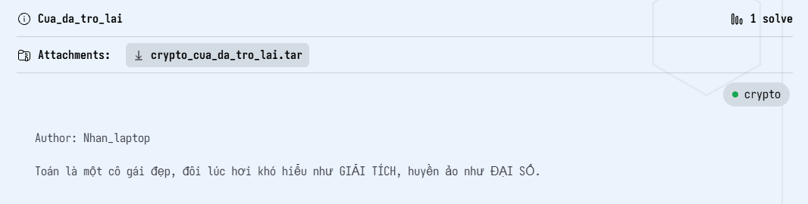
* Đây là bài Crypto thứ 3 mình giải sau cuộc thi. Kể từ ngày thi đến giờ cũng gần 1 tháng, mình mới chuẩn bị đủ kiến thức để chan bài này =)))) Và điều thú vị là bài này ý tưởng giải khá là giống bài [nLCG](https://hackmd.io/@Kran/ryBY4gNYGe) trong cuộc thi
* `Mục tiêu`: Khôi phục khóa `aes_key` để giải mã ciphertext
* `Kỹ thuật`: Đại số tuyến tính, Lý thuyết số

#### 2. Nền tảng cốt lõi

* Đối với các bạn mới định chan bài này thì cần phải biết code Sagemath trước khi giải nhé

* Một số câu lệnh mà các bạn cần hiểu cách nó hoạt động trước khi đọc solve:

* ```python
  A = Matrix(ZZ, row, col,...) #Khai báo ma trận kích thước row*col trên vành số nguyên Z
  R.<x0,x1,...> = PolynomialRing(ZZ) # Khai báo vành đa thức biến x0,x1,... với hệ số nguyên Z[x0,x1,...]
  k = x0^2 + x0 + 1 # Khai báo đa thức x0^2 + x0 + 1
  k.subs(x = 1) # Thay x = 1 vào đa thức k
  a = 100
  a.factor() # Liệt kê list thừa số nguyên tố của a (VD a = 100 => a.factor(), 2^2 * 5^2)
  F = GF(p) # Khai báo trường hữu hạn module p
  e = discrete_log(F(a),F(b)) # Tìm log b của a trên trường hữu hạn 
  ```

* Ma trận suy biến - Nghiệm không tầm thường: [Đọc](https://bhanzu.com/math/algebra/homogeneous-system-of-linear-equations)

#### 3. Phân tích lỗ hỗng/đề bài

* Chúng ta sẽ phân tích từ dưới lên để xem, làm cách nào chúng ta có thể khôi phục được flag:

  * ```python
    aes_key = long_to_bytes(int(e)).rjust(16, b'\x00')
    cipher = AES.new(aes_key, AES.MODE_CBC,iv =aes_key)
    pad_len = 16 - (len(flag) % 16)
    padded_flag = flag + b'\x00' * pad_len
    ciphertext = cipher.encrypt(padded_flag)
    print("ciphertext= ", ciphertext.hex())
    ```

  * Ở phần mã hóa flag, ta có thể thấy rằng flag đã được đệm và được mã hóa bằng thuật toán `AES` bằng key là `aes_key` và vector cũng là `aes_key`

  * `aes_key` được tạo bằng số nguyên `e`

  * ```python
    p = getPrime(128)
    F = GF(p)
    
    coeff = [F(randint(0, p-1)) for _ in range(10)]
    xi = [F(randint(0, p-1)) for _ in range(36*36)]
    
    A = Matrix(GF(p), 36, 36, [custom_random(coeff, xi[i]) for i in range(36*36)])
    e = getPrime(67)
    A_ct = A**e
    
    print("xi = ", [int(x) for x in xi])
    
    print("A = ", [[int(val) for val in row] for row in A.rows()])
    
    print("A_ct = ", [[int(val) for val in row] for row in A_ct.rows()])
    ```

  * Số nguyên `e` là 1 số nguyên tố dài 67 bit và `e` được đề cho dưới dạng `A_ct` bằng `A**e`

* Vậy để giải mã flag, ta cần tìm được số nguyên tố `e` từ 3 dữ kiện `xi`, `A`, `A_ct`

#### 4. Ý tưởng khai thác

* Để có thể khôi phục được `e`, chúng ta có mối quan hệ giữa 2 ma trận `A` và `A_ct`như sau:

* Ta có định thức của ma trận `A` khi ma trận nâng mũ `e` là:

* 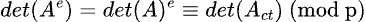

* Đăt `x = det(A) và y = det(A_ct)`, `e` được tính bằng cách là:

* 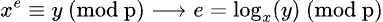

* Vậy để tính được `e`, mục tiêu đầu tiên của ta là phải khôi phục được số nguyên tố  `p`!

* Trong source code của bài, các phần tử của `A` được tạo bằng cách cho các phần tử `xi` và danh sách `ẩn coeiff` qua 1 hàm biến đổi phi tuyến tính:

* ```python
  def custom_random(coeff, x):
      y  = coeff[5] * x**4 + x**3 + x**6 + (x**2 + x + 1)**3 \
          + x**2 + x**7 + x
      z  = y * x**3 + x**4 * y + coeff[7] * y*x  + x**2 + x**3 
      a = coeff[0] + z + y +coeff[1]* x * y + x**3 + x**2
      b =  x**5 + coeff[2]* (x**4 + x**3 + x**2 + x + 1)
      c =  coeff[4]  *   x**7 + x**5 + x**3 + x * coeff[3]
      d = c + b + a + x**6 + coeff[9] * (x**4 + x**2 + 1)
      b = d + c +  coeff[6] *  x**8 + x**7 + x**5 + x**3 + x
      e =  a +  c + coeff[8] * x**9 + x**6 + x**4 + x**2 + 1
      g = x**11 + x ** 44 + 25062006 * x**25 +  1234567 * x**19 + 7654321 * x**7
      h = x ** 36 + x**33 + x**29 + x**23 + x**19 + x**13 + x**7 + x**3
      i = x ** 55 + x**50 + x**45 + x**40 + x**35 + x**30 + x**25 + x**20 + x**15 + x**10 + x**5 + x
      return y + z + a + b + c + d + e + g * a + h + b + c + i
  ```

* Chúng ta sẽ đưa các đa thức này vào vành đa thức để đưa về 1 hàm tổng quát `f với các ẩn số là coeff[i] và x`

> Đây là phần khó khăn nhất của mình bởi vì trước đó mình chưa biết code sagemath =))))), nên không thể đưa nó về hàm tổng quát được

* Nếu coi các ẩn coeff là hệ số của hàm `f`, thì các phần tử của ma trận A (xem rằng các hàng của ma trận A được trải phẳng) ta được viết gói gọn là:
* 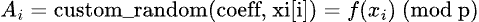
* 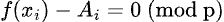
* Và ta có 1 phương trình kiểu này với mỗi phần tử ma trận A, ta sẽ đưa các phương trình này vào hệ phương trình tuyến tính đồng nhất với số lượng phương trình trong hệ bằng với số lượng ẩn coeff cộng thêm 1. Và ta đưa nó vào ma trận sẽ có dạng như sau:
> Từ đoạn này trở đi, ma trận A được hiểu là ma trận của hệ phương trình, không phải ma trận đề cho
* 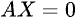
* Bởi vì `-Ai` là hệ số tự do, nên vector X sẽ có dạng:
* 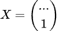
* Bởi vì vector ẩn X có 1 giá trị khác 0, nên X là nghiệm không tầm thường. Nên ma trận A là ma trận suy biến. Và ma trận A được khai báo trên trường hữu hạn module p, nên:
* 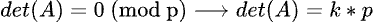
* Và ta đã tìm được mối quan hệ giữa `p` và `det(A)`

#### 5. Exploit chain

* Bước đầu tiên của quá trình giải là nhập các dữ liệu cần thiết `xi`, `A`, `A_ct` , `ciphertext`
* Sau đó khai báo vành đa thức hệ số nguyên gồm các biến `coeff - tổng cộng 10 biến` và biến `x` để đưa các đa thức trong hàm `custom_random` về 1 hàm tổng quát `K` gồm các ẩn số `c0,c1,c2,...,c9, x`. Hàm `K`:
* 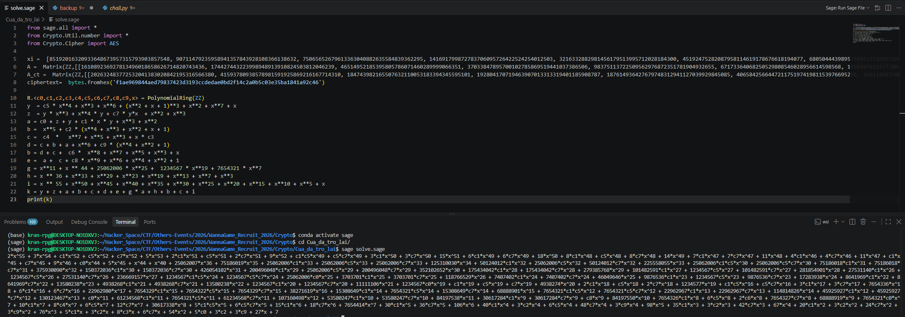

* ```python
  K(x,c0,c1,c2,c3,c4,c5,c6,c7,c8,c9) = 2*x^55 + 3*x^54 + c1*x^52 + c5*x^52 + c7*x^52 + 5*x^53 + 2*c1*x^51 + c5*x^51 + 2*c7*x^51 + 9*x^52 + c1*c5*x^49 + c5*c7*x^49 + 3*c1*x^50 + 3*c7*x^50 + 15*x^51 + 6*c1*x^49 + 6*c7*x^49 + 18*x^50 + 8*c1*x^48 + c5*x^48 + 8*c7*x^48 + 14*x^49 + 7*c1*x^47 + 7*c7*x^47 + 11*x^48 + 4*c1*x^46 + 4*c7*x^46 + 11*x^47 + c1*x^45 + c7*x^45 + 9*x^46 + c0*x^44 + 5*x^45 + x^44 + x^40 + 25062007*x^36 + 75186019*x^35 + 25062006*c1*x^33 + 25062006*c5*x^33 + 25062006*c7*x^33 + 125310030*x^34 + 50124012*c1*x^32 + 25062006*c5*x^32 + 50124012*c7*x^32 + 225558055*x^33 + 25062006*c1*c5*x^30 + 25062006*c5*c7*x^30 + 75186018*c1*x^31 + 75186018*c7*x^31 + 375930090*x^32 + 150372036*c1*x^30 + 150372036*c7*x^30 + 426054102*x^31 + 200496048*c1*x^29 + 25062006*c5*x^29 + 200496048*c7*x^29 + 352102652*x^30 + 175434042*c1*x^28 + 175434042*c7*x^28 + 279385768*x^29 + 101482591*c1*x^27 + 1234567*c5*x^27 + 101482591*c7*x^27 + 281854901*x^28 + 27531140*c1*x^26 + 1234567*c5*x^26 + 27531140*c7*x^26 + 236669157*x^27 + 1234567*c1*c5*x^24 + 1234567*c5*c7*x^24 + 25062006*c0*x^25 + 3703701*c1*x^25 + 3703701*c7*x^25 + 118766529*x^26 + 7407402*c1*x^24 + 7407402*c7*x^24 + 46049646*x^25 + 9876536*c1*x^23 + 1234567*c5*x^23 + 9876536*c7*x^23 + 17283938*x^24 + 8641969*c1*x^22 + 8641969*c7*x^22 + 13580238*x^23 + 4938268*c1*x^21 + 4938268*c7*x^21 + 13580238*x^22 + 1234567*c1*x^20 + 1234567*c7*x^20 + 11111106*x^21 + 1234567*c0*x^19 + c1*x^19 + c5*x^19 + c7*x^19 + 4938274*x^20 + 2*c1*x^18 + c5*x^18 + 2*c7*x^18 + 1234577*x^19 + c1*c5*x^16 + c5*c7*x^16 + 3*c1*x^17 + 3*c7*x^17 + 7654336*x^18 + 6*c1*x^16 + 6*c7*x^16 + 22962980*x^17 + 7654329*c1*x^15 + 7654322*c5*x^15 + 7654329*c7*x^15 + 38271619*x^16 + 15308649*c1*x^14 + 7654321*c5*x^14 + 15308649*c7*x^14 + 68888901*x^15 + 7654321*c1*c5*x^12 + 7654321*c5*c7*x^12 + 22962967*c1*x^13 + 22962967*c7*x^13 + 114814826*x^14 + 45925927*c1*x^12 + 45925927*c7*x^12 + 130123467*x^13 + c0*x^11 + 61234568*c1*x^11 + 7654321*c5*x^11 + 61234568*c7*x^11 + 107160498*x^12 + 53580247*c1*x^10 + 53580247*c7*x^10 + 84197538*x^11 + 30617284*c1*x^9 + 30617284*c7*x^9 + c8*x^9 + 84197550*x^10 + 7654326*c1*x^8 + 6*c5*x^8 + 2*c6*x^8 + 7654327*c7*x^8 + 68888919*x^9 + 7654321*c0*x^7 + 10*c1*x^7 + 8*c4*x^7 + 6*c5*x^7 + 12*c7*x^7 + 30617338*x^8 + 5*c1*c5*x^5 + 6*c5*c7*x^5 + 15*c1*x^6 + 18*c7*x^6 + 7654414*x^7 + 30*c1*x^5 + 36*c7*x^5 + 106*x^6 + 40*c1*x^4 + 3*c2*x^4 + 6*c5*x^4 + 48*c7*x^4 + 3*c9*x^4 + 98*x^5 + 35*c1*x^3 + 3*c2*x^3 + 42*c7*x^3 + 67*x^4 + 20*c1*x^2 + 3*c2*x^2 + 24*c7*x^2 + 3*c9*x^2 + 76*x^3 + 5*c1*x + 3*c2*x + 8*c3*x + 6*c7*x + 54*x^2 + 5*c0 + 3*c2 + 3*c9 + 27*x + 7
  ```

* Vì ta đã biết các giá trị `xi` và các phần tử của ma trận A được tính bằng `K(xi)`. Nên hàm `K` sẽ chỉ còn 10 ẩn coeff. Để dễ dàng xác định được các số hạng trong hàm, ta sẽ thế `x = 1` vào hàm `K`

* 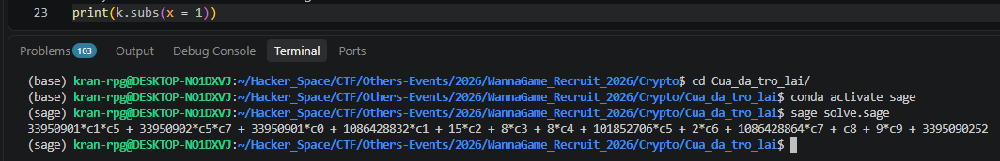

* ```python
  K(c0,...,c9) = 33950901*c1*c5 + 33950902*c5*c7 + 33950901*c0 + 1086428832*c1 + 15*c2 + 8*c3 + 8*c4 + 101852706*c5 + 2*c6 + 1086428864*c7 + c8 + 9*c9 + 3395090252
  ```

* Các ẩn của hàm `K` là: 

* ```python
  [c1*c5, c5*c7, c0, c1, c2, c3, c4, c5, c6, c7, c8, c9, 1] 
  ```

* Ẩn có thành phần phi tuyến tính `c1*c5 và c5*c7`, nên không thể giải hệ phương trình như bình thường, để khắc phục điều này, ta tuyến tính hóa `c1*c5 và c5*c7` thành 2 ẩn mới là `u1 và u2`:

* Vector X sẽ có dạng: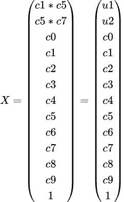

* Độ dài của vector X là 13, ta lập ma trận `M` có độ dài 13 * 13, với mỗi hàng là hệ số tương ứng của các số hạng trong vector X ứng với 1 giá trị `xi` và `Ai`

* Ta tính được `det(M) = k * p`

* Để giảm độ lớn của `k`, ta lập thêm vài ma trận `M` khác nữa để tính định thức, sau đó lấy `gcd` của các định thức ma trận `M` với nhau để thu được `k * p` với `k` đã bị giảm độ nhỏ đi rất nhiều

* Sau đó phân tích thừa số nguyên tố của `k*p` để thu được `p`

* Ta lập trường hữu hạn module `p`, sau đó tìm `e`

* Và cuối cùng là giải mã ciphertext >-<

* Script: [Đọc](solve.sage)

* #### Flag: W1{easy_mathematic}

#### 5. Reference

* Vành đa thức đa biến: [Đọc](https://doc.sagemath.org/html/en/reference/polynomial_rings/sage/rings/polynomial/multi_polynomial_element.html)
* Log trên trường số module: [Đọc](https://doc.sagemath.org/html/en/reference/groups/sage/groups/generic.html#sage.groups.generic.discrete_log)
* Ma trận suy biến - Nghiệm không tầm thường: [Đọc](https://bhanzu.com/math/algebra/homogeneous-system-of-linear-equations)
* Write up bài nLCG của mình: [Đọc](https://hackmd.io/@Kran/ryBY4gNYGe)

