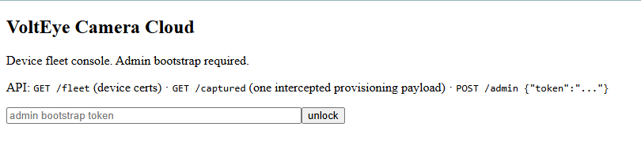
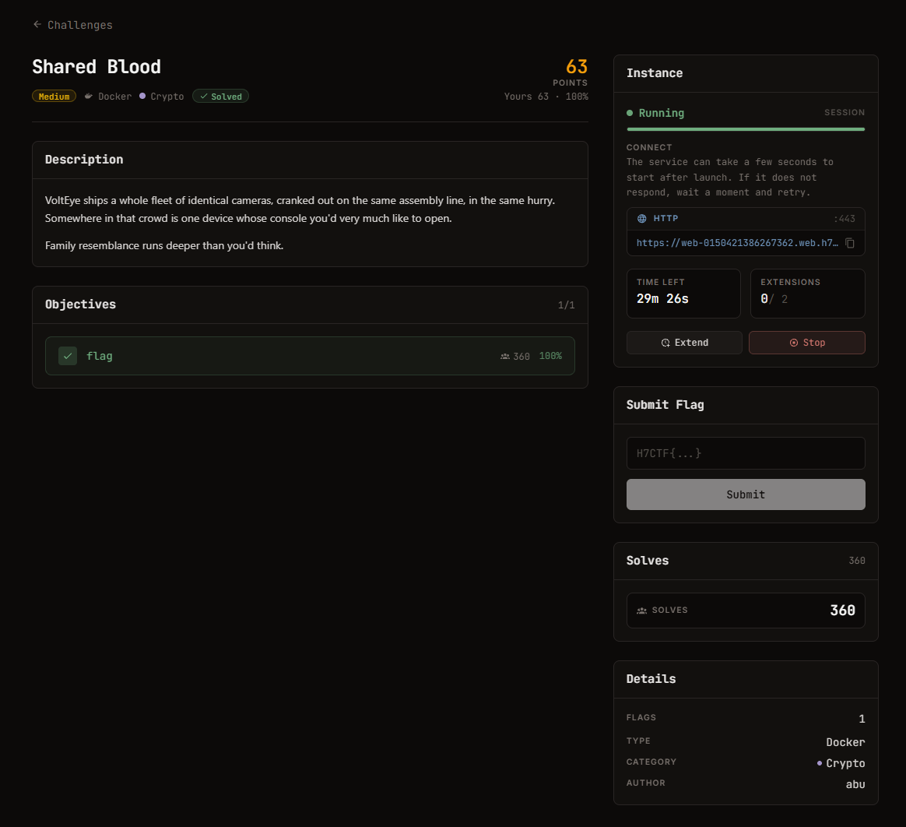
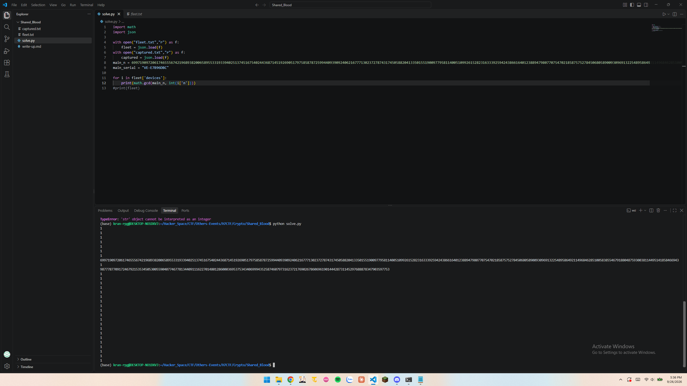

# Shared Blood

#### Mảng: Crypto, Mức độ: Medium

#### 1. Overview

* Đây là 1 bài giải mã RSA, kết hợp thao tác get/post trên web để lấy thông tin
* Mục Tiêu: Tìm token post lên đích đến là /admin để lấy cờ
* Lỗ hỗng: Sử dụng chung thừa số nguyên tố làm lộ thừa số nguyên tố của N
* Kỹ thuật: Dùng GCD để lấy thừa số nguyên tố của N

#### 2. Nền tảng cốt lõi

* Chỉ cần biết nền tảng RSA là đủ để làm bài này
* Biết thêm cách thao tác trên server

#### 3. Phân tích lỗ hổng

* Khi gửi request lên server để lấy fleet và captured ta thu được như sau:
  * [Fleet](fleat.txt): Là 1 file json gồm các serial và N của máy ảnh và e
  * [Captured](captured.txt) : Là 1 file json chứa thông tin của máy ảnh nghi ngờ gồm:
    * "note": "intercepted provisioning payload (RSA/PKCS1v1.5, encrypted to the device cert)"
    * "e": 65537
    * Ciphertext
* Đề đã hint cho ta ngay chính đề bài và lời giới thiệu:
  * ***Shared Blood***
  * ***Family resemblance runs deeper than you'd think.***
  * ***VoltEye ships a whole fleet of identical cameras, cranked out on the same assembly line, in the same hurry. Somewhere in that crowd is one device whose console you'd very much like to open.***
* Thứ giống nhau giữa các thiết bị hoàn toàn là đều có e. Thứ khác là N, nhưng để giải mã được cipher, ta cần biết thừa số nguyên tố của N, vậy thì có vẻ như trong lúc sản suất camera (theo ngữ cảnh của đề bài) thì khả năng có 1 số linh kiện 1 trùng, ý muốn nói ở đây có khả năng có 1 số N nào đó trong lô hàng (fleet) đang dùng chung thừa số nguyên tố với N.
* Khi bước vào kiểm tra thì thật sự là như vậy:
* Đã biết được thừa số nguyên tố, phía sau chỉ là quy trình giải mã RSA

> Lưu ý: trong note của captured có nói **intercepted provisioning payload (RSA/PKCS1v1.5, encrypted to the device cert)** , có nghĩa là token gốc đã bị đệm padding vào ở đầu văn bản, vậy nên sau khi giải mã RSA xong, cần phải loại bỏ padding

#### 4. Exploit chain

* Quy trình: 

  * Gửi get đến server để lấy fleet và captured
  * Trích xuất thông tin và bắt đầu tìm thừa số nguyên tố N của captured
  * Giải mã RSA, loại bỏ padding và lấy được token
  * post lên server file json chứa token đến đích cuối là /admin

* Script: [Đọc](solve.py)

* #### Flag: H7CTF{21399781-f53c-4064-84da-782f668f7349}