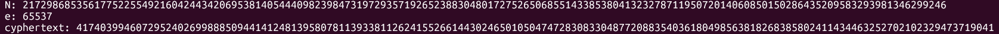

# EVEN RSA CAN BE BROKEN???

#### Mảng: Crypto Mức độ: Dễ

#### 1. Overvỉew

* 1 bài RSA như thế nào mà chúng ta có thể phá vỡ ? =)))))))))))))
* Yêu cầu: Nối đến server nhận N,e,c. Giải mã c để có flag
* Lỗ hỗng: Số N quá dễ phân tích thành thừa số nguyên tố
* Kỹ thuật: Số nguyên tố duy nhất là số chẵn???

#### 2. Nền tảng cốt lõi

* Các bạn chỉ cần có căn bản về thuật toán RSA là đủ

#### 3. Phân tích lỗ hổng

* Hints: 

  * ***How much do we trust randomness?***
  * ***Notice anything interesting about N?***
  * ***Try comparing N across multiple requests***

* Khi đọc source code bài, có 1 đoạn ta cần chú ý:

  ```python
  from sys import exit
  from Crypto.Util.number import bytes_to_long, inverse
  from setup import get_primes
  
  e = 65537
  
  def gen_key(k):
      """
      Generates RSA key with k bits
      """
      p,q = get_primes(k//2)
      N = p*q
      d = inverse(e, (p-1)*(q-1))
  
      return ((N,e), d)
  ```

* Dựa vào hints thứ nhất, chúng ta có thể lờ mờ đoán được hàm `get_primes` được lấy trong setup do bên tác giả tự code có vẻ có vấn đề, bởi vì đơn giản là có những hàm random tốt hơn trong chính thư viện `Crypto.Util.number` đó là hàm `getPrime(k) với k là số bit của số nguyên tố`

* Khi nối netcat đến server, ta thu được bộ ba số N,e,c

* Dựa vào hints số 2 và số 3: Ta xem thử số N

* #### N là 1 số chẵn !!!

* Nếu N là 1 số chẵn thì tích của 2 số nguyên tố, trong đó chắc chắn có số 2!!!

* Đến đây số N đã bị phân tích thừa số nguyên tố, giờ chỉ là việc phá RSA >_<

#### 4 . Exploit chain

* Quy trình viết lệnh python:

  * Nối nc đến server
  * Nhận các số N,e,c
  * tìm q và p bằng cách đặt luôn q là số 2 và p tính bằng cách lấy N chia 2
  * Tìm khóa bí mật d
  * Giải mã cipher

* Script: [Đọc](solve.py)

* #### Flag: academy{tw0_1$_pr!m3207f407f}

  