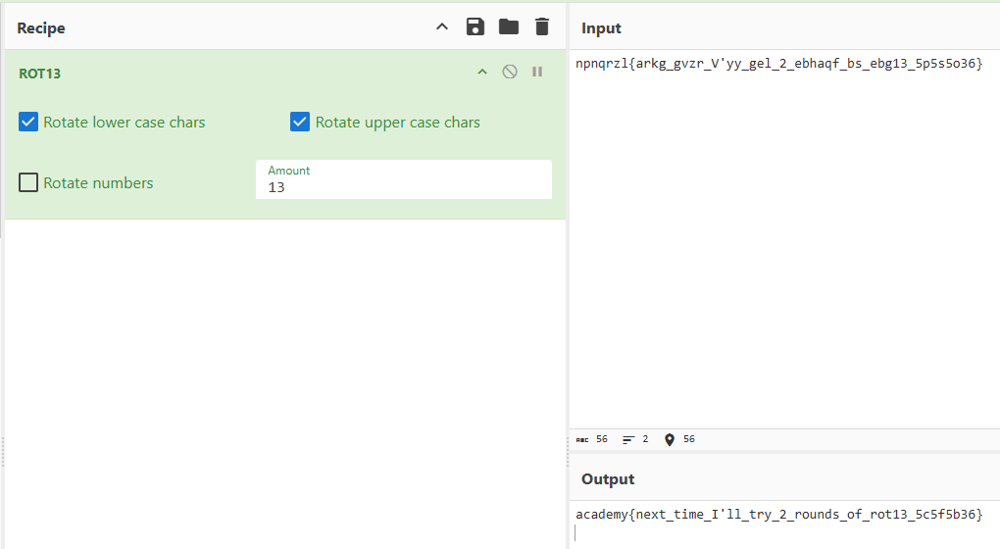

# Mod_26

#### Category: Crypto - Difficult: Easy

#### 1. Overview

* Bài này cho chúng ta những hiểu biết cơ bản về rot13

* `Mục Tiêu`: Giải mã values.txt
* `Kỹ thuật`: rot

#### 2. Nền tảng cốt lõi

* Thật sự bài này là cơ bản nhất rồi, nó thuộc loại kiến thức bậc 0 nên không cần nền tảng giừ để giải

#### 3. Phân tích

* Bài cho ta 1 cái cờ mà thứ tự bảng chữ cái đã bị thay đổi
* Đem lên cyberchef để giải mã hoặc viết script để dịch chuyển các chữ các cho đến khi xuất hiện cờ là được

#### 4. Exploit chain

* Script: [Đọc](solve.py)
* Cyberchef:
* #### Flag: academy{next_time_I'll_try_2_rounds_of_rot13_5c5f5b36}