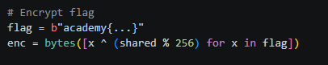

# Shared Secrets

#### Mảng: Crypto Mức độ: Dễ

#### 1. Overvỉew

* Đây là 1 bài cho thấy một bức tường bảo vệ, điểm yếu nhất của nó chính là mắc xích yếu nhất
* Yêu cầu: Cung cấp 1 file Message.txt và encryption.py. Giải mã Ciphertext để lấy được cờ
* Lỗ hổng: Lỗ hổng toán học, toán tử mod
* Kỹ thuật: Brute Force

#### 2. Nền tảng cốt lõi

* Bài này bạn chỉ cần đọc hiểu code python và hiểu được cách mà ciphertext được tạo ra và đảo ngược chúng là được.

#### 3. Phân tích lỗ hổng

* Đọc source code encryption, ta có thể nhận ra thuật toán mã hóa ở đây là Differ-Helman, nhưng tại đoạn mã hóa flag, lại có 1 lỗ hổng khiến cho việc tạo ra số nguyên tố 1024 bit không còn ý nghĩa.

  

* Phép mod đã khiến cho khóa chung mất hết độ lớn vốn có của nó và giá trị chỉ vỗn vẹn nằm trong khoảng : `[0,255]`

* Vậy thì ta sẽ bruteforce hết 256 bytes và xor thử với ciphertext, nếu có phần đầu cờ như `academy{` (PicoCTF bản mới) hoặc `PicoCTF{`(PicoCTF bản cũ) thì sẽ dừng lại và in ra cờ

#### 4. Exploit chain

* Quy trình:
  * Lưu lại biến enc của file message
  * Chạy Brute Force 256 key khác nhau xor với enc

* Script:[Đọc](solve.py)
  
* #### Flag: academy{dh_s3cr3t_e3954beb}

