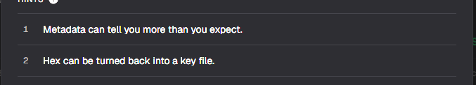
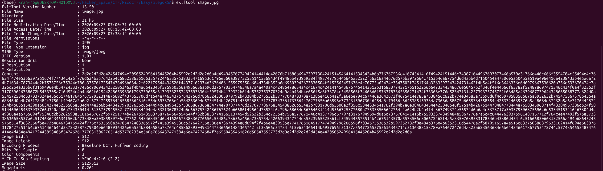
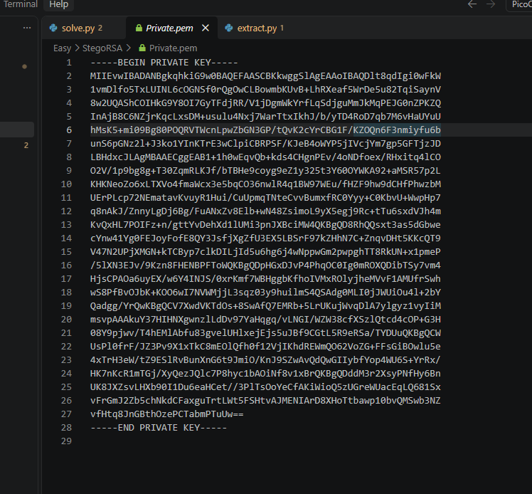

# StegoRSA

### Mảng: Crypto Mức độ: Dễ

#### 1. Overview

* Đây là 1 bài khá là hay, khi mà bài Crypto này được lai 1 chút với Forencis!
* Yêu cầu: Giải mã flag đã bị encrypt
* Lỗ hổng : Để lộ khóa bí mật
* Kỹ thuật: Sử dụng các công cụ Forencis để lấy thông tin khóa giải mã file flag

#### 2. Nền tảng cốt lõi

* Vì đây là 1 bài lai với Forencis nên các bạn cần biết 1 chút về nó:
  * Các bạn cần hiểu cấu trúc của 1 file đa phương tiện (video, ảnh, âm thanh,...), bao gồm các thông tin cơ bản của 1 tệp tin và 1 thông tin siêu dữ liệu của tệp đó
  * Công cụ trích xuất siêu dữ liệu của Forencis: **exiftool của linux**
* Đối với nền tảng kiến thức Crypto, bạn cũng cần biết về cách giải mã RSA và các loại chứng chỉ TLS, ngoài ra các bạn cũng phải biết các chiết xuất thông tin trong các chứng chỉ TLS bằng thư viện `Crypto.PublicKey` 

#### 3. Phân tích

* Hint : 
  * ***Metadata can tell you more than you expect.***
  * ***Hex can be turned back into a key file.***
* Dịch cabin của hint trên: Tôi đang giấu thông tin key trong `Metadata` và Hex có thể quay về lại tệp tin chìa khóa
* Khi trích xuất metadata của tấm ảnh ta thu được 1 dòng dữ liệu rất dài và kỳ lạ trong phần comment:
* Ta nhận ra ngay đây là 1 chuỗi hex và ta cũng nhận ra đậy có thể là 1 file key pem khi mà bắt đầu của chuỗi hex là `2d` chính là kí tự ASCII `-`
* Khi giải mã chuỗi kí tự hex, ta thu được:
* Nắm trong tay file Private key, giờ chỉ là việc giải mã RSA đã có khóa
* Khi giải mã xong flag, ta vẫn chưa nhận được cờ hoàn chỉnh bởi vì cờ đang được đệm thêm padding **(Form RSA PKCS#1 v1.5)**, ta chỉ cần loại bỏ phần padding bắt đầy bằng `\x20` và kết thuc bằng `\x00` là được.

#### 4. Exploit Chain:

* Quy trình giải như sau:

  * Exiftool lên tấm ảnh để thu phần comment
  * Đưa vào file python để giải mã file hex để lấy private key
  * Giải mã RSA, loại bỏ phần padding

* Script: [đọc](solve.py)

* #### Flag: academy{rs4_k3y_1n_1mg_3e14722a}

