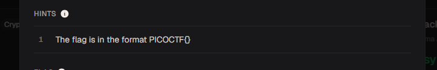
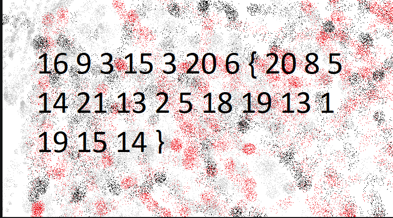

# The Numbers

#### Category: Crypto - Difficult: Easy

#### 1. Overview

* Bài này cho chúng ta những hiểu biết cơ bản về mật mã học thời xưa

* `Mục Tiêu`: Giải mã bức ảnh
* `Kỹ thuật`: thứ tự bảng chữ cái

#### 2. Nền tảng cốt lõi

* Nhận biết các thứ tự bảng chữ các trong alphabet

#### 3. Phân tích

* Hint: 

  * ***The flag is in the format PICOCTF{}***

* Khi nhìn vào hint và kèm với bức ảnh:

  

* Chúng ta nhận ra chữ cái đơn giản nhất là chữ `C` có thứ tự bản chữ cái là đứng vị trí số 3!

#### 4. Exploit chain

* Quy trình:

  * Trích xuất các số trong ảnh 
  * Đổi các số sang chữ cái in hoa theo thứ tự bản chữ cái

* Script: [Đọc](solve.py)

* #### Flag: PICOCTF{THENUMBERSCASON}

