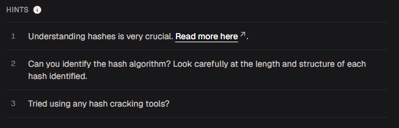
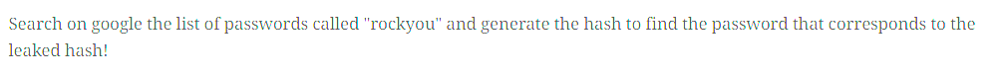
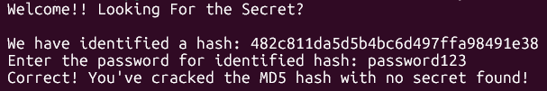
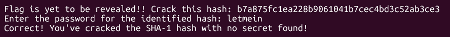
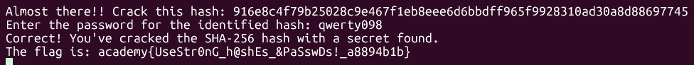

# hashcrack

#### Mảng Crypto Mức độ: Dễ

#### 1.Overview

* Đây là 1 bài thú vị về hash!
* Mục Tiêu: Tìm mật khẩu tương ứng với chữ ký hash của mật khẩu
* Lỗ hổng: Sử dụng mật khẩu quá yếu hoặc quá phổ biến
* Kỹ thuật: Sử dụng john the ripper để thử mọi loại mật khẩu phổ biến có trong rockyou.txt

#### 2. Nền tảng cốt lõi

* Hiểu cách hash hoạt động
* Biết cách phân biệt các loại hash
* Biết cách sử dụng john the ripper

#### 3. Phân tích

* Hints: 
  * ***Understanding hashes is very crucial.[Read more here](https://primer.cylabacademy.org/#_hashing).***
  * ***Can you identify the hash algorithm? Look carefully at the length and structure of each hash identified.***
  * ***Tried using any hash cracking tools?***
* Khi đọc phần thông tin thêm ở hint 1, các bạn cần chú ý hint gợi ý như ảnh: [Đọc](https://primer.cylabacademy.org/#_hashing:~:text=Search%20on%20google%20the%20list%20of%20passwords%20called%20%22rockyou%22%20and%20generate%20the%20hash%20to%20find%20the%20password%20that%20corresponds%20to%20the%20leaked%20hash!) 
* Có 1 list các password phổ biến được gọi là `rockyou` và sinh ra hash để so sánh với hash đã được leak và chúng ta thu được mật khẩu!
* Khi nối đến server bằng netcat, chúng ta được cung cấp 1 đoạn hash và yêu cầu gửi 1 mật khẩu tương ứng với hash đó. Nhưng cần `lưu ý: Có rất nhiều loại hash khác nhau! Một số loại phổ biến như:` [Xem thêm](https://www.ibm.com/docs/en/i/7.4.0?topic=sf-hash-md5-hash-sha1-hash-sha256-hash-sha512)  
  * md5: Dài 32 ký tự
  * sha1: Dài 40 ký tự
  * sha256: Dài 64 kí tự

#### 4. Exploit Chain

* Quy trình:
  * Netcat đến server để lấy hash 
  * Sử dụng john the ripper để bruteforce và thu được password tương ứng
  * Làm hết các lượt cho đến khi nhả cờ
  
* Chi tiết:
  
  * Ở hash đầu tiên, ta thu được hash dài 32 ký tự chính là md5 hash, lưu đoạn hash vào 1 file txt rồi chạy bash john để lấy passwork tương ứng

  * `Password: password123`
  
    ```bash
    john --wordlist=rockyou.txt hashfile.txt --format=RAW-MD5
    ```
  
  * Ở hash thứ 2, ta thu được hash dài 40 kí tự, chính là sha1, tương tự như trên 
  
  * `Password: letmein`
  
    ```bash
    john --wordlist=rockyou.txt hashfile.txt --format=sha1crypt
    ```
  
  * Ở hash thứ , ta thu được hash sha256.
  
  * `Password: qwerty098`
  
    ```bash
    john --wordlist=rockyou.txt hashfile.txt --format=sha256crypt
    ```
  
* #### Flag: academy{UseStr0nG_h@shEs_&PaSswDs!_a8894b1b}

#### 5. Reference

* John The Ripper:[Xem](https://www.youtube.com/watch?v=tJRz9j2REb4)
* Hash : [Đọc](https://www.ibm.com/docs/en/i/7.4.0?topic=sf-hash-md5-hash-sha1-hash-sha256-hash-sha512)
* rockyou: [Tải](https://weakpass.com/wordlists/rockyou.txt)
* CTF primer: [Hints tại đây](https://primer.cylabacademy.org/#_hashing:~:text=Search%20on%20google%20the%20list%20of%20passwords%20called%20%22rockyou%22%20and%20generate%20the%20hash%20to%20find%20the%20password%20that%20corresponds%20to%20the%20leaked%20hash!)