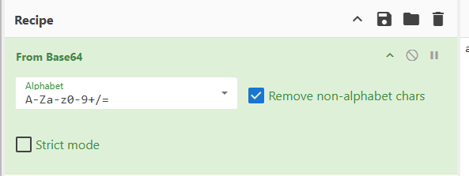
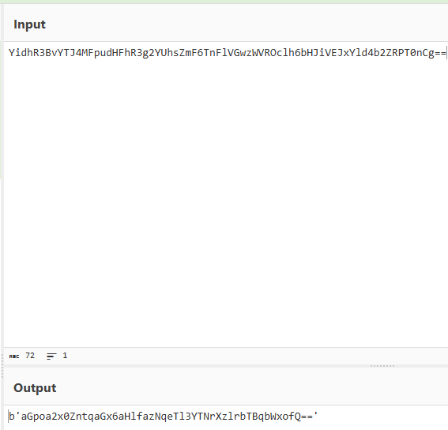
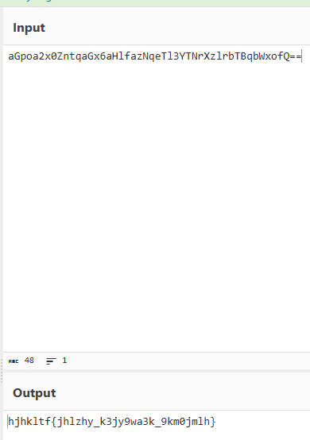
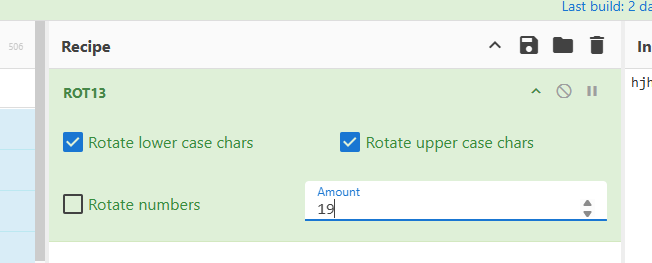
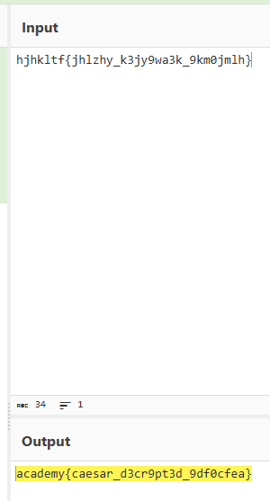

# interencdec

#### Category: Crypto - Difficult: Easy

#### 1. Overview

* `Mục Tiêu`: Giải mã enc_flag
* `Kỹ thuật`: Decode base64

#### 2. Nền tảng cốt lõi

* Biêt sử dụng tool
* Biết cách nhận diện base64

#### 3. Phân tích 

* Khi mở file enc_flag lên, ta có thể thấy chuỗi kết thúc bằng `==` => Đây là chuỗi base64
* Sau khi decode, tiếp tục ta nhận 1 chuỗi base64, ta loại bỏ các phần thừa và tiếp tục decode base64
* Sau khi decode base64 lần 2, ta nhận được một chuỗi có vẻ bị xáo trộn thứ tự bảng chữ cái, ta thay đổi rot để cho cờ lộ diện

#### 4. Exploit chain

* Có 2 cách để giải:

  * Cách 1: Sử dụng script để giải mã:

    * Script: [Đọc](solve.py)

  * Cách 2: Copy enc_flag lên cyberchef để giải mã:

    

    #### Flag:academy{caesar_d3cr9pt3d_9df0cfea}

    

    

    

    

    

    

    

    

    

    