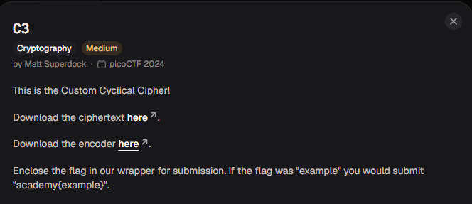
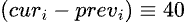
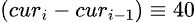
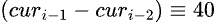
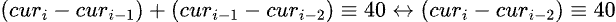

# C3

#### Category: Crypto - Diff: Medium

#### 1. Overview

* 
* `Mục tiêu`: Giải mã ciphertext
* `Kỹ thuât`: Phép truy hồi

#### 2. Nền tảng cốt lõi

* Hiểu biết toán 1 chút là được

#### 3. Ý tưởng khai thác/Exploit chain:

* ##### 3.1.Part 1

* ```python
  import sys
  chars = ""
  from fileinput import input
  for line in input():
    chars += line
  
  lookup1 = "\n \"#()*+/1:=[]abcdefghijklmnopqrstuvwxyz"
  lookup2 = "ABCDEFGHIJKLMNOPQRSTabcdefghijklmnopqrst"
  
  out = ""
  
  prev = 0
  for char in chars:
    cur = lookup1.index(char)
    out += lookup2[(cur - prev) % 40]
    prev = cur
  
  sys.stdout.write(out)
  ```

* Bài này sử dụng trạng thái vị trí của `char` trước đó để mã hóa `char` ở vị trí hiện tại. Vì vậy, muốn giải mã, ta cần phải đi từ đuôi lên ngược lại đầu ciphertext

* Plaintext có các kí tự thuộc list `lookup1` khi mã hóa sẽ ánh xạ sang các kí tự thuộc list `lookup2`

* Để giải mã, ta cần biết được `cur` của plaintext

  * Để tính được `cur` , khi ta lấy vị trí kí tự ciphertext thứ `i` trong list `lookup2`, ta sẽ thu được:
  * 
  * Và `prev` chính là `cur` của kí tự trước đó:
  * 
  * Ta lấy vị trí kí tự ciphertext thứ `i-1`, ta sẽ thu được:
  * 
  * Khi lấy hai vị trí cộng lại, ta sẽ được:
  * 
  * Và khi cộng hết tất cả các vị trị ciphertext trong list `lookup2` lại với nhau từ `i` đến `i = 1`, ta sẽ có:
  * 
  * Và `cur0` chính là `prev = 0` được khai báo ở đoạn đầu của chương trình. Và thế là ta thu được `cur` của ciphertext ở vị trí `i`, ta chỉ cần ánh xạ nó ngược về list `lookup1` là xong.

* ##### 3.2. Part 2

* Sau khi giải mã xong, ta lại thu được đoạn code mới:

* ```py
  chars = ""
  from fileinput import input
  for line in input():
      chars += line
  b = 1 / 1
  
  for i in range(len(chars)):
      if i == b * b * b:
          print chars[i] #prints
          b += 1 / 1
  ```

* Ta chỉ cần viết chính xác như này, chỉnh sửa lại 1 chút là xong. Chi tiết xem trong script

* Script: [Đọc](solve.py)

* # Flag: academy{adlibs}

