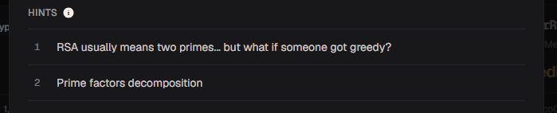
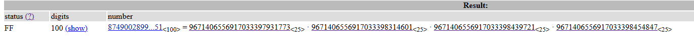

# ClusterRSA

#### Category: Crypto - Diff: Medium

#### 1. Overview

* `Mục tiêu`: Giải mã RSA
* `Lỗ hỗng`: Sử dụng các thừa số nguyên tố nhỏ
* `Kỹ thuât`: Phân tích thừa số nguyên tố và phá giải RSA

#### 2. Nền tảng cốt lõi

* Hiểu biết thuật toán mã hóa bất đối xứng RSA,và cách giải mã RSA

#### 3. Phân tích lỗ hổng

* Hint:

* Mình dựa vào hint, lên trang [factordb](https://factordb.com) để phân tích số n

* 

#### 4. Exploit chain

* Quy trình: 

  * Phân tích thừa số nguyên tố của n
  * Giải mã RSA

* Script: [Đọc](solve.sage)

* #### Flag: academy{mul71_rsa_85395d1f}