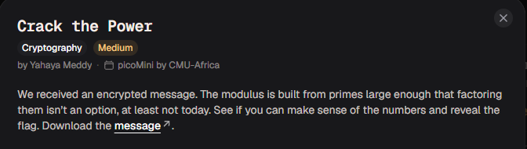
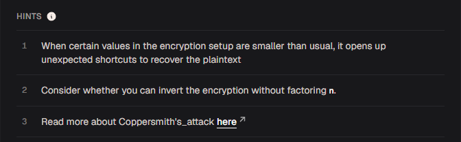

# Crack the Power

#### Category: Crypto - Diff: Medium

#### 1. Overview

* 
* `Mục tiêu`: Phá giải RSA
* `Lỗ hổng`: Sử dụng số e nhỏ và không đệm plaintext

#### 2. Nền tảng cốt lõi

* Biết cách hoạt động của thuật toán RSA

#### 3. Phân tích lỗ hỗng

* 
* Dựa vào hint thứ nhất của bài, ta có thể hiểu rằng ý rằng tác giả đang muốn gợi ý chúng ta về việc plaintext là 1 plaintext nhỏ - có nghĩa là chưa có đệm.
* Bài cung cấp cho ta 3 số N,e,c và điều đặt biệt là e ~~khá là nhỏ~~ đó là `20`

#### 4. Ý tưởng khai thác.

* Bởi vì `e` là 1 số khá nhỏ và có thể đúng như hint của đề bài rằng là flag chưa có đệm thêm kí tự. Khi chuyển flag thành dạng số thì khi không đệm, giá trị của flag cũng khá nhỏ, nên khi flag mũ e lên thì sẽ có 2 trường hợp xảy ra:
  * TH1:`m^e < N`: Trường hợp đơn giản chỉ là `c = m^e`, ta có thể giải nó ngay lập tức bằng cách chia căn cho `e`
  * TH2:`m^e >= N`: Đối với trường hợp này, ta cần biến đổi biểu thức đồng dư `m^e = c (mod N)` thành `m^e = c + k*N` với k là hệ số nhân của N. Trong trường hợp `e` và `m` nhỏ thì số lần chia cho N (chính là giá trị của k) sẽ khá là ít, đủ nhỏ để chúng ta thử mọi số hệ số k để lấy được giá trị `m`

#### 5. Exploit chain

* Quy trình:

  * Trích xuất thông tin N,e,c
  * Chạy vòng lặp tăng giá trị `k` cho đến khi nhận được cờ

* Script: [Đọc](solve.py)

* Sau khi chạy script, ta đã giải mã nó khi `k = 0` (TH1)

* #### Flag: academy{t1ny_e_25f80100}

#### 7. Reference

* Coppersmith's attack: [Đọc](https://en.wikipedia.org/wiki/Coppersmith's_attack)