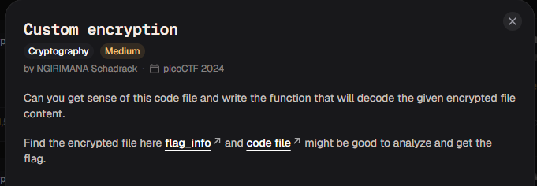

# Custom encryption

#### Category: Crypto - Diff: Medium

#### 1. Overview

* 
* `Mục tiêu`: Viết code decrypt cipher để lấy flag

#### 2. Nền tảng cốt lõi

* Đọc hiểu code python
* Hiểu tính chất phép xor

#### 3. Phân tích lỗ hổng

* ```python
  def test(plain_text, text_key):
      p = 97
      g = 31
      if not is_prime(p) and not is_prime(g):
          print("Enter prime numbers")
          return
      a = randint(p-10, p)
      b = randint(g-10, g)
      print(f"a = {a}")
      print(f"b = {b}")
      u = generator(g, a, p)
      v = generator(g, b, p)
      key = generator(v, a, p)
      b_key = generator(u, b, p)
      shared_key = None
      if key == b_key:
          shared_key = key
      else:
          print("Invalid key")
          return
      semi_cipher = dynamic_xor_encrypt(plain_text, text_key)
      cipher = encrypt(semi_cipher, shared_key)
      print(f'cipher is: {cipher}')
  ```

* Đề cung cấp cho ta chuỗi số cipher đã được mã hóa từ flag và 2 số a,b

* Điều quan trọng là 2 số a,b chính là cấu tạo của khóa chung đã encrypt flag ở bước cuối cùng, vậy nên ta có thể khôi phục lại khóa chung này

* Tiếp theo trong source cũng đã cung cấp cho ta đoạn text_key làm đầu vào của hàm `dynamic_xor_encrypt` đó là `trudeau`

#### 4. Ý tưởng khai thác

* Ta sẽ khôi phục lại khóa và viết các hàm đảo ngược của `encrypt` và `dynamic_xor_encrypt`

* Đối với hàm `dynamic_xor_encrypt`, hàm này đảo ngược chính nó, thế nên ta hoàn toàn có thể copy+paste để tái sử dụng hàm này.

* Đối với hàm `encrypt`:

  * ```python
    def encrypt(plaintext, key):
        cipher = []
        for char in plaintext:
            cipher.append(((ord(char) * key*311)))
        return cipher
    ```

  * Hàm lấy mã ASCII của các kí tự trong `plaintext * key * 311 = c`, để đảo ngược, ta chỉ cần lấy `c / (key * 311)` và lấy lại kí tự ASCII là xong

#### 5. Exploit chain

* Quy trình:

  * Nhập các số a,b và list số cipher
  * Viết hàm đảo ngược các hàm mã hóa
  * Giải mã

* Script: [Đọc](solve.py)

* #### Flag: academy{custom_d2cr0pt6d_5826e4ee}