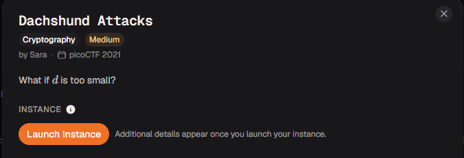

# Dachshund Attacks

#### Category: Crypto - Diff: Medium

#### 1. Overview

* 
* `Mục tiêu`: Phá RSA khi d nhỏ
* `Lỗ hỗng`: d nhỏ =)))
* `Kỹ thuật`: wiener attack

#### 2. Nền tảng cốt lõi

* Hiểu biết và phương thức tấn công wiener (Các bạn nên xem write-up bài `Small Trouble` của mình trước khi giải. [Đọc](../Small_Trouble/write-up.md))

#### 3. Phân tích lỗ hỗng

* Đây là bài kinh điển của tấn công vào lỗ hỗng RSA khi giá trị khóa bí mật d nhỏ

#### 4. Ý tưởng khai thác

* Vì `d` quá nhỏ nên mình sẽ sử dụng phương thức tấn công wiener để tấn công.

#### 5. Exploit chain

* Quy trình:
  * Netcat đến server, lấy các giá trị N,e,ciphertext
  * Tấn công wiener
  * Giải mã ciphertext
* Script: [Đọc](solve.sage)
* #### Flag: academy{proving_wiener_2ca14ab}