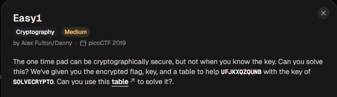
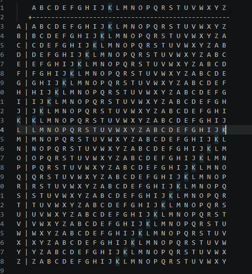

# Easy1

#### Category: Crypto - Diff: Medium

#### 1. Overview

* 
* Đây cơ bản là 1 bài mã hóa caesar cổ điển =)))
* `Mục tiêu`: Giải mã ciphertext
* `Kỹ thuật`: Giải mã Caesar

#### 2. Nền tảng cốt lõi

* Hiểu cách mã hóa caesar hoạt động

#### 3. Phân tích lỗ hỗng

* Đề cung cấp cho ta 
  * Key : SOLVECRYPTO
  * Ciphertext : UFJKXQZQUNB

#### 4. Ý tưởng khai thác

* 
* Nếu xem các kí tự là 1 con số thì ta hiểu rằng `A = 0, B = 1, C =2, D = 3,..., Z = 25`
* Ciphertext là kết quả của quá trình mã hóa flag từ key theo quá trình mã hóa caesar, để giải mã ta chỉ cần đảo ngược quá trình nhảy của kí tự

#### 5. Exploit chain

* Quy trình:
  * Viết hàm ngược của mã hóa flag
  * Giải mã
* Script: [Đọc](solve.py)
* #### Flag: academy{CRYPTOISFUN}