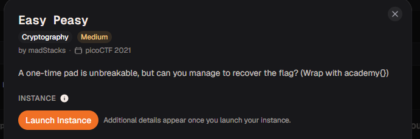
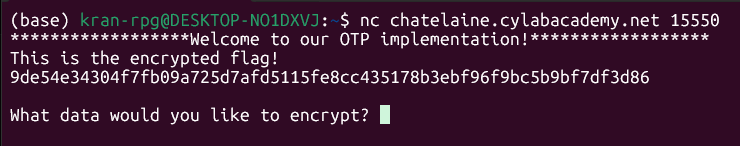

# Easy Peasy

#### Category: Crypto - Diff: Medium

#### 1. Overview

* 
* `Mục tiêu`: Khôi phục key để khôi phục cờ

#### 2. Nền tảng cốt lõi

* Đọc hiểu luồng code python
* Hiểu phép xor và module

#### 3. Phân tích lỗ hỗng

* ```python
  print("******************Welcome to our OTP implementation!******************")
  c = startup(0)
  while c >= 0:
  	c = encrypt(c)
  ```

* Khởi đầu của chương trình là in ra banner, sau đó chạy hàm `startup(0)` và bắt đầu chạy `c = encrypt(c)`

* Đối với hàm `startup(0)`, code khá dài nên mình sẽ tóm tắt chức năng của hàm

  * ```python
    KEY_FILE = "key"
    KEY_LEN = 50000
    FLAG_FILE = "flag"
    def startup(key_location):
    	flag = open(FLAG_FILE).read()
    	kf = open(KEY_FILE, "rb").read()
    
    	start = key_location
    	stop = key_location + len(flag)
    
    	key = kf[start:stop]
    	key_location = stop
    
    	result = list(map(lambda p, k: "{:02x}".format(ord(p) ^ k), flag, key))
    	print("This is the encrypted flag!\n{}\n".format("".join(result)))
    
    	return key_location
    ```

  * Chìa khóa có độ dài là `50000`
  * Lấy chìa khóa bằng độ dài với flag
  * Flag mã hóa bằng phép xor với key, in dưới dạng hex
  * Cập nhập lại vị trí `key_location`

* Với độ dài cờ đã cho:

* 

* Ciphertext dài 64 kí tự, khi chuyển từ hex sang bytes, ciphertext dài `32` kí tự tương ứng với độ dài của key

* Nên giá trị khởi tạo của `c = startup(0)` sẽ bằng `32`

* Đối với hàm `encrypt(c)`

  * ```python
    def encrypt(key_location):
    	ui = input("What data would you like to encrypt? ").rstrip()
    	if len(ui) == 0 or len(ui) > KEY_LEN:
    		return -1
    
    	start = key_location
    	stop = key_location + len(ui)
    
    	kf = open(KEY_FILE, "rb").read()
    
    	if stop >= KEY_LEN:
    		stop = stop % KEY_LEN
    		key = kf[start:] + kf[:stop]
    	else:
    		key = kf[start:stop]
    	key_location = stop
    
    	result = list(map(lambda p, k: "{:02x}".format(ord(p) ^ k), ui, key))
    
    	print("Here ya go!\n{}\n".format("".join(result)))
    
    	return key_location
    ```

  * Hàm tiếp tục tại ví trí `key` tại `key_location`

  * Mã hóa đoạn text ta gửi lên server

  * Khi mà giá trị đối số `c` hay giá trị `key_location` lớn hơn độ dài khóa. `key_lotaion` sẽ bắt đầu lại từ đầu `key`

#### 4. Ý tưởng khai thác

* Mục tiêu để ta có thể giài mã được ciphertext là đoạn key được sử dụng xor với flag
* Như phân tích ở trên, ta biết được vị trí của key là từ kí tự thứ 1 - 32
* Độ dài cả file key là `50000`, khi `key_location` lớn hơn `50000` thì sẽ quay trở lại đầu key để tiếp tục tạo khóa
* Ta chỉ cần gửi payload lên server chuỗi kí tự cố định độ dài `50000`, rồi lấy 64 kí tự hex cuối của kết quả server trả về là ta đã lấy được key

#### 5. Exploit chain

* Quy trình:

  * Gửi payload gồm các số 0 có độ dài là `50000`
  * Lấy 64 kí tự cuối của kết quả chuyển qua bytes rồi chuyển qua số nguyên
  * Key sẽ được khôi phục bằng cách lấy từng kí tự xor với kí tự số 0
  * Giải mã ciphertext

* Script: [Đọc](solve.py)

* #### Flag: academy{0d4de341f38aaded7ff175e7ff475d86}

