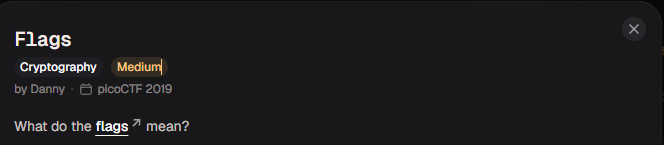
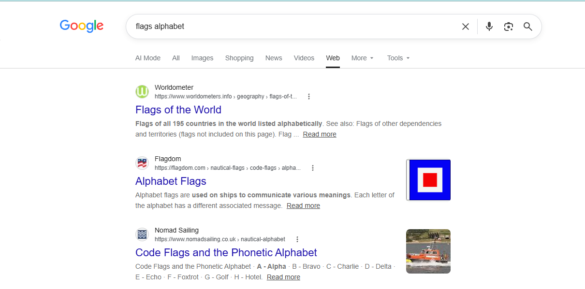
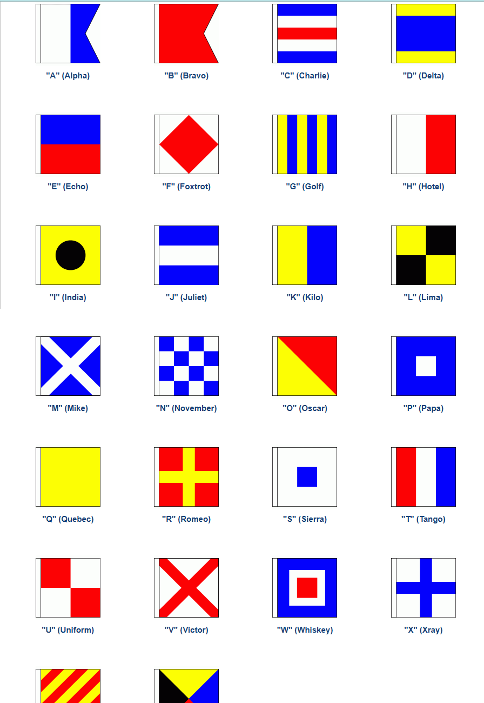
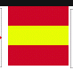
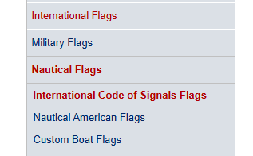
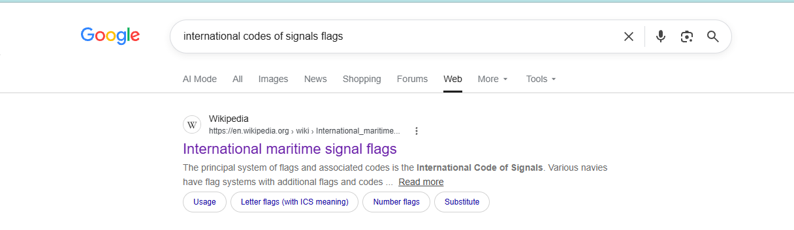
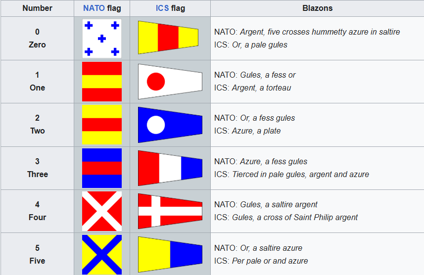

# Flags

#### Category: Crypto - Diff: Medium

#### 1. Overview

* 
* Bài này thì chúng ta sẽ giải cờ bằng cờ :dancer:
* `Mục tiêu`: Giải mã bức ảnh `flags`

#### 2. Nền tảng cốt lõi

* International codes of signals flags: [Đọc](https://en.wikipedia.org/wiki/International_maritime_signal_flags)

#### 3. Phân tích/Exploit chain

* Đề cho ta 1 tấm ảnh chứa các cờ khác nhau:

* 

* Chúng ta dễ dàng nhận ra 6 cờ đầu là `PICOCTF`, nếu đối chiếu thêm trong dấu `{}` thì chúng ta còn biết thêm `{F????????T?FF}`

* Mình cứ nghĩ những flags có khi được tượng hình cho các chữ cái +)))), mình thử thay lá cờ X bằng chữ X, lá cờ có dạng giống chữ K, nhưng cách này không khả thi thì cờ mình giải ra là 1 đoạn nội dung vô nghĩa

* Khi mình search thử `flags alphabet` thì mình có nhận được cái này:

* 

* Mình click vào trang Flagdom để xem thử được bảng này:

* 

* Mình nghĩ rằng là bài này đến đây là hết nhưng không, lúc mình đối chiếu với các cờ để giải mã thì mình thiếu 2 lá cờ chưa biết là:

* 

* Lúc này cờ đang có dạng `PICOCTF{F?LAG?AND?TUFF}` nên mình mạnh dạn đoán cờ đầu tiên là chữ `L` và cờ dấu X là kí tự `_` =))))

* Nhưng cờ vẫn sai, mình có thử thay `_` thành dấu cách, thay thành chữ S vì nó cũng có nghĩa nhưng không thành

* MÌnh thấy mục hiện tại của trang web là 

* `International code of signals flags`

* Mình thử tra trang web khác thì nhận được trang wikipedia ở đầu trang =))

* 

* Và bùm 

* #### Flag: PICOCTF{F1AG5AND5TUFF}