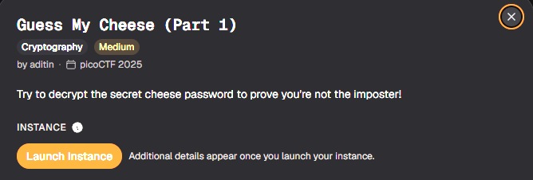
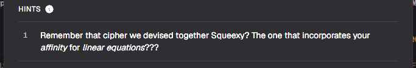
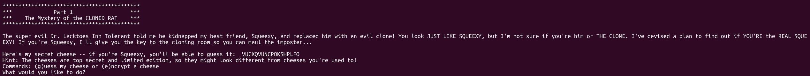

# Guess My Cheese (Part 1)

#### Category:Crypto - Diff: Medium

#### 1. Overview

* 
* Đây là bài đầu tiên mình giải mã ciphertext được mã hóa bằng mã hóa affine :v
* `Mục tiêu`: Giải mã cheese secret để lấy được cờ
* `Lỗ hổng`: Lộ oracle

#### 2. Nền tảng cốt lõi

* Mã hóa affine: [Đọc](https://vi.wikipedia.org/wiki/M%E1%BA%ADt_m%C3%A3_Affine)
* Hiểu 1 cách đơn giản, kí tự sẽ được đưa về giá trị chính là thứ tự của nó trong bảng chữ cái `(A = 0,B = 1,C = 2,D = 3,...)` rồi được đưa vào hàm mã hóa `P(x) = a*x + b mod 26` với `x` là giá trị của chữ cái đó

#### 3. Phân tích lỗ hổng

* Hint: 
* Khi netcat đến server, ta được cho 1 cheese secret đã được mã hóa và ta có 3 cơ hội để (g)uess hoặc (e)crypt.
* 
* Mình nhận ra đây là 1 dạng attack vào oracle
* Dựa vào hint của bài, mình seach được ngay thông tin về `mã hóa affine`

#### 4. Ý tưởng khai thác

* Chúng ta sẽ gửi 1 plaintext - 1 tên cheese lên server để nhận được ciphertext, sao đó sử dụng đại số tuyến tính để tìm nghiệm `a,b` trong phương trình tuyến tính bậc nhất mã hóa affine.

#### 5. Exploit chain

* Quy trình:

  * Gửi plaintext, lấy về ciphertext
  * Sử dụng đại số tuyến tính trên vành module 26 để giải tìm nghiệm `a,b`
  * Giải mã ngược cheese secret
  * Gửi cheese lên server

* Sctipt: [Đọc](solve.sage)

* #### Flag: academy{ChEeSy0b861459}

#### 6. Reference

* Đại số tuyên tính trên sagemath: [Đọc](https://doc.sagemath.org/html/en/tutorial/tour_linalg.html)
* Alphabet: [Đọc](https://en.wikipedia.org/wiki/File:Abecedarium_latinum_clasicum.svg)
* Mật mã học: [Đọc](https://vi.wikipedia.org/wiki/M%E1%BA%ADt_m%C3%A3_Affine)

