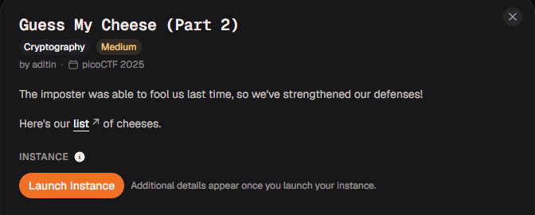
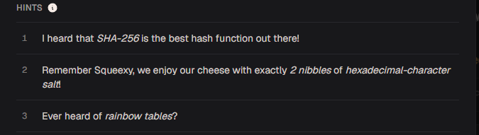
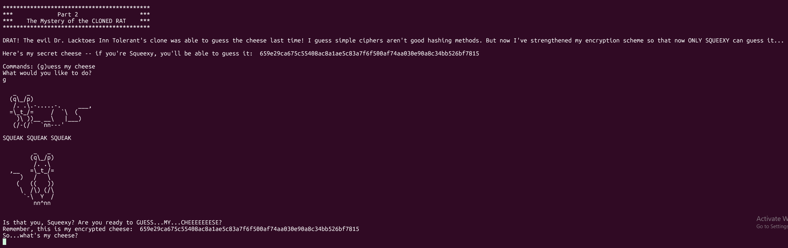
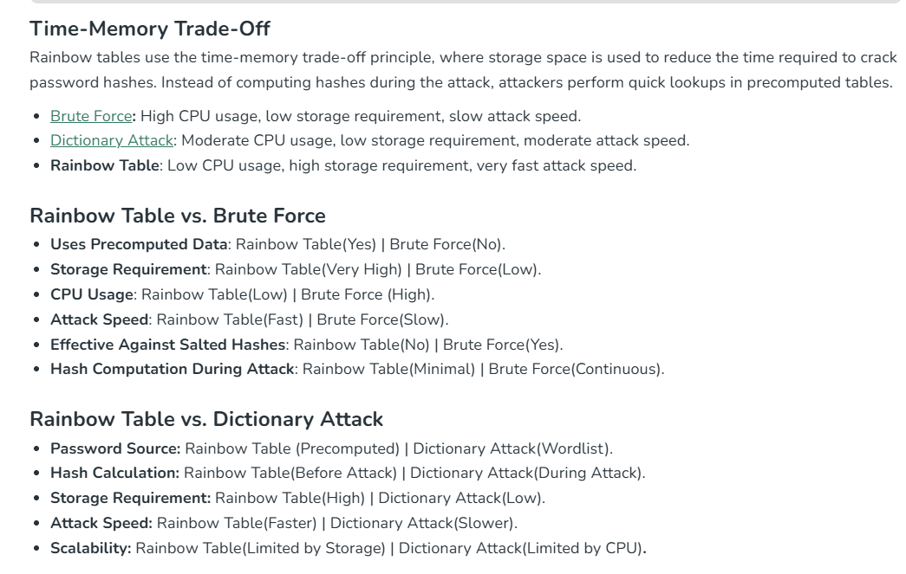

# Guess My Cheese (Part 2)

#### Category: Crypto - Diff: Medium

#### 1. Overview

* 
* Đây là 1 bài mà mình phải thật sự rất bất lực khi mà không hiểu được đầu vào hàm băm của server =((((
* `Mục tiêu`: Đoán tên phô mai (cheese) và muối (2 kí tự hex) có chuỗi băm sha256 giống với chuỗi băm của server cho
* `Kỹ thuật`: Băm các loại phô mai trong list kèm với muối so sánh với chuỗi băm mà server cho

#### 2. Nền tảng cốt lõi

* Biết và hiểu được ý nghĩa các loại tấn công chuỗi băm (Rainbow table, Dictionary,...)

#### 3. Phân tích lỗ hổng

* Hint:

* Khi netcat đến server, ta sẽ được server nhả cho một chuỗi băm và yêu cầu chúng ta đoán loại phô mai có chuỗi băm như thế:

  * 

* Dựa vào hint thứ 1, ta có thể biết được rằng, loại hàm băm được sử dụng là hàm băm sha256

* > Thật sự cũng không cần hint thứ 1, chỉ cần bạn đếm độ dài của chuỗi băm là bạn có thể biết được loại hàm băm được sử dụng
  >
  > Xem thêm bài hashcrack: [Đọc](../../Easy/hashcrack/write-up.md)

* Dựa vào hint thứ 2, trước khi phô mai đưa được vào hàm băm, đã được bên server thêm muối vào phô mai.

* Và cũng dựa vào hint 3, ta được tác giả hint về rainbow tables, và mình tìm hiểu về nó thì biết được đặc tính của tấn công bằng rainbow tables

* 

* Và mình biết đến khái niệm ***Effective Against Salted Hashe***

* Khi tìm hiểu sâu hơn thì mình biết được 1 số cách salt được thêm vào password trước khi băm

#### 4. Ý tưởng khai thác

* Khi nắm được rất nhiều thông tin từ hint, mình đã nghĩ rằng, phương pháp tốt nhất là bruteforce. 
* Với danh sách các phô mai đã biết, với đó là `salt` là 2 kí tự hex. Mình nghĩ được có 3 trường hợp kí tự hex sẽ được thêm vào phô mai bằng các dạng:
  * Raw bytes
  * Kí tự in hoa
  * Kí tự in thường
* Đối với phô mai, trước khi mà mình liệt kê thêm trường hợp này, mình đã thử đi thử lại rất nhiều cách khác nhau nhưng vẫn không giải được bài này, sau đó mình nhớ lại bài này ở part 1, dù mình gửi lên server chữ in hoa hay in thường thì server nhả ra đều là in hoa. Vì vậy mình đã nghĩ có khả năng server sẽ định dạng lại phô mai trước khi đưa vào hàm băm. Mình thêm 2 trường hợp nữa là:
  * Cheese in hoa
  * Cheese in thường

#### 5. Exploit chain

* Quy trình:

  * Kết nối netcat server
  * Lấy chuỗi băm
  * Tính các chuỗi băm tất cả các trường hợp có thể xảy ra gồm:
    * Có 3 cách biểu diễn salt `(raw bytes, 2 kí tự hex thường, 2 kí tự hex hoa)`
    * Có 2 cách để thêm salt vào cheese `(thêm vào đầu cheese, thêm vào cuối cheese)`
    * Có 3 cách để biểu diễn cheese `(cheese in hoa trước khi băm, in thường, giữ nguyên)`
  * So sánh với chuỗi băm cần đoán

* Script : [Đọc](solve.py)

* #### Flag: academy{cHeEsYf43fe6b8}

#### 6. Reference

* Rainbow tables vs ... : [Đọc](https://www.geeksforgeeks.org/ethical-hacking/rainbow-table-attack/)

