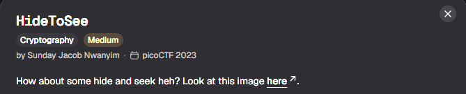
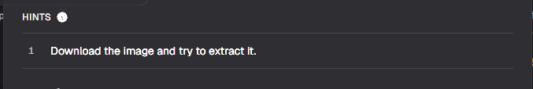
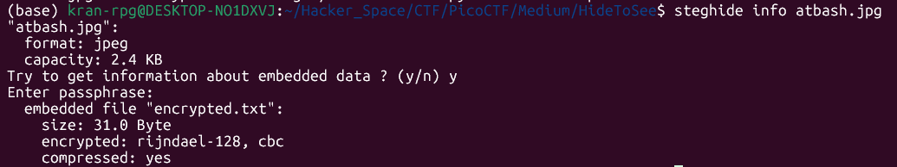

# HideToSee

#### Category: Crypto - Diff: Medium

#### 1. Overview

* 

* Mặc dù đây là bài thuộc mảng crypto, nhưng có vẻ, nó có lai 1 chút với stereography. Để có thể giải thì chúng ta cần biết 1 số công cụ của mảng này.
* `Mục tiêu`: Tìm kiếm thông tin ẩn trong file ảnh
* `Kỹ thuật`: steghide

#### 2. Nền tảng cốt lõi

* Các bạn cần biết lệnh linux này trước khi giải: steghide. [Chi tiết](https://steghide.com/)
* Biết cách giải mã atbash cipher

#### 3. Phân tích lỗ hỗng

* Hint: 

* Đề cho ta 1 hint duy nhất là `Tải ảnh và thử chiết xuất nó`

* Khi mình tìm hiểu cách `"chiết xuất"` ảnh thì mình đã biết 1 công cụ thường được sử dụng để giấu tin hay là chiết xuất thông tin ẩn trong các file thì đó là công cụ ` steghide`

* > Công cụ này rất phổ biến trong việc giải mã thông tin ẩn trong mảng stereography

* Khi chiết xuất thông tin của file ảnh thì mình được như sau:

* 

* Trong đó là file text chứa cờ đã bị mã hóa atbash, tới lúc này chỉ cần giải mã

  * Các bạn có thể sử dụng cyberchef để giải hoặc là sử dụng python để giải

#### 4. Exploit chain

* Quy trình:

  * Chiết xuất thông tin ẩn trong file ảnh
  * Giải mã

* Script: [Đọc](solve.py)

* #### Flag: academy{atbash_crack_aa003f7a}