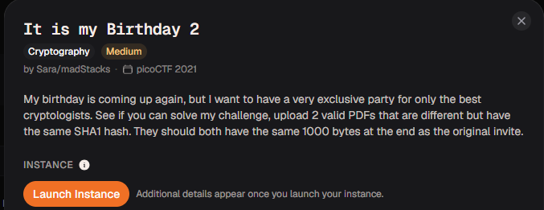
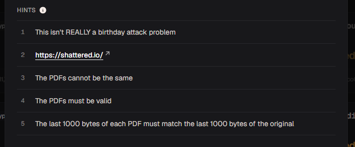
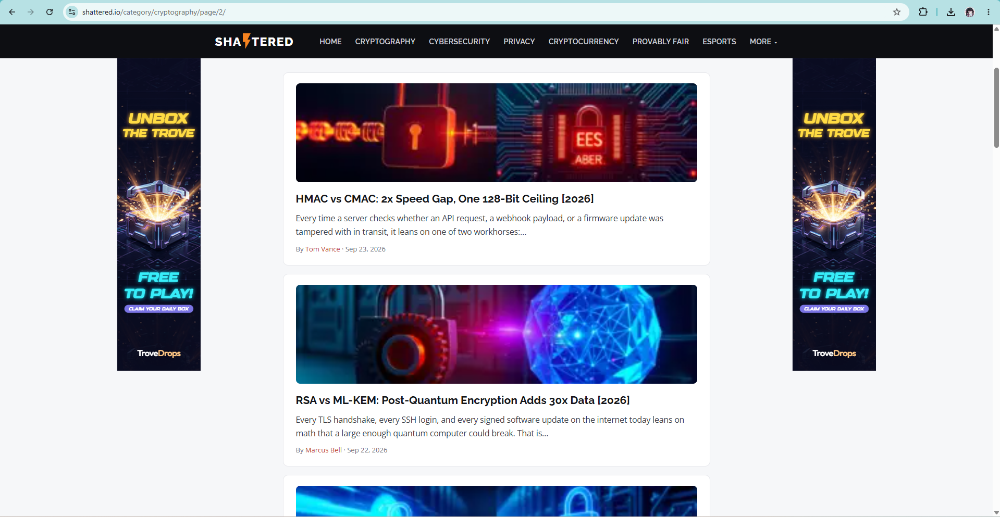
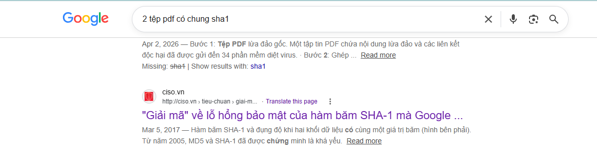
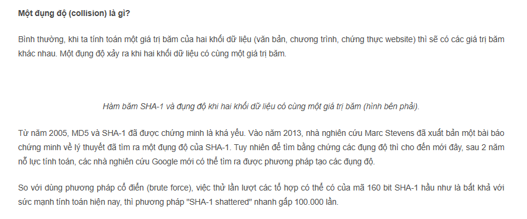
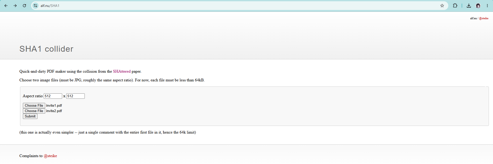
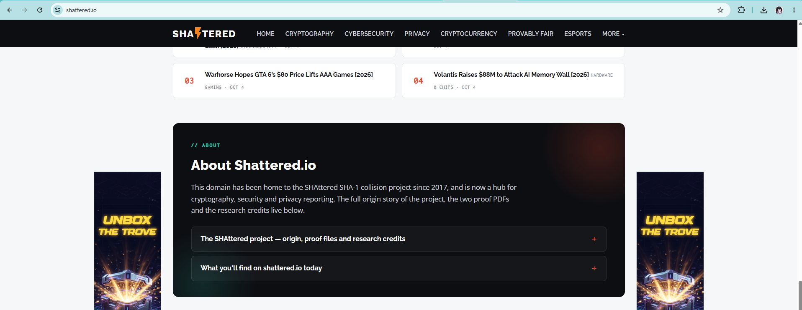
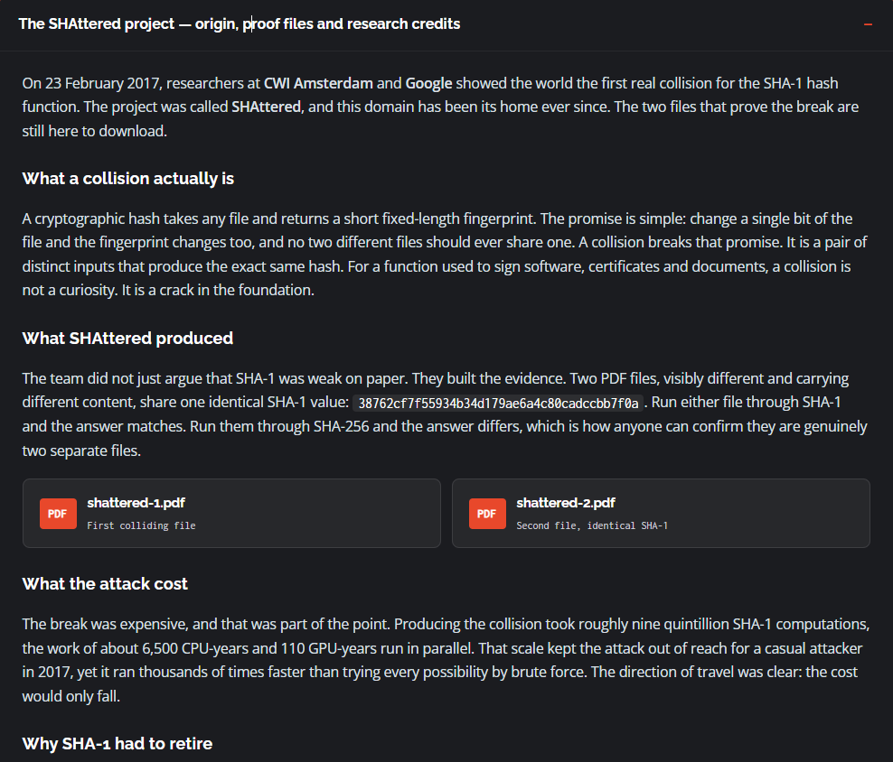
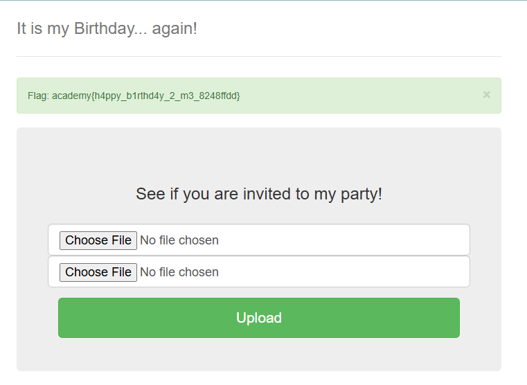

# It is my Birthday 2

#### Category: Crypto - Diff: Medium

#### 1. Overview

* 

* Bài này là 1 trong những bài khiến mình mở mang thông tin bảo mật ngày nay nhất =)))). Nó thay đổi suy nghĩ của mình về việc không thể làm giả chữ kí số bằng hash với 2 nội dung khác nhau, nhưng với các hàm băm yếu như `md5` và `sha1`. Chúng ta hoàn toàn có thể làm giả nó và yeah. 2 file khác nhau nhưng có chung 1 hash
* `Mục tiêu`: Gửi lên 2 file thiệp mời sinh nhật khác nhau nhưng có chung 1 mã băm để lấy cờ
* `Lỗ hỗng`: SHAttered SHA-1 Collision
* `Kỹ thuật`: Nối 2 file pdf có chung hash, khác nội dung với thiệp mời để tạo ra 2 thiệp mời khác nội dung (về mặt nhị phân) nhưng có chung hash

#### 2. Nền tảng cốt lõi

* Biết các chức năng cốt lõi của các hàm băm trong chữ kí số, xác thực danh tính
* Lỗ hỗng bảo mật SHAttered SHA-1 Collision: [Chi tiết](https://shattered.io/sha1-collision/)

#### 3. Phân tích lỗ hỗng

* Hints: 
* Hiện tại, đây là 1 trong những bài Medium ít lượt giải nhất trên `picoCTF` chỉ hơn lượt giải bài `It's Not My Fault 2`
* Khi click vào hint thứ 2, nó dẫn mình đến trang web mà mình thật sự không biết là nó đang muốn nói với mình cái gì, mình có thử lướt xem thử thì chủ yếu là các bài báo bảo mật crypto ngày nay!
* 
* Sau đó mình có thử search trên google: `"2 tệp pdf có chung sha1"` thì phát hiện ra 1 bài báo của việt nam nói đến:
* 
* Khi đọc qua thì có 1 thông tin quan trọng để giải bài này:
* 
* Và nó có dẫn mình đến trang web:
* 
* Và tiếp tục nó lại dẫn mình về trang web SHAtered =))))))))))), nhưng lần này khác với lần trước, khi lướt xuống cuối trang thì mình có phát hiện 1 đoạn thông tin giới thiệu của trang web:
* 
* Khi đọc bản giới thiệu trang web mình đã phát hiện ra thông tin mình cần:
* 
* Mình đã tìm ra 2 file pdf khác nội dung nhưng có chung 1 hash sha1!
* Lỗ hỗng đó có tên là: `SHAttered SHA-1 collision` cũng chính là tên miền của trang web

#### 4. Ý tưởng khai thác

* Sau khi đọc nội dung khái quát về lỗ hỗng SHAttered SHA-1 collision. Mình sẽ tóm tắt như sau:

  * Bài báo cấp cho chúng ta 2 file pdf có chung mã băm sha1
  * Cấu trúc của 2 file pdf gồm phần head giống nhau và phần đuôi giống nhau, nhưng khác nhau ở phân thân nội dung.
  * Gọi `P` là nội dung phần head, `L` là nội dung phần cuối và `Mi` là nội dung khối của phần thân
  * Cấu trúc file shattered-1.pdf là:
  * 
  * Cấu trúc file shattered-2.pdf là:
  * 
  * 2 file pdf được thiết kế có các khối `M` khác nhau khi so sánh 2 file, và chức năng của khối `M` đầu tiên của 2 file pdf đó là làm sai lệnh `có kiểm soát` trạng thái hash sha1 hiện tại và với khối `M` thứ 2 sẽ sửa sai lệch đó lại trạng thái như cũ.

* Quá trình tư duy:

* Với 2 file pdf này là [shattered-1.pdf](shattered-1.pdf) và [shattered-2.pdf](shattered-2.pdf)

* Mình đã thử gửi thẳng lên trang web của bài này vì nghĩ chỉ cần có chung hash sha1 là lấy được cờ nhưng lại không thành công =)))))

* Sau đó mình đọc lại kĩ đề hơn thì bài này yêu cầu gửi 2 thiệp sinh nhật có 1000 bytes cuối giống nhau và trước đó, bài có gửi cho ta 1 file pdf sinh nhật là  [invite.pdf](invite.pdf)

* Mình không biết liệu 2 file [shattered-1.pdf](shattered-1.pdf) và [shattered-2.pdf](shattered-2.pdf) có 1000 bytes cuối giống nhau hay không? Cũng như cũng không biết server có cơ chế kiểm tra phải có file thiệp mời mới pass được hay không (file thiệp mời là [invite.pdf](invite.pdf)) 

* Để đảm bảo rằng mình gửi lên file pdf có thiệp mời và khác nội dung, và có đuôi 1000 bytes giống nhau. Mình đã nối file pdf thiệp mời với các file pdf shatered để tạo ra 2 file pdf mới.

* > Lưu ý: Thứ tự nối là shatered rồi mới đến thiệp mới để đảm bảo đuôi file có 1000 bytes giống nhau.

#### 5. Exploit chain

* Quy trình: 

  * Tải 2 file pdf của bài báo là [shattered-1.pdf](shattered-1.pdf) và [shattered-2.pdf](shattered-2.pdf)
  * Tạo ra 2 thiệp mời có chung hash sha1
  * Payload

* Lệnh linux tạo ra 2 file pdf thiệp mời:

* ```bash
  cat shattered-1.pdf invite.pdf > invite1.pdf
  cat shattered-2.pdf invite.pdf > invite2.pdf
  ```

* Sau đó gửi lên server 2 file pdf mới tạo ra

* 

* ####  Flag: academy{h4ppy_b1rthd4y_2_m3_8248ffdd}

#### 6. Reference

* About Shatered.io: [Đọc](https://shattered.io/#:~:text=//%20ABOUT-,About%20Shattered.io,-This%20domain%20has)