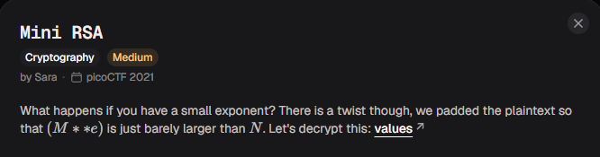

# Mini RSA

#### Category: Crypto - Diff: Medium

#### 1. Overview

* 
* `Mục tiêu`: Phá RSA khi e = 3

#### 2. Nền tảng cốt lõi

* Hiểu 1 số định nghĩa của thuật toán RSA

#### 3. Phân tích lỗ hỗng

* Theo như đề bài thì mã hóa RSA sử dụng số `e` nhỏ và có thêm padding để cho `M**e` lớn hơn `N` một chút 

#### 4. Ý tưởng khai thác

* Vì `M**e` chỉ lớn hơn `N` một chút, nên chúng ta chỉ cần bruteforce để tìm được plaintext
* Ta có `M` khi mã hóa sẽ là:
* 
* Tương đương:
* 
* Và cuối cùng là: 
* 

#### 5. Exploit chain

* Quy trình:
  * BruteForce k cho tới khi nhận được cờ
* Script: [Đọc](solve.py)
* #### Flag: academy{e_sh0u1d_b3_lArg3r_35f26e1a}

> Bài này chính là trường hợp còn lại của việc phá RSA khi số mũ e nhỏ, các bạn xem 2 trường hợp BruteForce RSA khi e nhỏ tại [Crack the Power](../Crack_the_Power/write-up.md)