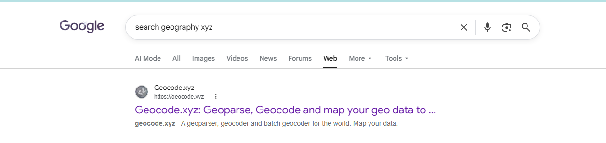
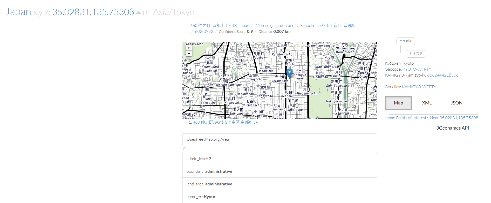
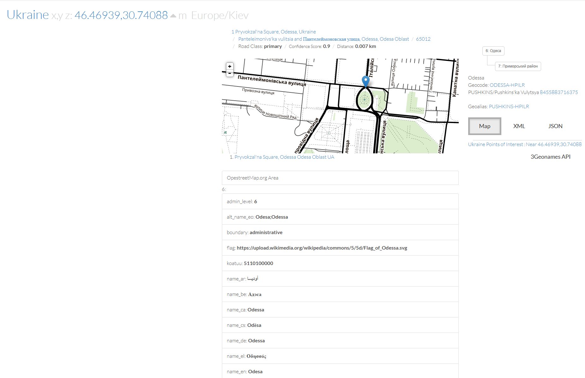
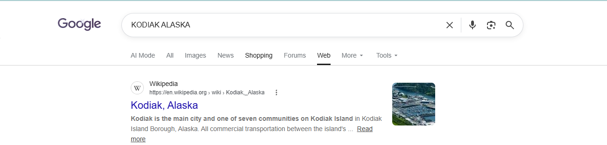

# Mr-Worldwide

#### Category: Crypto - Diff: Medium

#### 1. Overview

* 
* Đây là 1 bài khá là giải trí sau những giờ giải crypto căng thẳng =))))))
* `Mục tiêu`: Giải mã các con số trong cờ để giải mã
* `Kỹ thuật`: Research

#### 2. Nền tảng cốt lõi

* Không có. hoặc là cần có chút sự hiểu biết ngoài crypto :v

#### 3. Phân tích/Exploit chain

* Đề cung cấp cho ta đoạn tin nhắn:

* ```wiki
  academy{(35.028309, 135.753082)(46.469391, 30.740883)(39.758949, -84.191605)(41.015137, 28.979530)(24.466667, 54.366669)(3.140853, 101.693207)_(9.005401, 38.763611)(-3.989038, -79.203560)(52.377956, 4.897070)(41.085651, -73.858467)(57.790001, -152.407227)(31.205753, 29.924526)}
  ```

* Mình nhận ra ngay, những cặp số đại diện cho 1 vị trí địa lý trên bản đồ chính là `kinh độ` và `vĩ độ`, bởi vì tên đề bài `Mr-Worldwide` đã hint cho ta!

* Mình đã tìm kiếm trang web tra cứu địa chỉ dựa trên kinh độ và vĩ độ thì web trả về kết quả sau:

* 

* Mình đã sài trang web đầu tiên để search địa chỉ thì nó chỉ đên thành phố `Kyoto` ở Nhật Bản

* 

* Địa chỉ tiếp theo chỉ đến `Odessa` ở Ukraina

* 

* Mình đã tra tất cả thành phố thì được list các thành phố/Tỉnh sau:

* ```wiki
  Kyoto, Japan
  Odessa, Ukraina
  Dayton, USA
  Istanbul, Turkey
  Abu Dhabi, United Arab Emirates
  Kuala Lumpur, Malaysia
  _
  Addis Ababa, Ethiopia
  Loja, Ecuador
  Amsterdam, Netherlands
  Sleepy Hollow, United States
  Kodiak, United States
  Alexandria, Egypt
  ```

* Lấy các chữ cái đầu là ta thu được dòng: `KODIAK_ALASKA`, và mình search thử thì ra kết quả của 1 thành phố nữa:

* 

* #### Flag: academy{KODIAK_ALASKA}