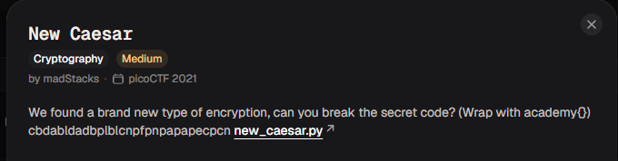

# New Caesar

#### Category: Crypto - Diff: Medium

#### 1. Overview

* 
* `Mục tiêu`: Giải mã caesar custom

#### 2. Nền tảng cốt lõi

* Đọc hiểu syntax và luồng python
* Hiểu biết về mã hóa caesar

#### 3. Phân tích lỗ hỗng

* Flag được mã hóa qua 2 lần:

  * Đầu tiên là hàm `b16_encode`:

  * ```python
    def b16_encode(plain):
    	enc = ""
    	for c in plain:
    		binary = "{0:08b}".format(ord(c))
    		enc += ALPHABET[int(binary[:4], 2)]
    		enc += ALPHABET[int(binary[4:], 2)]
    	return enc
    ```

  * Tóm tắt chức năng của hàm như sau:

  * Hàm quét qua tất cả các kí tự cờ

  * Đưa mã ascii của kí tự từ thập phân sang nhị phân `(với định dạng 08b, b có ý nghĩa là in dưới dạng nhị phân, 8 là độ dài cố định, và 0 có ý nghĩa là nếu thiếu thì điền các vị trí thiếu với giá trị là 0)`

  * Cắt nửa đầu chuỗi nhị phân `(từ 1 - 4 bit đầu tiên của binary)` đổi sang thập phân rồi lấy giá trị tại chỉ số đó

  * Tương tự với nừa sau chuỗi nhị phân 

  * Trả lại cờ đã bị mã hóa, cờ mã hóa độ dài tăng gấp đối và các kí tự thuộc `ALPHABET`

  * Thứ 2 là hàm `shift`

  * ```python
    def shift(c, k):
    	t1 = ord(c) - LOWERCASE_OFFSET
    	t2 = ord(k) - LOWERCASE_OFFSET
    	return ALPHABET[(t1 + t2) % len(ALPHABET)]
    ```

  * Đây cơ bản là mã hóa caesar với k là kí tự trong khóa `key`, nhưng giới hạn các kí tự, thay vì mod 26 thì các kí tự chỉ được mod với `16 hay là len(ALPHABET)` và các kí tự của dãy chỉ thuộc `ALPHABET`

* Tìm theo là key của hàm `shift`

* ```python
  key = "redacted"
  assert all([k in ALPHABET for k in key])
  assert len(key) == 1
  ```

* Có 1 điều kiện kiểm tra độ dài key dài bằng 1, nếu không sẽ văng ra lỗi. Điều này cho biết rằng key chỉ là 1 kí tự đơn lẻ nằm trong `ALPHABET`

#### 4. Ý tưởng khai thác

* Với 2 hàm như thế này, mình nghĩ đến việc viết hàm ngược của 2 hàm trên.
* Đối với hàm `b16_encode`, ta chỉ cần viết quá trình đảo ngược từ dưới lên trên:
  * Chi tiết hơn thì ta sẽ cho 1 biến index chạy trên ciphertext với bước nhảy là `2`
  * Trích xuất các `index` chứa các kí tự `cipher[i]` và `cipher[i+1]`, sau đó khôi phục lại giá trị `ord(<kí tự gốc>)` bằng cách lấy giá trị `index` của nữa chuỗi nhị phân đầu là kí tự `cipher[x]`  `* 16` hay dịch bit sang trái 4 lần: `4 <<`  rồi cộng với  `index` kí tự còn lại
  * Lưu lại kí tự dưới dạng kí tự ascii
* Đối với hàm `shift`, ta chỉ cần bruteforce không gian khóa là được, bởi vì độ dài khóa chỉ có 1 và nằm trong `ALPHABET (chỉ có 16 khóa khác nhau)`

#### 5. Exploit chain

*  Quy trình:

  * Viết hàm ngược của `b16_encode`
  * BruteForce 16 khóa khác nhau
  * Chọn ra kết quả phù hợp nhất

* Script: [Đọc](solve.py)

* Kết quả:

* ```wiki
  0. !01ûýððô/-
  1. /
  / ê
  äìïïã
  2. ùÙù
        ÓÛÞÞÒ
  
  ÈèúÂÊÍÍÁüú
  4. íü×üý·×é±¹¼¼°ëé
  5. ÜëÆëì¦ÆØ ¨««¯ÚØ
  6. ËÚµÚÛµÇÇ
  7. ºÉ¤ÉÊ
          ¤¶¸¶
  8. ©¸¸¹s¥}uxx|§¥
  9. §¨bldggk
  10. qQq[SVVZ
  
  11. v
  `
  @`rJBEEItr
  12. et_tu?_a91448ca
  13. TcNcd.NP( ##'RP
  14. CR=RS=OAO
  15. 2A,AB
           ,>0>
  ```

* #### Flag: academy{et_tu?_a91448ca}