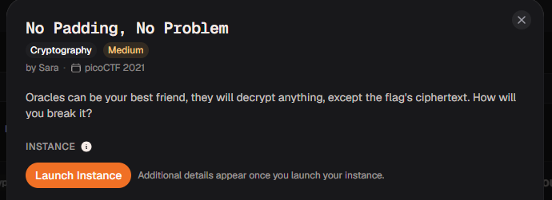
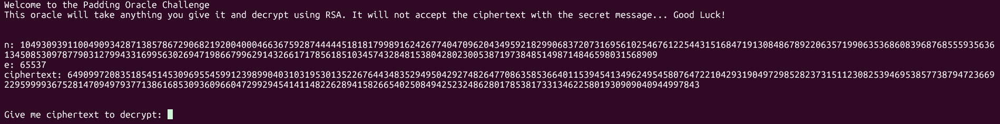
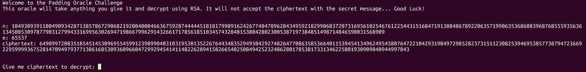
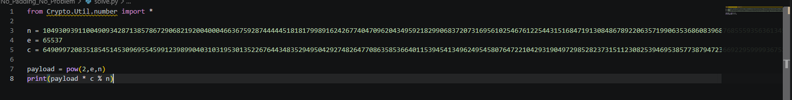
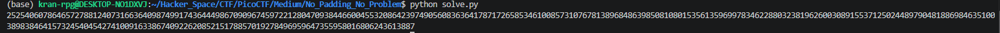
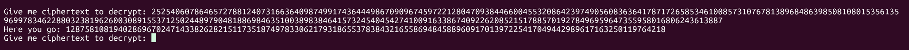
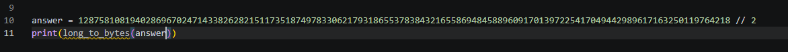
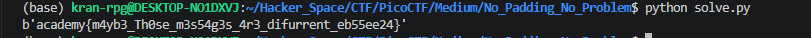

# No Padding, No Problem

#### Category: Crypto - Diff: Medium

#### 1. Overview

* 
* Đây là bài anh em song sinh với `rsa_oracle` =)))) 
* Khuyến khích mọi người giải bài rsa_oracle trước khi giải bài này nhé

* `Mục tiêu`: Giải mã ciphertext
* `Kỹ thuât`: RSA Chosen-Ciphertext Attack (CCA)

#### 2. Nền tảng cốt lõi

* Biết cách thực hiện  RSA Chosen-Ciphertext Attack (CCA)
* Khuyến khích mọi người giải bài `rsa_oracle` trước khi giải bài này.[Đọc](../rsa_oracle/write-up.md)

#### 3. Phân tích

* Đề cho ta netcat đến server và cho phép ta giải mã bất kì đoạn ciphertext nào, ngoại trừ ciphertext của secret
* 

#### 4. Ý tưởng khai thác

* Đây là bài CTF kinh điển của việc sử dụng phương thức RSA Chosen-Ciphertext Attack (CCA) để giải mã ciphertext
* Lấy  các giá trị `n` và `e`, tính toán payload là `2^e` rồi nhân với `ciphertext` chia module `n`
* Gửi lên server kết quả tính ra để server giải mã nó, giá trị server trả về chính là `flag * 2`
* Chỉ cần chia 2 kết quả và đưa về bytes là được

#### 5. Exploit chain

* Quy trình:

  * Netcat đến server, lấy các giá trị n,e,c rồi tính toán payload, sau đó lấy payload nhân với c
  * 
  * 
  * 
  * Gửi kết quả lên server:
  * 
  * Lấy kết quả chia 2 và đưa về bytes:
  * 
  * 

* Script: [Đọc](solve.py)

* #### Flag: academy{m4yb3_Th0se_m3s54g3s_4r3_difurrent_eb55ee24}

#### 6. Reference

* rsa_oracle: [Đọc](../rsa_oracle/write-up.md)