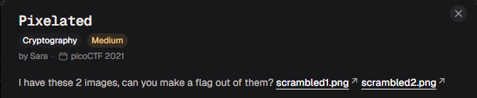
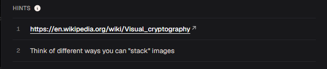
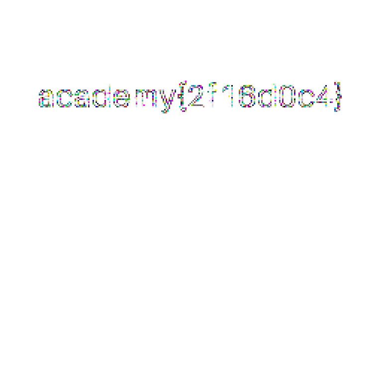
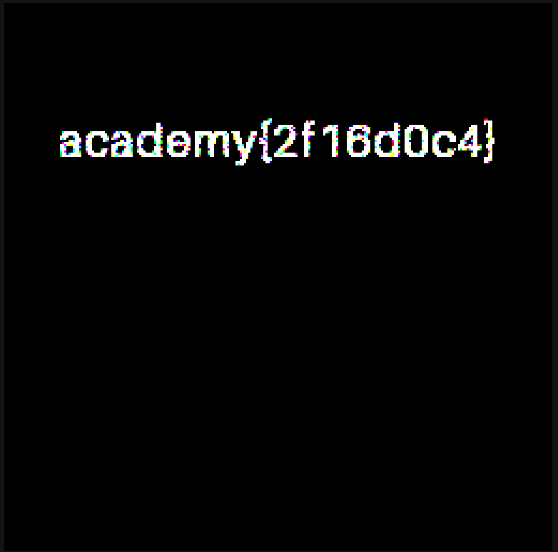

# Pixelated

#### Category: Crypto - Diff: Medium

#### 1. Overview

* 
* Đây là 1 bài mà mình đã từng giải khi mà còn học Cryptohack, các bạn xem qua write-up bài [lemur_xor](../../../Cryptohack/Challenges/General/Lemur_XOR/write-up.md) để hiểu hơn
* `Mục tiêu`: GIải mã 2 bức ảnh
* `Kỹ thuật`: Lồng ghép 2 bức ảnh lên nhau bằng phép `and` và `xor`

#### 2. Nền tảng cốt lõi

* Biết sử dụng công cụ `convert` của ImageMagick

#### 3. Phân tích lỗ hỗng

* Hint: 
* Đề đang hint cho ta về việc suy nghĩ khác đi về cách ghép các ảnh lại với nhau
* Một cách trực tiếp thì tác giả đang muốn chúng ta `đè` 2 tấm ảnh lên nhau để xuất hiện cờ

#### 4. Ý tưởng khai thác

* Mình có lấy câu lệnh phép xor để làm ra file ảnh flag luôn nhưng khi đọc cũng khá là chật vật, vậy nên mình có viết lại lệnh linux để xuất ra tấm ảnh dễ nhìn hơn
* Ý tưởng là dung hợp 2 tấm ảnh lại với nhau bằng cách lấy từng pixel `xor` hoặc là `and` với nhau để tạo ra ảnh chứa cờ

#### 5. Exploit chain

* Hai lệnh linux để giải bài này như sau:

* ```shell
  convert scrambled1.png scrambled2.png -fx "(255*u)&(255*v)" flag1.png # Phép and của từng điểm ảnh với nhau
  convert scrambled1.png scrambled2.png -fx "(((255*u)&(255*(1-v)))|((255*(1-u))&(255*v)))/255" flag.png # Phép xor của từng điểm ảnh với nhau
  ```

* Kết quả phép xor:

* Kết quả phép and:

* #### Flag: academy{2f16d0c4}