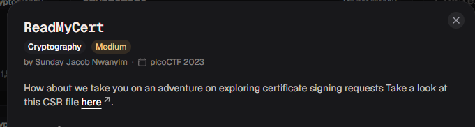
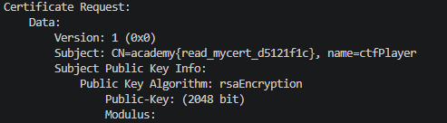

# ReadMyCert

#### Category: Crypto - Diff: Medium

#### 1. Overview

* 
* `Mục tiêu`: Đọc chứng chỉ để lấy cờ

#### 2. Nền tảng cốt lõi

* Biết chứng chỉ X509 là gì
* Biết sử dụng shell command `openssl`

#### 3. Exploit chain

* Ta sử dụng đoạn command này để đọc chứng chỉ đề bài cho:

* ```shell
  openssl req -in readmycert.csr -noout -text
  ```

* 

* #### Flag: academy{read_mycert_d5121f1c}