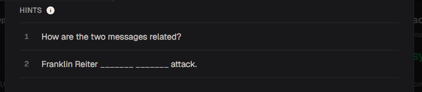

# Related Messages

#### Category: Crypto - Diff: Medium

#### 1. Overview

* Đây là bài đầu tiên mình sử dụng phương thức tấn công là :`Franklin–Reiter related-message attack`
* `Mục tiêu`: Đề cho ta c1,c2, mối quan hệ tuyến tính giữa m1 và m2, và N. Giải mã RSA để lấy được cờ
* `Lỗ hổng`: Đề tái sử dụng khóa `(N, e)`
* `Kỹ thuật`: Franklin–Reiter related-message attack

#### 2. Nền tảng cốt lõi

* Các bạn cần biết kỹ thuật `Franklin–Reiter related-message attack` trước khi được solve: [Đọc](https://en.wikipedia.org/wiki/Coppersmith%27s_attack)

  * Điều kiện để sử dụng phương thức tấn công này, ta biết được mối quan hệ giữa 2 plaintext theo mối quan hệ tuyến tính và 2 plaintext sử dụng chung 1 khóa công khai `(N, e)`

  * Hiểu 1 cách đơn giản, `Franklin–Reiter related-message attack` sử dụng 2 đa thức `g1(x)` và `g2(x)` được rút ra từ biểu thức RSA:

  * Ta có mối quan hệ tuyến tính giữa 2 plaintext:

  * 

  * Ta đặt M2 = x, ta có được 2 đa thức sau:

  * 

  * 

  * Và 2 đa thức trên có chung nghiệm là x = M2

    > Khi x = M2 thì cả 2 đa thức đều:
    >
    > 
    >
    > 

  * Hay cả 2 đa thức có 1 ước chung là đa thức `(x - M2)` trên vành `Zmod(N)`

  * Ta sẽ tìm ước chung lớn nhất của 2 đa thức, phần lớn các cuộc tấn công sẽ thu về được ước chung lớn nhất là `(x - M2)`, nhưng nếu như trong trường hợp nghiệm chung của 2 đa thức có nhiều hơn 1 nghiệm chung thì ước chung của 2 đa thức sẽ có nhiều hơn 1 ước chung và trả về ước chung lớn nhất là đa thức có `bậc >= 2`. Ta chỉ cần giải tìm ra các nghiệm đa thức của đa thức `gcd` và thử lại từng nghiệm để xác định được `M2`

* Các bạn cần biết 1 số code sagemath:

  * ```python
    R.<x> = PolynomialRing(Zmod(N)) # Khai báo vành đa thức 1 ẩn x thuộc vành số nguyên module N (Zn[x])
    f1.monic() 
    '''
    Rút gọn đa thức f thành dạng đa thức monic (dạng đa thức có hệ số bậc cao nhất = 1)
    VD: f1 = 2*x^3 + 16
    Đa thức monic f1 là:
    f1 = x^3 + 8
    '''
    ```

#### 3. Phân tích lỗ hổng

* Hint: 
  * ***How are the two messages related?***
  * ***Franklin Reiter _______ _______ attack.***
* Mối quan hệ của 2 plaintext là mối quan hệ tuyến tính khi mà trong source code của server đã trả ra cho chúng ta kết quả của phép `M1 - M2 = b` hay `M1 = 1*M2 + b`
* Đề cũng hint luôn phương pháp tấn công

#### 4. Exploit chain

* Quy trình:

  * Trích xuất các thông tin trong `output.txt`
  * Triển khai Franklin–Reiter related-message attack
  * Giải mã

* Script: [Đọc](solve.sage)

* #### Flag: academy{m3ssage_w1th_typ0}

#### 5. Reference

* Franklin–Reiter related-message attack:[Đọc](https://en.wikipedia.org/wiki/Coppersmith%27s_attack#:~:text=RSA%20encryption.-,Franklin%E2%80%93Reiter%20related%2Dmessage%20attack,edit,-Franklin%20and%20Reiter)