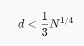
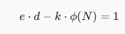
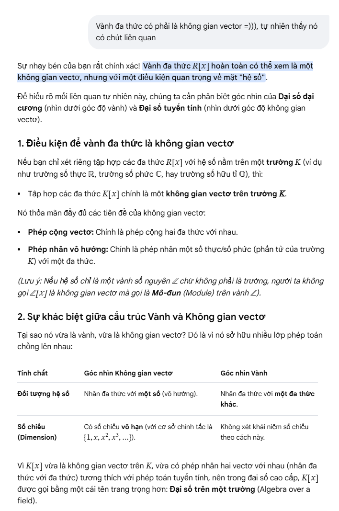
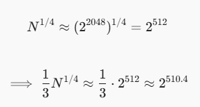

# Small Trouble

#### Category: Crypto - Diff: Medium

#### 1. Overview

* Đây là bài đầu tiên mà mình sử dụng thuật toán `wiener attack` để phá giải RSA >-<
* `Mục tiêu`: Phá giải RSA
* `Lổ hỗng`: Khóa bí mật nhỏ
* `Kỹ thuật`: Sử dụng `Wiener attack` để phá giải RSA tìm lại khóa d

#### 2. Nền tảng cốt lõi

* `Wiener's attack wikipedia`: [Đọc](https://en.wikipedia.org/wiki/Wiener%27s_attack) 

  * Hiểu 1 cách đơn giản thì khi `wiener attack` thực hiện được khi:
  * 
  * Bởi vì khi thỏa mãn điều kiện trên, khi khai triển liên phân số `e / N`, khóa bí mật `d` sẽ xuất hiện dưới mẫu của các phân số giản ước và đồng thời cũng xuất hiện 1 hệ số `k` nằm trên tử của 1 phân số giản ước cùng với `d`  ,và hệ số `k` đó chính là `k` trong:
  * 

* Biết sử dụng sagemath để code thuật toán:

  * ```python
    # Danh sách các câu lệnh các bạn nên tìm hiểu trước khi đọc solve
    cf = continued_fraction(e / N) # Khai triển liên phân số
    R.<x> = PolynomialRing(ZZ) # Khởi tạo vành đa thức biến x với hệ số nguyên Z[x]
    P = x^2 - s * x + N # Đa thức ẩn x
    roots = P.roots(multiplicities=False) # Tính các nghiệm của đa thức P và multiplicities=False sẽ không trả về số lượng của 1 nghiệm
    cf.convergents() # Danh sách các phân số giản ước
    k = conv.numerator() # Lấy giá trị ở tử của phân số conv
    d = conv.denominator() # Lấy giá trị ở mẫu của phân số conv
    ```

* Hiểu định nghĩa khai triển liên phân số, phân số giản ước của 1 phân số

* Hiểu biết cách vận hành của thuật toán RSA

* Khi research thông tin để viết write-up này, mình đã được AI trả lời 1 thông tin mà mình nghĩ các bạn năm nhất nên biết =))))

* 

#### 3. Phân tích lỗ hổng

*  Bài này cho ta gồm:

  * N
  * e
  * c

* Phân tích source code cho thấy:

  * ```python
    # compute d
    d = getPrime(256)
    
    # Compute the public exponent
    e = inverse(d, phi)
    ```

  * `d` được khởi tạo trước `e` và `d` được khởi tạo dài 256 bit

    > Trong thực tế, giá trị của các khóa càng nhỏ thì tốc độ mã hóa hay giải mã càng nhanh. Nhưng thực tế, cái gì càng nhanh thì càng rủi ro. Bình thường, các thuật toán RSA sẽ khởi tạo `e = 2^16 + 1 = 65537 (Số nguyên tố Fermat)`  và sau đó mới tìm `d` và `d` trọng hầu hết các trường hợp sẽ lớn gần bằng phi của N (~2048 bit). Trong trường hợp của bài này, `d` được khởi tạo chỉ dài vổn vẹn 256 bit và là 1 số nguyên tố, sau đó mới tìm `e`. Chưa biết `e` có thỏa mãn các điều kiện cơ bản của khóa công khai hay không nhưng nếu nó đủ lớn thì vẫn sẽ thỏa mãn điều kiện của 1 khóa công khai.

  * `N` có độ lớn `2^2024`, `d` có độ lớn `2^256` và nó thỏa mãn điều kiện để thực hiện `wiener attack`:
  
  * 
  
#### 4. Exploit chain

* Quy trình:

  * Trích xuất N,e,c
  * Triển khai thuật toán wiener
  * Giải mã RSA

* Script: [Đọc](wiener.sage)

* #### Flag: academy{sm4ll_d_073cf0e5}

#### 5. Reference

* Wiener's attack: [Đọc](https://en.wikipedia.org/wiki/Wiener%27s_attack)
* Sage math: [Đọc](https://doc.sagemath.org/html/en/reference/diophantine_approximation/sage/rings/continued_fraction.html)

* Mở rộng:
  * Số Fermat: [Đọc](https://vi.wikipedia.org/wiki/S%E1%BB%91_Fermat)