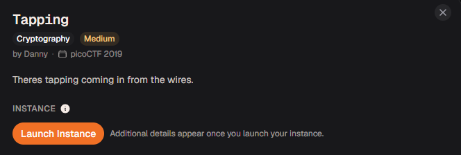
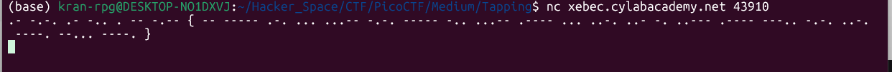

# Tapping

#### Category: Crypto - Diff: Medium

#### 1. Overview

* 
* `Mục tiêu`: Giải mã cipher
* `Kỹ thuật`: Morse decode

#### 2. Nền tảng cốt lõi	

* Mã Morse

#### 3. Phân tích

* Khi netcat đến server thì ta nhận được một chuỗi các kí tự `.` và  `-`
* 
* Và đây là dấu hiệu của mã morse

#### 4. Exploit chain

* Quy trình:
  * Netcat đến server, copy mã morse
  * Dán vào trang [Morse decode](https://morsecode.world/international/translator.html) để giải mã
  * #### Flag: ACADEMY{M0RS3C0D31SFUN218CF979}