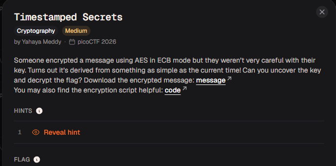
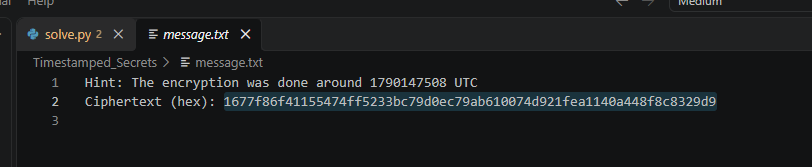

# Timestamped Secrets

#### Category: Crypto - Diff: Medium

#### 1. Overview

* `Mục tiêu`: Ciphertext bị lộ khóa, chính là tem thời gian, sử dụng nó để khôi phục lại flag
* `Lỗ hổng`: Sử dụng Unix timestamps để làm khóa cho mã hóa
* `Kỹ thuật`: Brute force timestamp

#### 2. Nền tảng cốt lõi

* Hiểu biết cơ bản về lỗi bảo mật khi sử dụng khóa là timestamp

#### 3. Phân tích

* 

* 

* Dựa vào đề bài cũng như source code thì chìa khóa được tạo bởi hàm `time.time()`

* ```py
  timestamp = int(time.time())
  key = sha256(str(timestamp).encode()).digest()[:16]
  ```

* Chúng ta chỉ cần brute force quanh khoảng thời gian tạo khóa là được.

#### 4. Exploit chain

* Viết hàm decrypt và cho chạy brute force quanh khoảng thời gian tạo khóa
* Script : [Đọc](solve.py)
* #### Flag: academy{sa3S_sEc9t_65bbf411}