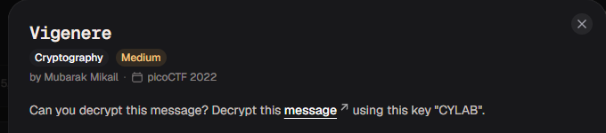
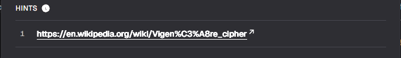
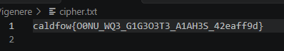

# Vigenere

#### Category: Crypto - Diff: Medium

#### 1. Overview

* 
* Đây là bài đầu tiên mình sử dụng mật mã caesar =))))
* `Mục tiêu`: Giải mã ciphertext
* `Kỹ thuật`: Giải mã Caesar

#### 2. Nền tảng cốt lõi

* Biết và hiểu cách giải mã caesar

#### 3. Phân tích lỗ hỗng

* Hint : 
* [Đọc tại đây](https://en.wikipedia.org/wiki/Vigen%C3%A8re_cipher)

* 
* Đề cho chúng ta key là `CYLAB` , chúng ta sẽ viết hàm giải mã carsar để giải mã nó thôi. Các bạn có thể lên cyberchef vẫn được nhé

#### 4. Exploit chain

* Quy trình:
  * Viết hàm giải mã caesar
  * Giải mã
* Script: [Đọc](solve.py)
* #### Flag: academy{D0NT_US3_V1G3N3R3_C1PH3R_42ccuf9c}