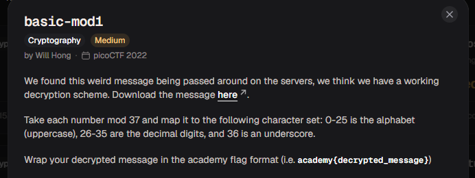
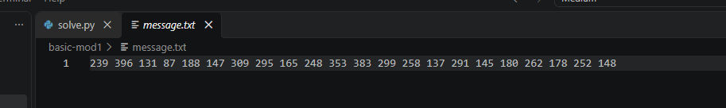

# basic-mod1

#### Category: Crypto - Diff: Medium

#### 1. Overview

* 
* `Mục tiêu`: Giải mã message chứa các số nguyên

#### 2. Nền tảng cốt lõi

* Biết module là gì

#### 3. Phân tích

* Đề cho ta 1 đoạn message chứa các số nguyên:
* 
* Theo như hint đề bài thì ta cần chia module với 37, sao đó, tùy thuộc vào kết quả mà có kí tự tương ứng
  * `0-25`: `A-Z`
  * `26-35`: `0-9`
  * ~~`36`~~: `_`

#### 4. Ý tưởng khai thác

* Mình sẽ tạo 1 list gồm các kí tự tương ứng với kết quả, rồi khi thực hiện phép module thì lấy tại vị trí kết quả tương ứng để giải mã kí tự.

#### 5. Exploit chain

* Quy trình:

  * Tạo list kết quả
  * Giải mã

* Script: [Đọc](solve.py)

* Kết quả: `R0UND_N_R0UND_0686D44A`

* #### Flag: academy{R0UND_N_R0UND_0686D44A}