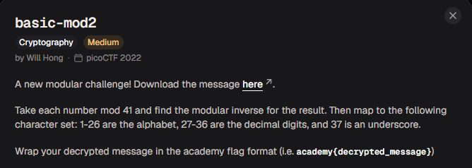

# basic-mod2

#### Category: Crypto - Diff: Medium

#### 1. Overview

* 
* `Mục tiêu`: Giải mã message bằng cách tìm nghịch đảo module

#### 2. Nền tảng cốt lõi

* Biết module là gì
* Biết nghịch đảo module của 1 số là gì
* Làm bài [basic-mod1](../basic-mod1/write-up.md) trước khi làm bài này

#### 3. Phân tích

* Tương tự ở bài `basic-mod1`, nhưng chúng ta khác 1 chút là kết quả thay vì module `37` thì module `41` và sau đó tìm nghịch đảo module của kết quả trên module 41 rồi mới đưa về kí tự

#### 4. Ý tưởng khai thác

* Tương tự ở bài `basic-mod1` nhưng ta thêm quá trình tìm nghịch đảo.

* List được thêm dấu cách ở đầu để kết quả không bị sai lệnh so với vị trí đề cho:

* > Đề cho các kết quả từ 0-36 ở bài trước đó, nhưng với bài này, kết quả quy đổi kí tự chỉ từ 1-37, đã mất số 0 nên ta cần thêm 1 dấu space ở đầu list để đẩy các kí tự sau đó lên thêm 1 vị trí 

#### 5. Exploit chain:

* Quy trình:
  * Viết list các kí tự quy đổi
  * Giải mã 
* Script: [Đọc](solve.py)
* Kết quả: `1nv3r53ly_h4rd_fed0a735`
* #### Flag: academy{1nv3r53ly_h4rd_fed0a735}