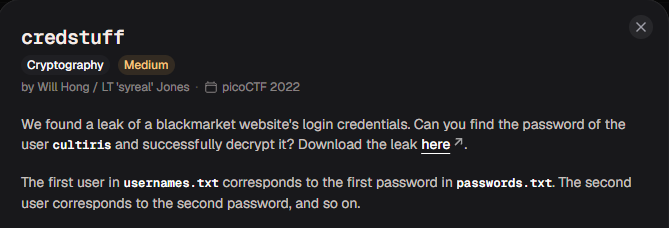
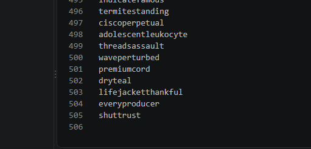
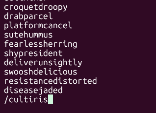
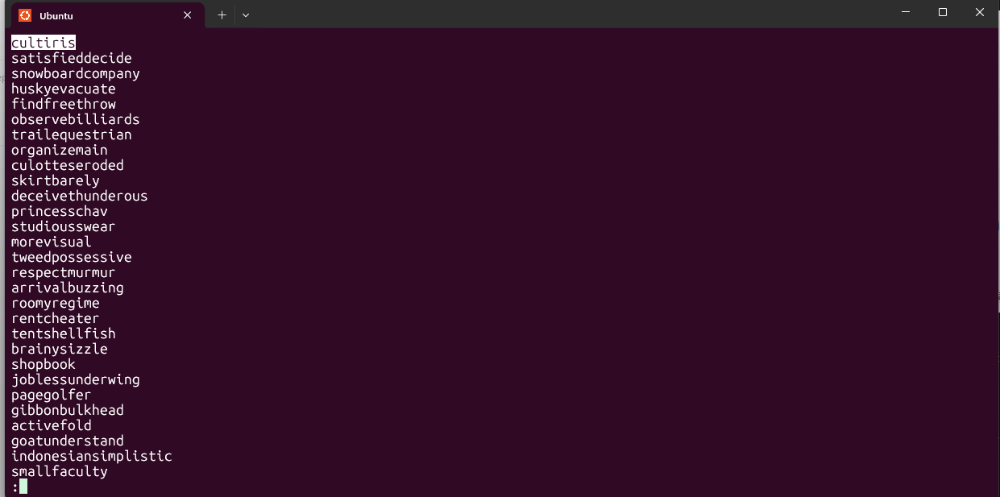
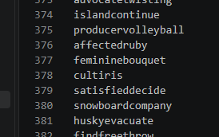
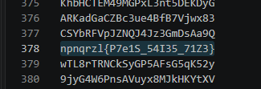

# credstuff

#### Category: Crypto - Diff: Medium

#### 1. Overview

* 
* `Mục tiêu`: Tìm kiếm thông tin leak
* `Kỹ thuật`: less linux ,giải mã caesar

#### 2. Nền tảng cốt lõi

*  Nhận biết được mã hóa caesar
* Sử dụng lệnh less để tìm kiếm mục tiêu

#### 3. Phân tích lỗ hỗng

* Đề cho ta 1 file gồm rất nhiều mật khẩu và username, nhiệm vụ của chúng ta là tìm mật khẩu của username `cultiris` và giải mã mật khẩu

#### 4. Ý tưởng khai thác/Exploit chain

* Khi kiểm tra file password và username thì có đến tận `505 username và mật khẩu khác nhau`

* 

* Mình sử dụng linux để khoanh vùng tìm kiếm lại với lệnh `less`

* ```shell
  cat username.txt | less
  ```

* Sau đó mình nhập `cultiris` để tìm

* 

* 

* Và mình thử đi đến cuối file để phỏng đoán vị trí của nó trong file username, sau đó vào VS code để tìm và biết được vị trí của nó là ở dòng `378`

* 



* Tra tương ứng dòng ở file password:

* 

* Format cờ là `academy{...}`, mình thấy có 2 chữ `n` tương ứng vị trí chữ `a` nên mình phỏng đoán đây là mã hóa caesar, sau đó mình đưa vào file python để giải mã

* Script: [Đọc](solve.py)

* #### Flag: academy{C7r1F_54V35_71M3}


