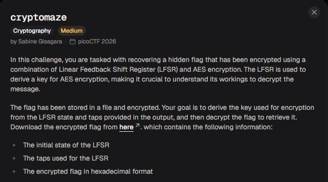
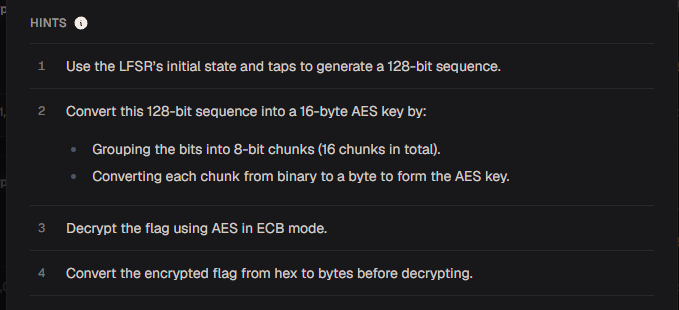

# cryptomaze

#### Category: Medium - Diff: Medium

#### 1. Overview

* 
* Đây là 1 trong những bài khá là hay của mã hóa bằng LFSR
* `Mục tiêu`: Khôi phục khóa AES từ trạng thái LFSR

#### 2. Nền tảng cốt lõi

* Linear-feedback shift register - Mục `Fibonacci LFSRs`: [Đọc](https://en.wikipedia.org/wiki/Linear-feedback_shift_register#:~:text=considered%20as%20well.-,Fibonacci%20LFSRs,-edit)
* Nếu các bạn đã từng làm bài `shift registers` thì cần biết sự khác nhau giữa bài này với bài kia:
  * Bài `shift registers` biểu diễn chuẩn toán học của bit, cách mà chiều bit được tạo ra trong Fibonacci LFSRs là chiều bit từ phải sang trái và bit được loại bỏ là bit bên phải của chuỗi bit
  * Bài này biểu diễn theo list python thuần túy, chiều bit được hiểu là biểu diễn từ trái qua phải và bit được loại bỏ là bit nằm phía bên trái

> Các bạn đã từng giải bài trên thì khi giải bài này không được nhầm lẫn cách biểu diễn nhé, nếu các bạn không xác định được cách biểu diễn bit để thực hiện LFSR thì bạn sẽ không thể khôi phục lại khóa bởi vì xác định sai chiều sẽ làm sai trạng thái ban đầu của dãy

#### 3. Phân tích lỗ hỗng

* Bài cung cấp cho ta gồm 3 thông tin quan trọng để khôi phục lại khóa

* ```wiki
  LFSR Initial State:
  [0, 0, 1, 0, 0, 1, 0, 1, 1, 1, 1, 0, 1, 1, 0, 0, 1, 0, 0, 1, 0, 1, 1, 0, 1, 0, 0, 1, 0, 1, 0, 1, 0, 1, 0, 0, 1, 1, 0, 1, 1, 0, 0, 0, 1, 0, 1, 1, 1, 1, 0, 0, 0, 1, 0, 0, 0, 1, 0, 1, 1, 0, 1, 1]
  LFSR Taps:
  [63, 61, 60, 58]
  Encrypted Flag:
  5fdec2e502a7c8d5951f41da4b0e0057fa1c4a5dcf3ecb8affd53e58f05cdfb138338e7e04fbddef0c6260a4eb758417
  ```

* Tác giả chỉ nói chúng ta là từ 3 thông tin này, hãy khôi phục khóa =))))

* Hint:

* Hint cung cấp cho ta cách tìm lại key và cách giải mã ciphertext đó là:

  * Sử dụng thuật toán thực hiện LFSR trên trạng thái khởi đầu đề cho để sinh ra 128 bit để tạo khóa AES
  * Để tạo khóa từ các bit, nhóm các khối 8-bit lại với nhau và chuyển qua bytes
  * Giải mã ciphertext bằng chế độ ECB `(chế độ không sử dụng vector gây nhiễu)`
  * Chuyển ciphertext từ hex sang bytes trước khi giải mã

#### 4. Ý tưởng khai thác

* Với bài này, điều đầu tiên là cần viết 1 hàm chạy LFSR. Tác giả không đề cập chúng ta sẽ khôi phục khóa bằng cách gì, chỉ cho chúng ta biết rằng muốn khôi phục khóa thì sử dụng LFSR để khôi phục khóa

* Mình nghĩ ra có 2 cách để khôi phục khóa

  1. Sử dụng kết quả xor của các tap để khôi phục khóa

  2. Sử dụng Output stream `(các bit đẩy ra ngoài khỏi dãy bit)` để khôi phục khóa

#### 5.Exploit chain

* Quy trình:

  * Thiết kế hàm theo cách 1
  * Thiết kế hàm theo cách 2
  * Giải mã theo 2 cách

* Script: [Đọc](solve.py)

* Kết quả:

* ```python
  b'academy{scr8mbledt_flvg_580f021d}'
  b'\xedB\x0e\xc0\xbcM~.\xa6\xd6v{\xda\xd1\xc6\x03>\x8f\x8a\xe7X \x83\xaf\xa5C\xe5=\x8d\xc8\xf0`\xdfJ<\x1e\x97\xa0\xc4dt\xf0\xa9k\xb1\x01\xcc2'
  ```

* Vậy khóa được tạo bởi các bit từ output stream

* #### Flag: academy{scr8mbledt_flvg_580f021d}