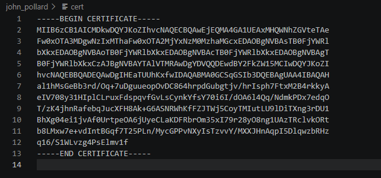
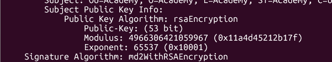
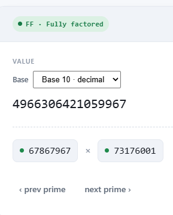

# john_pollard

#### Category: Crypto - Diff: Medium

#### 1. Overview

* 
* `Mục tiêu`: Tìm thừa số q,p của khóa công khai `N`

#### 2. Nền tảng cốt lõi

* Biêt cách trích xuất thông tin chứng chỉ, trích xuất khóa công khai

#### 3. Phân tích/Exploit chain

* Chúng ta nhận được 1 file định dạng pem chứa thông tin chứng chỉ x509 của 1 khóa công khai đề bài cho:

* 

* Mục tiêu của chúng ta là tìm `q,p` của `N`, nên trước hết mình sẽ trích xuất thông tin của chứng chỉ ra để xem khóa công khai là gì

* Có 2 cách để trích xuất:

  * Linux shell command:

  * ```shell
    openssl x509 -in cert -text -noout
    ```

  * Hoặc là bạn có thể sử dụng [Python](solve.py) để trích xuất khóa công khai

* Và chúng ta nhận được cặp khóa như sau:

* 

* `N = 4966306421059967 và e = 65537`

* Khóa công khai rất nhỏ, chỉ dài 53 bit, chúng ta chỉ cần lên trang factordb để phân tích thừa số nguyên tố là xong

* 

* #### Flag: academy{73176001,67867967}