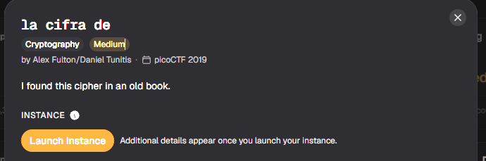
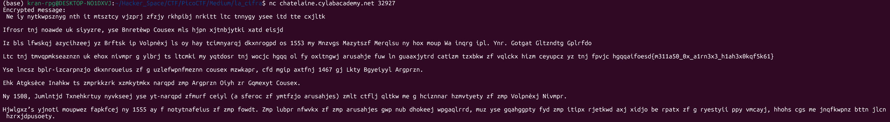
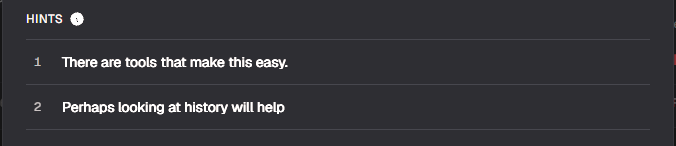
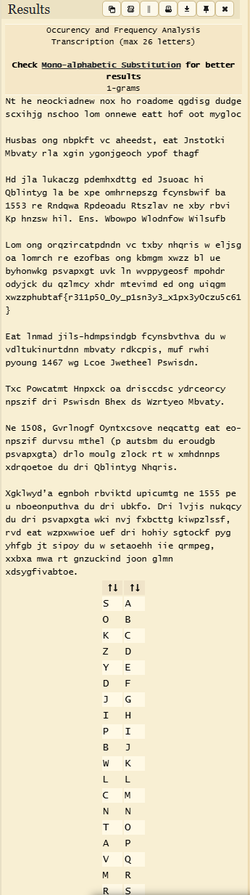
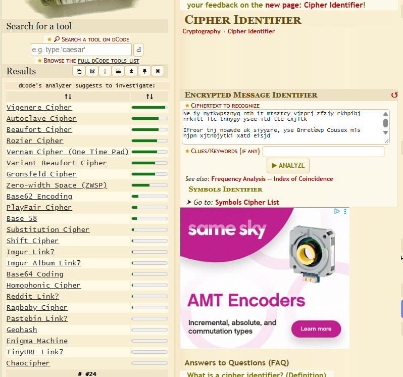
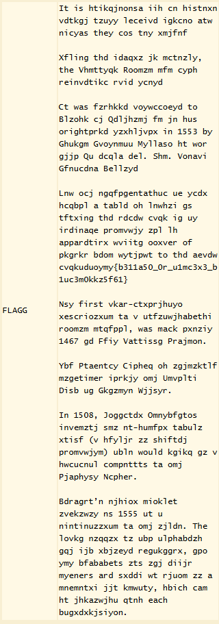
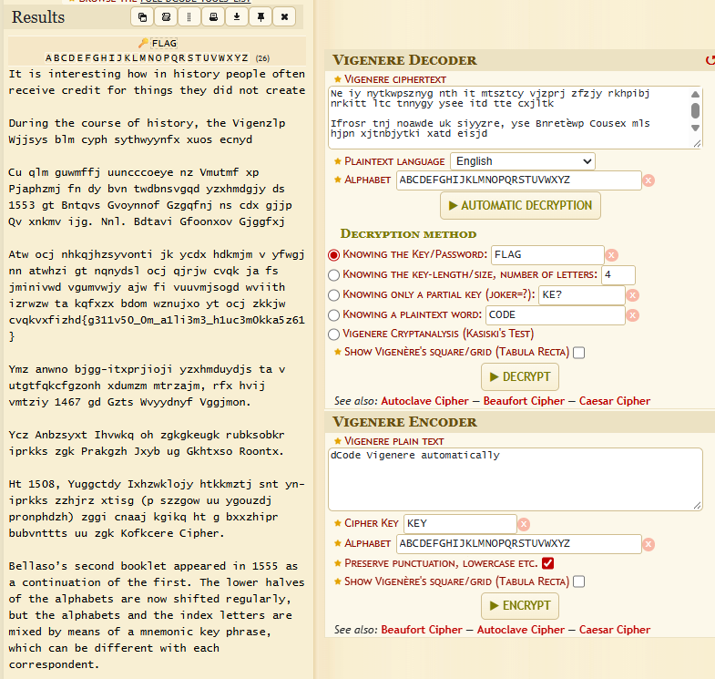
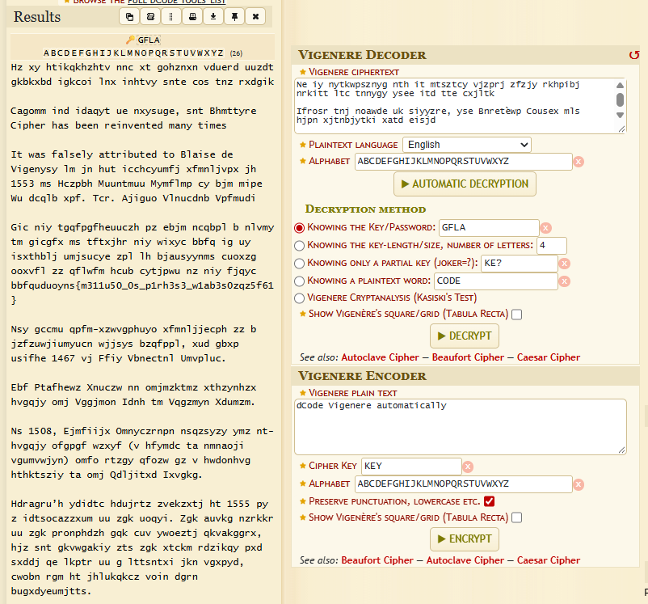
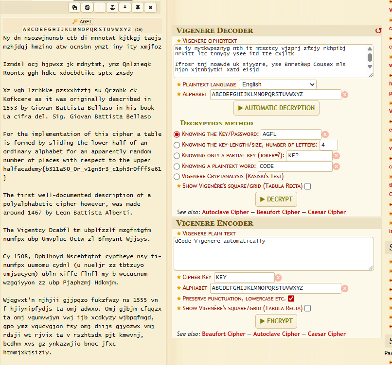
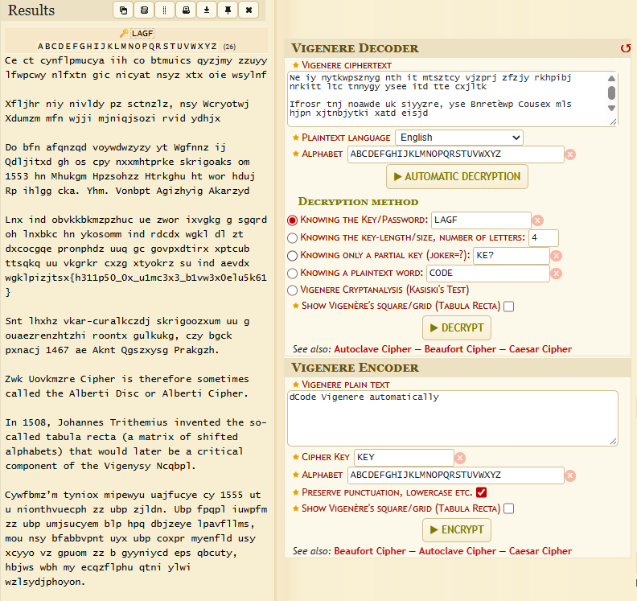

# la cifra de

#### Category: Crypto - Diff: Medium

#### 1. Overview

* 
* Đây là 1 bài giải mã ciphertext khá là hay =))))
* `Mục tiêu`: Giải mã ciphertext
* `Kỹ thuật`: Brute Force key, phân tích key

#### 2. Nền tảng cốt lõi

* Bài này các bạn cần phải nhìn ra được loại mã hóa được áp dụng lên ciphertext, có thể dùng tool, nhưng nếu nhận ra được loại mã hóa gì mình cũng nể các bạn thật =)))))
* Tool:
  * Cipher - Identify: [Đọc](https://www.dcode.fr/cipher-identifier)

#### 3. Phân tích/Exploit chain

* Khi netcat đến server, ta nhận được 1 đoạn message bị mã hóa

* 

* Hint: 

* Khi đọc hint thứ nhất, mình đã nghĩ rằng là đây có thể là mã hóa dịch chuyển đơn kí tự, nên dùng phân tích tần suất để thực hiện `frequency attack`, nhưng khi phân tích thì lại không có ra bản rõ nào cả.

* 

* Khi đối chiếu lại ciphertext thì mình thấy các cột mốc năm có 1 từ tiếng anh đó là `in` được mã hóa không đồng đều. Lúc thì `os` lúc sau là `ny` nên mình đã nghĩ đến mã hóa đa khối

* Để nhận dạng nhanh loại mã hóa, mình đã lên trang `cipher - identify của dcode` để xem thử loại mã hóa đó là gì thì đây:

* 

* Có xác suất cao là cờ đã bị `mã hóa Vigenere` - một dạng mã khóa đa khối trong mã hóa Caesar

* Khi thử để web `automatic decrypt` thì có hàng loạt có kết quả key khác nhau, không có cái nào phù hợp, nhưng trong số đó có 1 vài trường hợp có vẻ gần đã giải ra ciphertext

* 

* Nên mình đã đoán key là `FLAG`, mình đã thử thì đã giải mã được 1 đoạn message

* 

* Khi phân tích các kết quả của `automatic decrypt` thì mình nhận thấy các key dường như chỉ là hoán vị của khóa và đã có 1 vài đoạn ciphertext có thể đọc được, nên mình đã thử hoán vị các kí tự của khóa thì mình được như sau:

* 

* 

* 

* #### Flag: academy{b311a50_0r_v1gn3r3_c1ph3r0fff5e61}